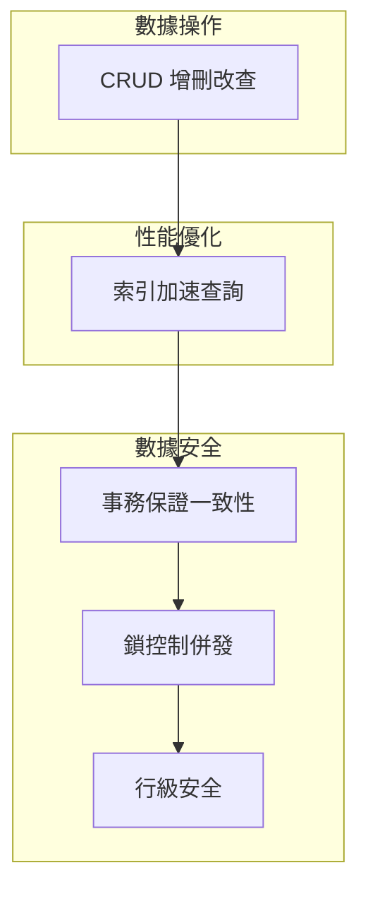
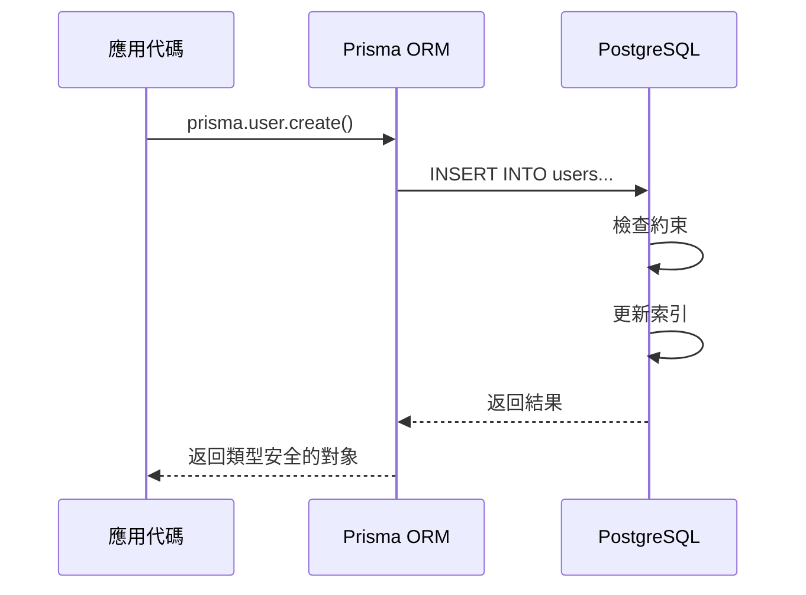

# 4.2 數據庫到底在忙什麼——關係型數據庫：CRUD/索引/事務

### 認知重構

關係型數據庫不僅僅是"存數據的地方"，它是一個**保證數據正確性和一致性的系統**。理解它的工作原理，能幫你寫出更高效、更安全的代碼。

### 關係型數據庫核心概念



| 概念 | 作用 | 解決的問題 |
|------|------|------------|
| **CRUD** | 基本數據操作 | 如何讀寫數據 |
| **索引** | 加速查詢 | 查詢太慢怎麼辦 |
| **事務** | 保證一致性 | 多步操作如何原子執行 |
| **併發控制** | 處理衝突 | 多人同時操作怎麼辦 |
| **RLS** | 數據隔離 | 如何限制用戶只看自己的數據 |

### 子章節導航

| 章節 | 主題 | 核心問題 |
|------|------|----------|
| 4.2.1 | CRUD 操作 | 增刪改查的本質是什麼？ |
| 4.2.2 | 索引原理 | 爲什麼加了索引查詢就快了？ |
| 4.2.3 | 事務特性 | 轉賬爲什麼是安全的？ |
| 4.2.4 | 併發控制 | 同時修改數據怎麼辦？ |
| 4.2.5 | 行級安全 | 張三爲什麼看不了李四的數據？ |

### 爲什麼選擇關係型數據庫？

| 特性 | 關係型數據庫 | NoSQL |
|------|-------------|-------|
| **數據結構** | 結構化表格 | 靈活文檔/鍵值 |
| **數據一致性** | 強一致性（ACID） | 最終一致性 |
| **查詢能力** | 強大的 SQL | 簡單查詢 |
| **適用場景** | 事務性應用 | 大數據/即時應用 |

**本課程選擇 PostgreSQL 的原因**：

1. 功能最全面的開源關係型數據庫
2. 原生支持 JSON，兼顧靈活性
3. 與 Prisma 配合最佳
4. 內置行級安全（RLS），適合多租戶應用

### 數據庫操作的全景圖



### AI 協作指南

**核心意圖**：讓 AI 幫你理解數據庫概念或優化查詢。

**常用提問模板**：
```
我的查詢很慢：[查詢代碼]
表結構是：[表結構]
數據量大約 [X] 條
請幫我分析原因並給出優化建議。
```

**關鍵術語**：`索引`、`事務`、`ACID`、`鎖`、`死鎖`、`RLS`

### 學習建議

- 如果你只用 Prisma，可以快速瀏覽本節，重點理解概念
- 如果你需要優化性能，重點學習 4.2.2 索引原理
- 如果你處理支付等敏感操作，重點學習 4.2.3 事務特性
