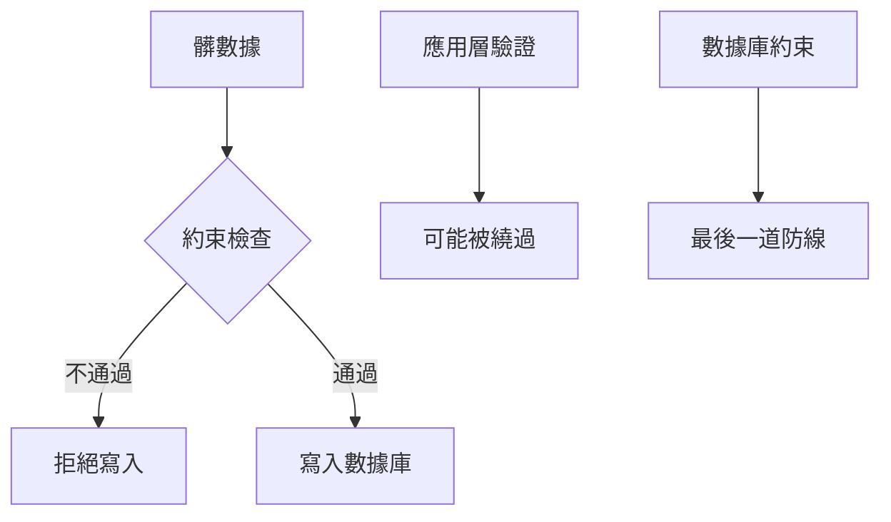

# 4.3.3 如何給數據上規矩——約束定義：主鍵/外鍵/唯一/檢查約束

### 一句話破題

約束是數據庫的"規矩"——它在數據層面強制執行業務規則，防止髒數據進入系統。

### 約束類型概覽

| 約束 | 作用 | SQL | Prisma |
|------|------|-----|--------|
| **主鍵** | 唯一標識每一行 | `PRIMARY KEY` | `@id` |
| **外鍵** | 關聯其他表 | `FOREIGN KEY` | `@relation` |
| **唯一** | 值不能重複 | `UNIQUE` | `@unique` |
| **非空** | 值不能爲 NULL | `NOT NULL` | 字段不加 `?` |
| **檢查** | 自定義條件 | `CHECK` | 需原生 SQL |
| **默認值** | 未指定時的默認值 | `DEFAULT` | `@default()` |

### 主鍵約束（Primary Key）

**作用**：唯一標識表中的每一行

**SQL**：
```sql
CREATE TABLE users (
  id VARCHAR(36) PRIMARY KEY,
  email VARCHAR(255)
);
```

**Prisma**：
```prisma
model User {
  id    String @id @default(cuid())
  email String
}
```

**主鍵特點**：
- 必須唯一
- 不能爲 NULL
- 一個表只能有一個主鍵

### 外鍵約束（Foreign Key）

**作用**：保證關聯數據的完整性

**SQL**：
```sql
CREATE TABLE posts (
  id VARCHAR(36) PRIMARY KEY,
  author_id VARCHAR(36) REFERENCES users(id)
);
```

**Prisma**：
```prisma
model Post {
  id       String @id
  authorId String
  author   User   @relation(fields: [authorId], references: [id])
}
```

**外鍵行爲選項**：

| 行爲 | 說明 | Prisma |
|------|------|--------|
| **CASCADE** | 父記錄刪除，子記錄也刪除 | `onDelete: Cascade` |
| **SET NULL** | 父記錄刪除，子記錄外鍵設爲 NULL | `onDelete: SetNull` |
| **RESTRICT** | 有子記錄時禁止刪除父記錄 | `onDelete: Restrict` |

```prisma
model Post {
  id       String @id
  authorId String
  author   User   @relation(fields: [authorId], references: [id], onDelete: Cascade)
}
```

### 唯一約束（Unique）

**作用**：保證字段值不重複

**SQL**：
```sql
CREATE TABLE users (
  id VARCHAR(36) PRIMARY KEY,
  email VARCHAR(255) UNIQUE
);
```

**Prisma**：
```prisma
model User {
  id    String @id
  email String @unique
}
```

**複合唯一約束**：多個字段組合唯一
```prisma
model TeamMember {
  id     String @id
  userId String
  teamId String
  
  @@unique([userId, teamId])  // 一個用戶在一個團隊只能有一條記錄
}
```

### 非空約束（Not Null）

**作用**：字段不能爲空

**SQL**：
```sql
CREATE TABLE users (
  id VARCHAR(36) PRIMARY KEY,
  email VARCHAR(255) NOT NULL
);
```

**Prisma**：
```prisma
model User {
  id    String @id
  email String      // 不加 ? 就是 NOT NULL
  name  String?     // 加 ? 表示可以爲 NULL
}
```

### 檢查約束（Check）

**作用**：自定義數據驗證規則

**SQL**：
```sql
CREATE TABLE products (
  id VARCHAR(36) PRIMARY KEY,
  price DECIMAL(10,2) CHECK (price > 0),
  stock INTEGER CHECK (stock >= 0)
);
```

**Prisma 不直接支持，需要用原生 SQL**：
```sql
ALTER TABLE products ADD CONSTRAINT price_positive CHECK (price > 0);
```

### 默認值約束（Default）

**作用**：未指定值時使用默認值

**SQL**：
```sql
CREATE TABLE users (
  id VARCHAR(36) PRIMARY KEY,
  status VARCHAR(20) DEFAULT 'ACTIVE',
  created_at TIMESTAMP DEFAULT CURRENT_TIMESTAMP
);
```

**Prisma**：
```prisma
model User {
  id        String   @id @default(cuid())
  status    String   @default("ACTIVE")
  createdAt DateTime @default(now())
}
```

### 約束的價值



**爲什麼要用約束**：
1. 應用層驗證可能被繞過（API 直接調用、SQL 注入）
2. 數據庫約束是最後一道防線
3. 約束能提供更好的錯誤信息

### 本節小結

- 約束在數據庫層面強制執行規則
- 主鍵唯一標識記錄，外鍵保證關聯完整性
- 唯一約束防止重複，檢查約束自定義規則
- 應用層驗證 + 數據庫約束 = 雙重保障
