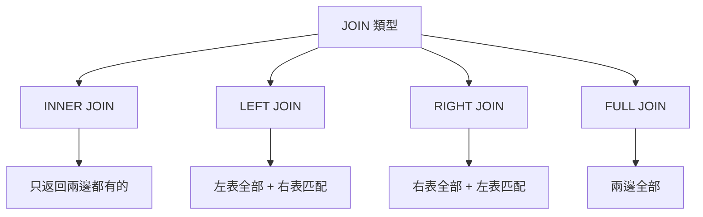

# 4.3.4 如何關聯多張表——JOIN 查詢：INNER/LEFT/RIGHT/FULL JOIN

### 一句話破題

JOIN 把多張表"拼"在一起查詢——當數據分散在不同表中時，這是獲取完整信息的唯一方式。

### 爲什麼需要 JOIN？

**場景**：查詢文章列表，需要顯示作者名稱

```
posts 表              users 表
┌────┬────────────┐   ┌────┬──────┐
│ id │ author_id  │   │ id │ name │
├────┼────────────┤   ├────┼──────┤
│ 1  │ u1         │   │ u1 │ 張三 │
│ 2  │ u2         │   │ u2 │ 李四 │
└────┴────────────┘   └────┴──────┘

需要的結果：
┌────┬────────────┬──────┐
│ id │ author_id  │ name │
├────┼────────────┼──────┤
│ 1  │ u1         │ 張三 │
│ 2  │ u2         │ 李四 │
└────┴────────────┴──────┘
```

### JOIN 類型一覽



### INNER JOIN：內連接

**只返回兩邊都匹配的記錄**

```sql
SELECT posts.id, posts.title, users.name
FROM posts
INNER JOIN users ON posts.author_id = users.id;
```

```
posts          users          結果
┌──┬────┐     ┌──┬────┐     ┌──┬──────┬────┐
│1 │ u1 │     │u1│張三│  →  │1 │title1│張三│
│2 │ u2 │     │u2│李四│     │2 │title2│李四│
│3 │ u9 │     └──┴────┘     └──┴──────┴────┘
└──┴────┘     (u9 不存在，所以 post 3 不在結果中)
```

### LEFT JOIN：左連接

**左表全部 + 右表匹配的記錄（無匹配則爲 NULL）**

```sql
SELECT posts.id, posts.title, users.name
FROM posts
LEFT JOIN users ON posts.author_id = users.id;
```

```
posts          users          結果
┌──┬────┐     ┌──┬────┐     ┌──┬──────┬────┐
│1 │ u1 │     │u1│張三│  →  │1 │title1│張三│
│2 │ u2 │     │u2│李四│     │2 │title2│李四│
│3 │ u9 │     └──┴────┘     │3 │title3│NULL│
└──┴────┘                   └──┴──────┴────┘
                            (即使 u9 不存在，post 3 也保留)
```

**最常用的 JOIN 類型**，保證左表數據完整。

### RIGHT JOIN：右連接

**右表全部 + 左表匹配的記錄**

```sql
SELECT posts.id, users.name
FROM posts
RIGHT JOIN users ON posts.author_id = users.id;
```

實際開發中很少用，一般用 LEFT JOIN 調換表順序代替。

### FULL JOIN：全連接

**兩邊全部記錄，無匹配則爲 NULL**

```sql
SELECT posts.id, users.name
FROM posts
FULL JOIN users ON posts.author_id = users.id;
```

使用場景較少。

### Prisma 中的 JOIN

Prisma 用 `include` 實現 JOIN：

```typescript
// 相當於 LEFT JOIN
const posts = await prisma.post.findMany({
  include: {
    author: true  // 自動 JOIN users 表
  }
})

// 結果
// { id: '1', title: 'xxx', author: { id: 'u1', name: '張三' } }
```

**多層嵌套**：
```typescript
const posts = await prisma.post.findMany({
  include: {
    author: true,
    comments: {
      include: {
        author: true
      }
    }
  }
})
```

### JOIN 性能注意事項

1. **確保關聯字段有索引**：外鍵通常自動創建索引

2. **避免過多 JOIN**：JOIN 太多會影響性能
   ```sql
   -- 不推薦：太多 JOIN
   SELECT * FROM posts
   JOIN users ON ...
   JOIN comments ON ...
   JOIN likes ON ...
   JOIN categories ON ...
   ```

3. **只選擇需要的字段**：
   ```typescript
   const posts = await prisma.post.findMany({
     select: {
       id: true,
       title: true,
       author: {
         select: { name: true }  // 只要 name
       }
     }
   })
   ```

### 本節小結

- JOIN 用於關聯多張表查詢
- LEFT JOIN 最常用，保證左表數據完整
- Prisma 用 `include` 實現 JOIN
- 注意 JOIN 的性能影響，確保有索引
