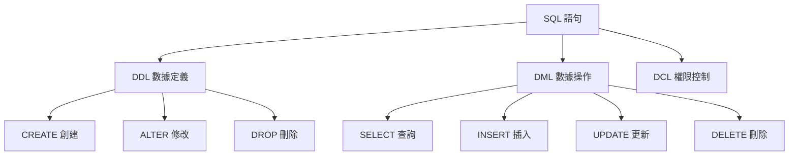

# 4.3 如何命令數據庫幹活——SQL 基礎操作：表/行/列、主鍵/外鍵、索引、事務、JOIN、CRUD

### 認知重構

SQL（Structured Query Language）是與數據庫對話的語言。雖然 Prisma 幫我們生成了大部分 SQL，但理解 SQL 基礎能讓你更好地調試問題和優化性能。

### SQL 語句分類



| 分類 | 說明 | 常用語句 |
|------|------|----------|
| **DDL** | 定義數據庫結構 | CREATE, ALTER, DROP |
| **DML** | 操作數據 | SELECT, INSERT, UPDATE, DELETE |
| **DCL** | 控制權限 | GRANT, REVOKE |

### 子章節導航

| 章節 | 主題 | 核心問題 |
|------|------|----------|
| 4.3.1 | DDL 數據定義 | 如何創建和修改表結構？ |
| 4.3.2 | DML 數據操作 | 如何增刪改查數據？ |
| 4.3.3 | 約束定義 | 如何保證數據質量？ |
| 4.3.4 | JOIN 查詢 | 如何關聯多張表？ |
| 4.3.5 | 聚合函數 | 如何統計和彙總數據？ |

### SQL vs Prisma 對照

| 操作 | SQL | Prisma |
|------|-----|--------|
| 創建表 | `CREATE TABLE` | `prisma migrate dev` |
| 插入 | `INSERT INTO` | `prisma.model.create()` |
| 查詢 | `SELECT` | `prisma.model.findMany()` |
| 更新 | `UPDATE` | `prisma.model.update()` |
| 刪除 | `DELETE` | `prisma.model.delete()` |
| 關聯查詢 | `JOIN` | `include: {}` |

### 學習建議

**如果你只用 Prisma**：
- 快速瀏覽本節，瞭解 SQL 基本概念
- 重點學習 JOIN（4.3.4）和聚合函數（4.3.5）的概念

**如果你需要寫原生 SQL**：
- 仔細學習每個子章節
- 練習在 Prisma 中執行原生 SQL

### 在 Prisma 中執行原生 SQL

```typescript
// 執行原生查詢
const result = await prisma.$queryRaw`
  SELECT * FROM users WHERE email LIKE '%@gmail.com'
`

// 執行原生命令（無返回值）
await prisma.$executeRaw`
  UPDATE users SET status = 'ACTIVE' WHERE last_login > NOW() - INTERVAL '30 days'
`
```

### AI 協作指南

**核心意圖**：讓 AI 幫你生成或解釋 SQL。

**常用提問模板**：
```
幫我寫一個 SQL 查詢：
- 表結構：[表結構]
- 需求：[查詢需求]
- 數據庫：PostgreSQL
```

```
這個 SQL 是什麼意思？請用中文解釋：
[SQL 語句]
```
