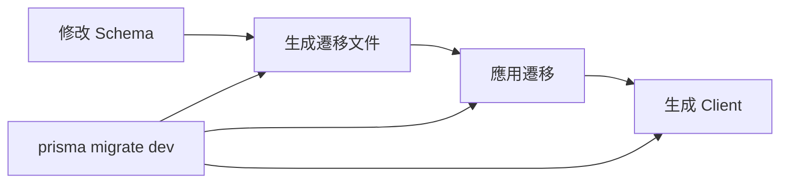

# 4.4.5 遷移與類型生成：db:generate / db:migrate

### 一句話破題

遷移是數據庫的"版本控制"——它記錄了每次結構變更，讓你能夠安全地演進數據庫。

### 遷移工作流程



### 開發環境遷移

**創建並應用遷移**：

```bash
npx prisma migrate dev --name init
```

這個命令會：
1. 檢測 Schema 變更
2. 生成 SQL 遷移文件
3. 應用遷移到數據庫
4. 重新生成 Prisma Client

**遷移文件結構**：

```
prisma/
├── migrations/
│   ├── 20240101120000_init/
│   │   └── migration.sql
│   ├── 20240102130000_add_posts/
│   │   └── migration.sql
│   └── migration_lock.toml
└── schema.prisma
```

**查看遷移文件內容**：

```sql
-- 20240101120000_init/migration.sql
CREATE TABLE "User" (
    "id" TEXT NOT NULL,
    "email" TEXT NOT NULL,
    "name" TEXT,
    "createdAt" TIMESTAMP(3) NOT NULL DEFAULT CURRENT_TIMESTAMP,
    
    CONSTRAINT "User_pkey" PRIMARY KEY ("id")
);

CREATE UNIQUE INDEX "User_email_key" ON "User"("email");
```

### 生成 Prisma Client

```bash
npx prisma generate
```

**何時需要運行**：
- 修改 schema.prisma 後
- 安裝依賴後（配合 `postinstall` 腳本）
- CI/CD 構建時

**自動生成配置**：

```json
// package.json
{
  "scripts": {
    "postinstall": "prisma generate"
  }
}
```

### db push vs migrate

| 命令 | 用途 | 場景 |
|------|------|------|
| `prisma db push` | 直接同步 Schema 到數據庫 | 原型開發、快速迭代 |
| `prisma migrate dev` | 生成遷移文件再應用 | 正式開發、團隊協作 |

```bash
# 原型階段：快速迭代，不生成遷移文件
npx prisma db push

# 正式開發：生成遷移文件，記錄變更歷史
npx prisma migrate dev --name add_user_role
```

### 生產環境遷移

```bash
# 只應用已有的遷移文件，不生成新的
npx prisma migrate deploy
```

**CI/CD 配置示例**：

```yaml
# .github/workflows/deploy.yml
- name: Apply migrations
  run: npx prisma migrate deploy
  env:
    DATABASE_URL: ${{ secrets.DATABASE_URL }}
```

### 遷移狀態管理

**查看遷移狀態**：

```bash
npx prisma migrate status
```

**重置數據庫**（開發環境）：

```bash
# 刪除所有數據，重新應用所有遷移
npx prisma migrate reset
```

::: danger 警告
`migrate reset` 會刪除所有數據！只在開發環境使用。
:::

### 處理遷移衝突

**場景**：團隊成員同時修改 Schema

```bash
# 1. 拉取最新代碼
git pull

# 2. 應用他人的遷移
npx prisma migrate dev

# 3. 如有衝突，手動解決後重新遷移
npx prisma migrate dev --name resolve_conflict
```

### 自定義遷移

**創建空遷移**（用於手動編寫 SQL）：

```bash
npx prisma migrate dev --create-only --name custom_migration
```

然後編輯生成的 `migration.sql` 文件：

```sql
-- 添加自定義 SQL
ALTER TABLE "User" ADD CONSTRAINT "email_format" 
CHECK (email ~* '^[A-Za-z0-9._%+-]+@[A-Za-z0-9.-]+\.[A-Za-z]{2,}$');
```

再應用：

```bash
npx prisma migrate dev
```

### 常用命令速查

| 命令 | 作用 |
|------|------|
| `prisma migrate dev` | 開發環境：生成並應用遷移 |
| `prisma migrate deploy` | 生產環境：應用遷移 |
| `prisma migrate reset` | 重置數據庫 |
| `prisma migrate status` | 查看遷移狀態 |
| `prisma db push` | 直接同步 Schema |
| `prisma generate` | 生成 Prisma Client |
| `prisma db pull` | 從數據庫生成 Schema |

### 避坑指南

1. **不要手動修改已應用的遷移文件**：會導致狀態不一致

2. **遷移文件要提交到 Git**：確保團隊成員的數據庫結構一致

3. **生產環境只用 `migrate deploy`**：不要在生產環境運行 `migrate dev`

4. **大型遷移分批執行**：避免鎖表時間過長

### 本節小結

- `prisma migrate dev` 用於開發環境遷移
- `prisma migrate deploy` 用於生產環境部署
- 遷移文件需要提交到版本控制
- `prisma generate` 生成類型安全的 Client
