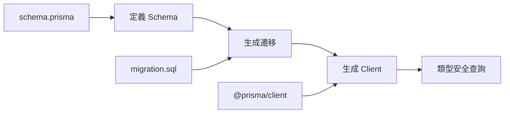
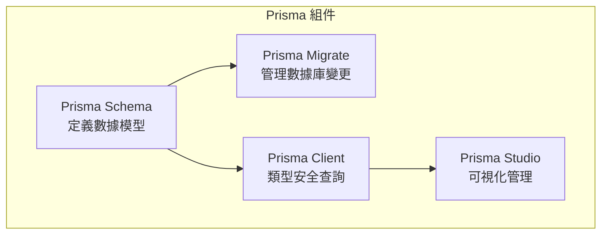

# 4.4 告別手寫 SQL——Prisma 實戰應用

### 認知重構

Prisma 是現代 TypeScript 項目的首選 ORM——它用類型安全的 API 取代了手寫 SQL，讓數據庫操作變得簡單、安全、可維護。

### 爲什麼選擇 Prisma？

| 特性 | Prisma | 傳統 ORM | 原生 SQL |
|------|--------|----------|----------|
| **類型安全** | 完全類型安全 | 部分支持 | 無 |
| **學習成本** | 低 | 中 | 高 |
| **遷移管理** | 內置 | 需配置 | 手動 |
| **查詢性能** | 優秀 | 一般 | 最佳 |
| **開發體驗** | 極佳 | 一般 | 差 |

### Prisma 工作流程



### 子章節導航

| 章節 | 主題 | 核心問題 |
|------|------|----------|
| 4.4.1 | 安裝配置 | 如何初始化 Prisma 項目？ |
| 4.4.2 | Schema 結構 | schema.prisma 文件怎麼寫？ |
| 4.4.3 | 模型定義 | 如何定義表和關係？ |
| 4.4.4 | 數據庫連接 | 如何配置數據庫連接？ |
| 4.4.5 | 遷移管理 | 如何管理數據庫變更？ |
| 4.4.6 | 種子數據 | 如何初始化測試數據？ |
| 4.4.7 | 建模實踐 | 真實項目如何設計模型？ |
| 4.4.8 | 查詢優化 | 如何優化 Prisma 查詢？ |
| 4.4.9 | 事務處理 | 如何保證數據一致性？ |

### Prisma 核心概念



### 快速體驗

```bash
# 1. 安裝
npm install prisma @prisma/client

# 2. 初始化
npx prisma init

# 3. 定義模型（schema.prisma）
# 4. 生成遷移
npx prisma migrate dev --name init

# 5. 使用
```

```typescript
import { PrismaClient } from '@prisma/client'
const prisma = new PrismaClient()

// 完全類型安全的查詢
const users = await prisma.user.findMany({
  where: { status: 'ACTIVE' },
  include: { posts: true }
})
```

### AI 協作指南

**核心意圖**：讓 AI 幫你生成 Prisma Schema 或查詢代碼。

**常用提問模板**：
```
幫我寫一個 Prisma Schema：
- 需求：[業務需求描述]
- 表：[需要的表]
- 關係：[表之間的關係]
```

```
幫我寫 Prisma 查詢：
- 模型：[相關模型]
- 需求：[查詢需求]
- 條件：[過濾條件]
```

### 學習路徑建議

**新手**：4.4.1 → 4.4.2 → 4.4.3 → 4.4.5 → 4.4.6
**進階**：4.4.4 → 4.4.7 → 4.4.8 → 4.4.9
