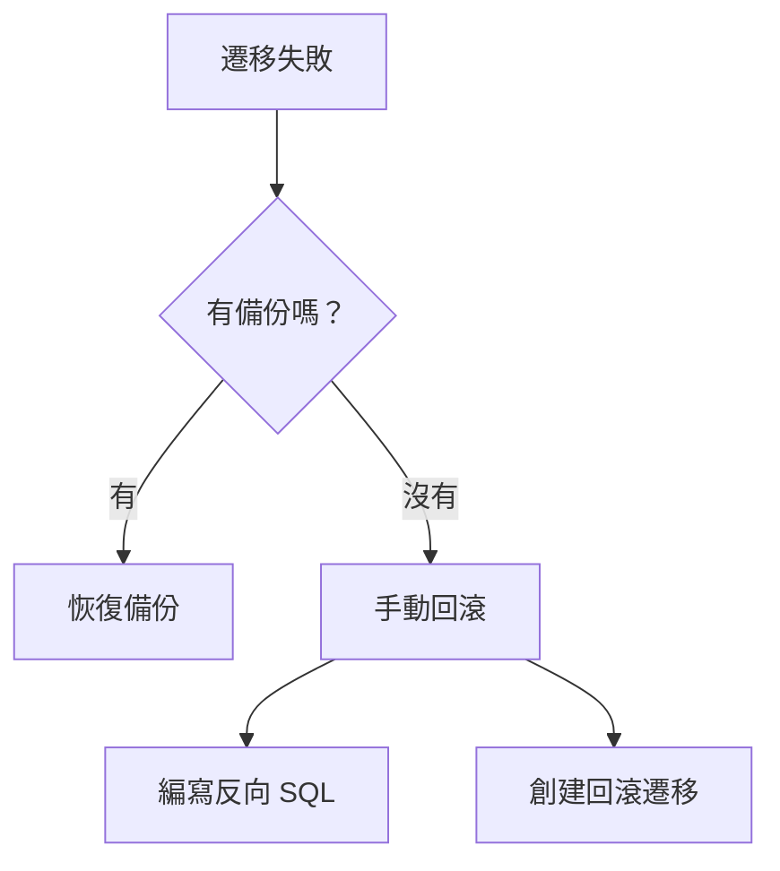

# 4.5.2 手術失敗了怎麼辦——回滾機制：遷移失敗的恢復方案

### 一句話破題

Prisma 沒有內置回滾命令——你需要自己準備回滾腳本或恢復備份。

### 回滾策略



### 預防措施：備份

**PostgreSQL 備份**：
```bash
# 備份
pg_dump -U postgres -d myapp > backup_$(date +%Y%m%d_%H%M%S).sql

# 恢復
psql -U postgres -d myapp < backup_20240101_120000.sql
```

**Supabase 備份**：
- 自動每日備份（Pro 計劃）
- 手動備份：Dashboard → Database → Backups

### 回滾方案一：恢復備份

```bash
# 1. 停止應用
pm2 stop all

# 2. 恢復數據庫
psql -U postgres -d myapp < backup.sql

# 3. 回退代碼版本
git checkout <previous-commit>

# 4. 重新部署
npm run deploy
```

### 回滾方案二：手動回滾遷移

**創建反向遷移**：

假設原遷移是添加字段：
```sql
-- 原遷移
ALTER TABLE users ADD COLUMN avatar TEXT;
```

創建回滾遷移：
```bash
npx prisma migrate dev --create-only --name rollback_avatar
```

編輯生成的 SQL：
```sql
-- 回滾遷移
ALTER TABLE users DROP COLUMN avatar;
```

應用回滾：
```bash
npx prisma migrate deploy
```

### 回滾方案三：標記遷移失敗

如果遷移執行了一半失敗：

```bash
# 標記遷移爲已回滾
npx prisma migrate resolve --rolled-back "20240101120000_failed_migration"
```

然後修復遷移文件後重新執行。

### 安全遷移模式

**分階段遷移**（避免破壞性變更）：

```
階段 1: 添加新字段（可空）
階段 2: 數據遷移
階段 3: 設置默認值/非空約束
階段 4: 刪除舊字段
```

**示例：重命名字段**

```sql
-- 階段 1: 添加新字段
ALTER TABLE users ADD COLUMN full_name TEXT;

-- 階段 2: 數據遷移
UPDATE users SET full_name = name;

-- 階段 3: 刪除舊字段（下次遷移）
ALTER TABLE users DROP COLUMN name;
```

### 遷移失敗常見原因

| 原因 | 解決方案 |
|------|----------|
| 數據不符合新約束 | 先清理數據再遷移 |
| 鎖表超時 | 在低峯期執行 |
| 磁盤空間不足 | 清理空間或擴容 |
| 權限不足 | 檢查數據庫用戶權限 |

### 回滾檢查清單

- [ ] 遷移前已備份數據庫
- [ ] 已準備回滾 SQL 腳本
- [ ] 已記錄當前應用版本
- [ ] 已通知相關人員
- [ ] 已準備回滾後的驗證步驟

### 本節小結

- Prisma 沒有自動回滾，需手動準備
- 生產遷移前必須備份
- 大變更拆分成多個小遷移
- 準備好回滾腳本和驗證步驟
