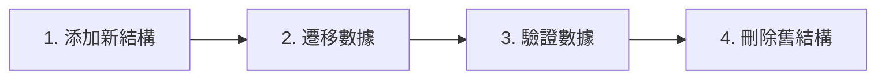

# 4.5.3 改表結構時數據怎麼辦——數據遷移：結構變更時的數據處理

### 一句話破題

數據遷移是結構遷移的延伸——不僅要改表結構，還要確保現有數據正確轉換到新結構。

### 常見數據遷移場景

| 場景 | 挑戰 | 解決方案 |
|------|------|----------|
| 添加非空字段 | 現有數據沒有值 | 設置默認值或先填充數據 |
| 重命名字段 | 數據需要複製 | 添加新字段 → 複製數據 → 刪除舊字段 |
| 拆分表 | 數據需要分發 | 創建新表 → 遷移數據 → 建立關聯 |
| 合併表 | 數據需要整合 | 創建新表 → 合併數據 → 刪除舊錶 |

### 場景一：添加非空字段

**問題**：現有數據沒有新字段的值

```prisma
model User {
  id    String @id
  email String
  role  String // 新增非空字段
}
```

**解決方案**：分步遷移

```bash
# 步驟 1: 添加可空字段
npx prisma migrate dev --create-only --name add_role_nullable
```

```sql
-- migration.sql
ALTER TABLE "User" ADD COLUMN "role" TEXT;
```

```bash
# 步驟 2: 填充數據
npx prisma migrate dev --create-only --name fill_role_data
```

```sql
-- migration.sql
UPDATE "User" SET "role" = 'USER' WHERE "role" IS NULL;
```

```bash
# 步驟 3: 設置非空約束
npx prisma migrate dev --create-only --name make_role_required
```

```sql
-- migration.sql
ALTER TABLE "User" ALTER COLUMN "role" SET NOT NULL;
```

### 場景二：重命名字段

```sql
-- 步驟 1: 添加新字段
ALTER TABLE "User" ADD COLUMN "fullName" TEXT;

-- 步驟 2: 複製數據
UPDATE "User" SET "fullName" = "name";

-- 步驟 3: 刪除舊字段（可選，下次遷移）
ALTER TABLE "User" DROP COLUMN "name";
```

### 場景三：拆分一對多關係

將 User 表中的 addresses 數組拆分爲獨立的 Address 表：

```sql
-- 步驟 1: 創建新表
CREATE TABLE "Address" (
  "id" TEXT PRIMARY KEY,
  "userId" TEXT NOT NULL REFERENCES "User"("id"),
  "street" TEXT,
  "city" TEXT
);

-- 步驟 2: 遷移數據（應用層處理）
-- 需要編寫腳本遍歷 User.addresses 並插入到 Address 表

-- 步驟 3: 刪除舊字段
ALTER TABLE "User" DROP COLUMN "addresses";
```

### 編寫數據遷移腳本

```typescript
// scripts/migrate-data.ts
import { PrismaClient } from '@prisma/client'

const prisma = new PrismaClient()

async function migrateUserRoles() {
  const users = await prisma.user.findMany({
    where: { role: null }
  })
  
  console.log(`Found ${users.length} users without role`)
  
  for (const user of users) {
    await prisma.user.update({
      where: { id: user.id },
      data: { role: 'USER' }
    })
  }
  
  console.log('Migration completed')
}

migrateUserRoles()
  .catch(console.error)
  .finally(() => prisma.$disconnect())
```

運行腳本：
```bash
npx tsx scripts/migrate-data.ts
```

### 大數據量遷移策略

**批量處理**：
```typescript
async function batchMigrate() {
  const batchSize = 1000
  let processed = 0
  
  while (true) {
    const users = await prisma.user.findMany({
      where: { role: null },
      take: batchSize
    })
    
    if (users.length === 0) break
    
    await prisma.user.updateMany({
      where: { id: { in: users.map(u => u.id) } },
      data: { role: 'USER' }
    })
    
    processed += users.length
    console.log(`Processed ${processed} users`)
  }
}
```

### 遷移順序建議



### 驗證數據遷移

```typescript
async function verifyMigration() {
  const nullRoleCount = await prisma.user.count({
    where: { role: null }
  })
  
  if (nullRoleCount > 0) {
    throw new Error(`Still have ${nullRoleCount} users without role`)
  }
  
  console.log('Verification passed!')
}
```

### 本節小結

- 數據遷移通常需要分多步執行
- 添加非空字段：先可空 → 填充數據 → 設非空
- 重命名字段：添加新 → 複製數據 → 刪除舊
- 大數據量使用批量處理
- 遷移後務必驗證數據
