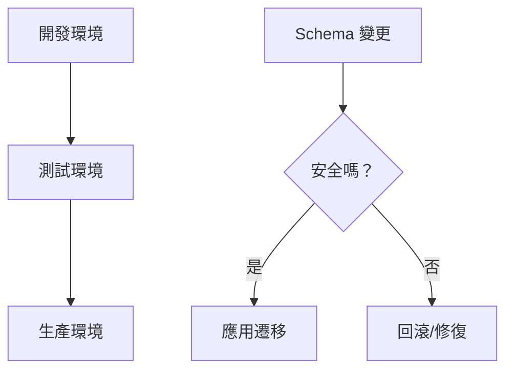

# 4.5 線上數據庫動手術——數據庫遷移策略：生產環境的變更管理

### 認知重構

生產環境的數據庫變更就像給飛行中的飛機換引擎——需要極其謹慎的策略和充分的準備。

### 爲什麼遷移很重要？



**遷移失敗的後果**：
- 服務中斷
- 數據丟失
- 用戶流失

### 子章節導航

| 章節 | 主題 | 核心問題 |
|------|------|----------|
| 4.5.1 | 環境同步 | 如何保證開發/測試/生產環境一致？ |
| 4.5.2 | 回滾機制 | 遷移失敗了怎麼恢復？ |
| 4.5.3 | 數據遷移 | 改表結構時數據怎麼處理？ |

### 遷移的基本原則

1. **先備份**：生產環境遷移前必須備份
2. **先測試**：在測試環境驗證遷移腳本
3. **小步快跑**：大變更拆分成多個小遷移
4. **可回滾**：每次遷移都要有回滾方案

### Prisma 遷移工作流

**開發環境**：
```bash
npx prisma migrate dev --name add_user_role
```

**生產環境**：
```bash
npx prisma migrate deploy
```

| 命令 | 環境 | 作用 |
|------|------|------|
| `migrate dev` | 開發 | 生成並應用遷移 |
| `migrate deploy` | 生產 | 只應用已有遷移 |
| `migrate reset` | 開發 | 重置數據庫 |

### 遷移前檢查清單

- [ ] 已在本地測試遷移
- [ ] 已在測試環境驗證
- [ ] 已備份生產數據庫
- [ ] 瞭解遷移的預計執行時間
- [ ] 準備好回滾方案
- [ ] 安排在低峯期執行

### 本章小結

- 生產遷移需要謹慎策略
- 使用 `migrate deploy` 部署生產環境
- 始終先備份、先測試
- 準備回滾方案應對失敗
