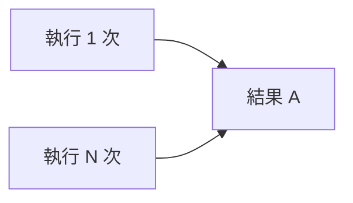

# 4.6.1 重複執行也不怕——多環境與冪等造數

### 一句話破題

冪等種子腳本的核心是"無論執行多少次，結果都一樣"——不會重複創建，也不會報錯失敗。

### 什麼是冪等性？



**非冪等腳本**：每次執行都創建新數據，導致數據膨脹或唯一約束報錯

**冪等腳本**：已存在則跳過或更新，不存在則創建

### 實現冪等的三種方式

#### 方式一：upsert（推薦）

```typescript
await prisma.user.upsert({
  where: { email: 'admin@example.com' },
  update: { name: 'Admin User' },  // 已存在時更新
  create: {                        // 不存在時創建
    email: 'admin@example.com',
    name: 'Admin User',
    role: 'ADMIN'
  }
})
```

#### 方式二：createMany + skipDuplicates

```typescript
await prisma.user.createMany({
  data: [
    { email: 'user1@example.com', name: 'User 1' },
    { email: 'user2@example.com', name: 'User 2' }
  ],
  skipDuplicates: true  // 跳過已存在的記錄
})
```

#### 方式三：先查詢再決定

```typescript
const existingUser = await prisma.user.findUnique({
  where: { email: 'admin@example.com' }
})

if (!existingUser) {
  await prisma.user.create({
    data: { email: 'admin@example.com', name: 'Admin' }
  })
}
```

### 多環境種子策略

```typescript
// prisma/seed.ts
async function main() {
  const env = process.env.NODE_ENV || 'development'
  
  // 所有環境都需要的基礎數據
  await seedBaseData()
  
  // 根據環境執行不同的種子
  switch (env) {
    case 'development':
      await seedDevelopmentData()
      break
    case 'test':
      await seedTestData()
      break
    case 'staging':
      await seedStagingData()
      break
  }
}

async function seedBaseData() {
  // 管理員賬戶、系統配置等
  await prisma.user.upsert({
    where: { email: 'admin@example.com' },
    update: {},
    create: {
      email: 'admin@example.com',
      name: 'Admin',
      role: 'ADMIN'
    }
  })
}

async function seedDevelopmentData() {
  // 開發環境：大量測試數據
  const users = Array.from({ length: 50 }, (_, i) => ({
    email: `user${i}@example.com`,
    name: faker.person.fullName()
  }))
  
  await prisma.user.createMany({
    data: users,
    skipDuplicates: true
  })
}

async function seedTestData() {
  // 測試環境：最小必要數據
  await prisma.user.upsert({
    where: { email: 'test@example.com' },
    update: {},
    create: {
      email: 'test@example.com',
      name: 'Test User'
    }
  })
}
```

### 使用固定 ID 保證一致性

```typescript
// 使用固定的 UUID 確保冪等
const ADMIN_ID = 'aaaaaaaa-0000-0000-0000-000000000001'
const TEST_USER_ID = 'aaaaaaaa-0000-0000-0000-000000000002'

await prisma.user.upsert({
  where: { id: ADMIN_ID },
  update: {},
  create: {
    id: ADMIN_ID,
    email: 'admin@example.com',
    name: 'Admin'
  }
})
```

### 處理關聯數據

```typescript
async function seedWithRelations() {
  // 先創建父級數據
  const user = await prisma.user.upsert({
    where: { email: 'author@example.com' },
    update: {},
    create: {
      email: 'author@example.com',
      name: 'Author'
    }
  })
  
  // 再創建子級數據（使用唯一標識）
  await prisma.post.upsert({
    where: { 
      // 需要複合唯一索引或其他唯一字段
      slug: 'first-post'
    },
    update: {},
    create: {
      slug: 'first-post',
      title: 'First Post',
      authorId: user.id
    }
  })
}
```

### 執行順序控制

```typescript
async function main() {
  // 按依賴順序執行
  await seedUsers()      // 1. 用戶
  await seedCategories() // 2. 分類
  await seedPosts()      // 3. 文章（依賴用戶和分類）
  await seedComments()   // 4. 評論（依賴文章和用戶）
}
```

### 本節小結

- 使用 `upsert` 是最簡單的冪等方案
- `createMany + skipDuplicates` 適合批量插入
- 根據環境變量切換不同的種子策略
- 使用固定 ID 確保跨環境一致性
