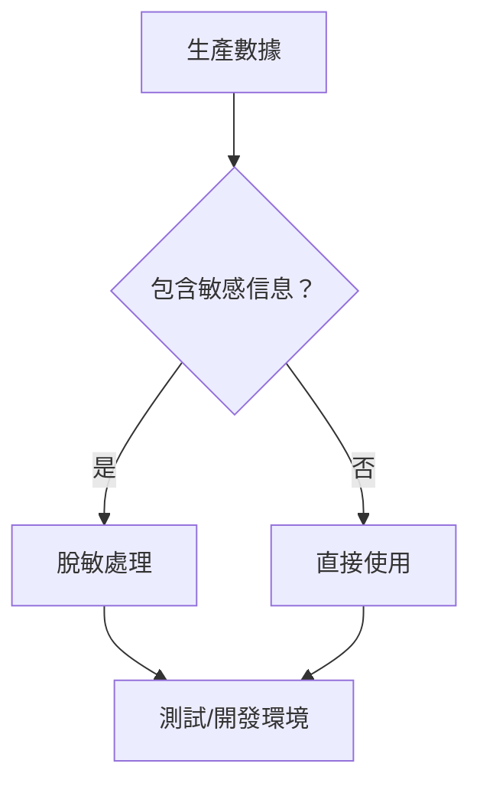
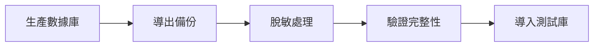

# 4.6.3 生產數據不能明文給測試——生產數據脫敏與測試數據生成

### 一句話破題

生產數據是調試的最佳素材，但直接使用會泄露隱私——脫敏是讓數據"可用但不可識別"的關鍵技術。

### 爲什麼需要脫敏？



**敏感信息類型**：
- 個人身份信息（姓名、身份證、手機號）
- 認證信息（密碼、Token）
- 財務信息（銀行卡、交易記錄）
- 業務敏感數據

### 脫敏策略

| 策略 | 說明 | 示例 |
|------|------|------|
| **替換** | 用假數據替換 | 張三 → 用戶A |
| **遮蔽** | 部分隱藏 | 13812345678 → 138****5678 |
| **哈希** | 不可逆轉換 | email → hash(email) |
| **隨機化** | 完全隨機 | 真實數據 → faker數據 |
| **保留格式** | 保持格式一致 | 有效手機號 → 假手機號 |

### 脫敏腳本示例

```typescript
// scripts/sanitize.ts
import { PrismaClient } from '@prisma/client'
import { faker } from '@faker-js/faker'
import crypto from 'crypto'

const prisma = new PrismaClient()

async function sanitizeUsers() {
  const users = await prisma.user.findMany()
  
  for (const user of users) {
    await prisma.user.update({
      where: { id: user.id },
      data: {
        // 替換姓名
        name: faker.person.fullName(),
        // 保留格式的郵箱
        email: `user_${hashId(user.id)}@example.com`,
        // 替換手機號
        phone: faker.phone.number(),
        // 重置密碼爲統一測試密碼
        password: await hashPassword('test123456')
      }
    })
  }
}

function hashId(id: string): string {
  return crypto.createHash('md5').update(id).digest('hex').slice(0, 8)
}

async function main() {
  console.log('Starting data sanitization...')
  await sanitizeUsers()
  await sanitizeOrders()
  await sanitizePayments()
  console.log('Sanitization completed!')
}

main()
  .catch(console.error)
  .finally(() => prisma.$disconnect())
```

### 分字段脫敏

```typescript
// lib/sanitizers.ts
export const sanitizers = {
  // 姓名：完全替換
  name: () => faker.person.fullName(),
  
  // 郵箱：保留域名結構
  email: (original: string) => {
    const domain = original.split('@')[1] || 'example.com'
    return `user_${faker.string.alphanumeric(8)}@${domain}`
  },
  
  // 手機號：遮蔽中間4位
  phone: (original: string) => {
    return original.slice(0, 3) + '****' + original.slice(-4)
  },
  
  // 身份證：保留前6後4
  idCard: (original: string) => {
    return original.slice(0, 6) + '********' + original.slice(-4)
  },
  
  // 地址：只保留城市
  address: (original: string) => {
    const city = original.match(/.+?(市|區)/)?.[0] || ''
    return city + faker.location.streetAddress()
  },
  
  // 金額：保留數量級
  amount: (original: number) => {
    const magnitude = Math.floor(Math.log10(original))
    return faker.number.float({
      min: 10 ** magnitude,
      max: 10 ** (magnitude + 1),
      fractionDigits: 2
    })
  }
}
```

### 生產數據導出流程



```bash
# 1. 導出生產數據
pg_dump -U postgres -d production > prod_backup.sql

# 2. 導入到臨時庫
psql -U postgres -d temp_sanitize < prod_backup.sql

# 3. 運行脫敏腳本
DATABASE_URL=postgresql://localhost/temp_sanitize npx tsx scripts/sanitize.ts

# 4. 導出脫敏後的數據
pg_dump -U postgres -d temp_sanitize > sanitized_backup.sql

# 5. 導入到測試環境
psql -U postgres -d test < sanitized_backup.sql
```

### 使用 Faker 生成真實感數據

```typescript
import { faker } from '@faker-js/faker'

// 設置中文環境
faker.locale = 'zh_CN'

// 生成用戶數據
function generateUser() {
  return {
    name: faker.person.fullName(),
    email: faker.internet.email(),
    phone: faker.phone.number(),
    avatar: faker.image.avatar(),
    bio: faker.lorem.paragraph(),
    createdAt: faker.date.past()
  }
}

// 生成訂單數據
function generateOrder(userId: string) {
  return {
    userId,
    orderNo: faker.string.alphanumeric(16).toUpperCase(),
    amount: faker.number.float({ min: 10, max: 1000, fractionDigits: 2 }),
    status: faker.helpers.arrayElement(['PENDING', 'PAID', 'SHIPPED', 'COMPLETED']),
    createdAt: faker.date.recent()
  }
}
```

### 脫敏驗證檢查

```typescript
async function verifySanitization() {
  // 檢查是否還有真實郵箱
  const realEmails = await prisma.user.count({
    where: {
      email: { not: { contains: '@example.com' } }
    }
  })
  
  if (realEmails > 0) {
    throw new Error(`Found ${realEmails} unsanitized emails!`)
  }
  
  // 檢查密碼是否統一重置
  const users = await prisma.user.findMany({
    select: { password: true }
  })
  
  const uniquePasswords = new Set(users.map(u => u.password))
  if (uniquePasswords.size !== 1) {
    console.warn('Warning: Passwords are not uniformly reset')
  }
  
  console.log('Sanitization verification passed!')
}
```

### 自動化脫敏管道

```yaml
# .github/workflows/sanitize.yml
name: Sanitize Production Data

on:
  schedule:
    - cron: '0 0 * * 0'  # 每週日執行

jobs:
  sanitize:
    runs-on: ubuntu-latest
    steps:
      - uses: actions/checkout@v4
      
      - name: Export production data
        run: |
          pg_dump $PROD_DATABASE_URL > backup.sql
        env:
          PROD_DATABASE_URL: ${{ secrets.PROD_DATABASE_URL }}
          
      - name: Create temp database
        run: |
          createdb temp_sanitize
          psql -d temp_sanitize < backup.sql
          
      - name: Run sanitization
        run: npx tsx scripts/sanitize.ts
        env:
          DATABASE_URL: postgresql://localhost/temp_sanitize
          
      - name: Export sanitized data
        run: pg_dump temp_sanitize > sanitized.sql
        
      - name: Upload artifact
        uses: actions/upload-artifact@v4
        with:
          name: sanitized-data
          path: sanitized.sql
```

### 本節小結

- 生產數據脫敏是合規和安全的必要步驟
- 根據數據類型選擇合適的脫敏策略
- 使用 Faker 生成真實感的測試數據
- 建立自動化脫敏管道保持數據新鮮
