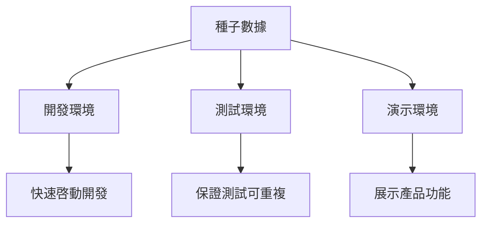

# 4.6 如何批量製造假數據——種子數據高級應用：多環境數據管理

### 認知重構

種子數據不只是"造假數據"——它是開發效率的倍增器，是測試質量的保障，是團隊協作的基礎。

### 種子數據的多重身份



### 子章節導航

| 章節 | 主題 | 核心問題 |
|------|------|----------|
| 4.6.1 | 冪等造數 | 如何讓種子腳本可以重複執行？ |
| 4.6.2 | 測試清理 | 測試前後的數據如何管理？ |
| 4.6.3 | 數據脫敏 | 如何安全使用生產數據做測試？ |

### 基礎種子腳本回顧

```typescript
// prisma/seed.ts
import { PrismaClient } from '@prisma/client'
import { faker } from '@faker-js/faker'

const prisma = new PrismaClient()

async function main() {
  // 創建用戶
  const user = await prisma.user.upsert({
    where: { email: 'admin@example.com' },
    update: {},
    create: {
      email: 'admin@example.com',
      name: 'Admin',
      role: 'ADMIN'
    }
  })

  // 批量創建測試數據
  for (let i = 0; i < 10; i++) {
    await prisma.post.create({
      data: {
        title: faker.lorem.sentence(),
        content: faker.lorem.paragraphs(3),
        authorId: user.id
      }
    })
  }
}

main()
  .catch(console.error)
  .finally(() => prisma.$disconnect())
```

### 運行種子

```bash
# 執行種子腳本
npx prisma db seed

# 重置數據庫並執行種子
npx prisma migrate reset
```

### 本章小結

- 種子數據服務於開發、測試、演示多種場景
- 使用 `upsert` 實現冪等性
- 使用 Faker 生成真實感的測試數據
- 根據環境定製不同的數據策略
