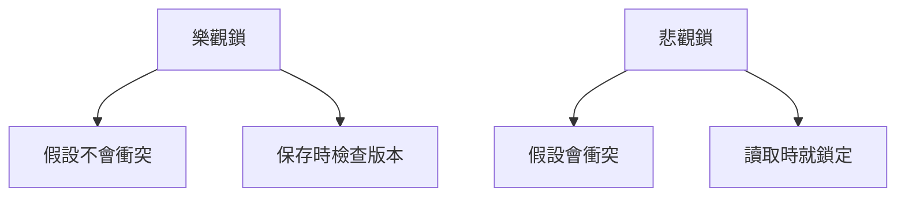

# 4.7.2 同時修改了怎麼辦——衝突檢測：併發修改的識別機制

### 一句話破題

衝突檢測的核心是"知道數據被改過"——通過版本號或時間戳，在保存時判斷數據是否已被他人修改。

### 樂觀鎖 vs 悲觀鎖



| 類型 | 策略 | 適用場景 |
|------|------|----------|
| **樂觀鎖** | 先修改，保存時檢測衝突 | 衝突概率低 |
| **悲觀鎖** | 先鎖定，確保獨佔修改 | 衝突概率高 |

### 樂觀鎖：版本號方案

```prisma
model Post {
  id        String   @id @default(cuid())
  title     String
  content   String
  version   Int      @default(1)
  updatedAt DateTime @updatedAt
}
```

```typescript
// 更新時檢查版本
async function updatePost(id: string, data: PostData, version: number) {
  const result = await prisma.post.updateMany({
    where: {
      id,
      version  // 只有版本匹配才更新
    },
    data: {
      ...data,
      version: { increment: 1 }
    }
  })
  
  if (result.count === 0) {
    throw new Error('CONFLICT: 數據已被他人修改')
  }
  
  return prisma.post.findUnique({ where: { id } })
}
```

### API 層實現

```typescript
// app/api/posts/[id]/route.ts
export async function PUT(
  request: Request,
  { params }: { params: { id: string } }
) {
  const body = await request.json()
  const { title, content, version } = body
  
  try {
    const post = await updatePost(params.id, { title, content }, version)
    return Response.json(post)
  } catch (error) {
    if (error.message.includes('CONFLICT')) {
      return Response.json(
        { error: '數據已被他人修改，請刷新後重試' },
        { status: 409 }
      )
    }
    throw error
  }
}
```

### 前端處理衝突

```typescript
async function savePost(post: Post) {
  const response = await fetch(`/api/posts/${post.id}`, {
    method: 'PUT',
    body: JSON.stringify({
      title: post.title,
      content: post.content,
      version: post.version  // 攜帶當前版本號
    })
  })
  
  if (response.status === 409) {
    // 衝突處理
    const confirmRefresh = confirm('數據已被他人修改，是否刷新獲取最新數據？')
    if (confirmRefresh) {
      await refreshPost(post.id)
    }
    return
  }
  
  return response.json()
}
```

### 使用 updatedAt 作爲版本

```typescript
async function updatePost(id: string, data: PostData, lastUpdatedAt: Date) {
  const result = await prisma.post.updateMany({
    where: {
      id,
      updatedAt: lastUpdatedAt  // 時間戳作爲版本
    },
    data
  })
  
  if (result.count === 0) {
    throw new Error('CONFLICT')
  }
  
  return prisma.post.findUnique({ where: { id } })
}
```

### 悲觀鎖：SELECT FOR UPDATE

```typescript
async function transferBalance(fromId: string, toId: string, amount: number) {
  return prisma.$transaction(async (tx) => {
    // 鎖定記錄
    const [from, to] = await Promise.all([
      tx.$queryRaw`SELECT * FROM "Account" WHERE id = ${fromId} FOR UPDATE`,
      tx.$queryRaw`SELECT * FROM "Account" WHERE id = ${toId} FOR UPDATE`
    ])
    
    if (from.balance < amount) {
      throw new Error('餘額不足')
    }
    
    // 執行轉賬
    await tx.account.update({
      where: { id: fromId },
      data: { balance: { decrement: amount } }
    })
    
    await tx.account.update({
      where: { id: toId },
      data: { balance: { increment: amount } }
    })
  })
}
```

### 使用 ETag 頭

```typescript
// GET 響應中返回 ETag
export async function GET(
  request: Request,
  { params }: { params: { id: string } }
) {
  const post = await prisma.post.findUnique({
    where: { id: params.id }
  })
  
  const etag = `"${post.version}"`
  
  return Response.json(post, {
    headers: { 'ETag': etag }
  })
}

// PUT 請求中使用 If-Match
export async function PUT(
  request: Request,
  { params }: { params: { id: string } }
) {
  const ifMatch = request.headers.get('If-Match')
  const version = ifMatch ? parseInt(ifMatch.replace(/"/g, '')) : null
  
  if (!version) {
    return Response.json(
      { error: '缺少 If-Match 頭' },
      { status: 428 }
    )
  }
  
  // ... 使用 version 進行樂觀鎖更新
}
```

### 檢測策略選擇

| 場景 | 推薦策略 |
|------|----------|
| 普通表單編輯 | 樂觀鎖 + 版本號 |
| 協同編輯文檔 | 樂觀鎖 + OT/CRDT |
| 金融交易 | 悲觀鎖 |
| 庫存扣減 | 悲觀鎖或樂觀鎖重試 |

### 本節小結

- 樂觀鎖適合衝突概率低的場景
- 悲觀鎖適合衝突概率高的關鍵業務
- 版本號或 updatedAt 是最常用的樂觀鎖標識
- HTTP 409 狀態碼錶示衝突
