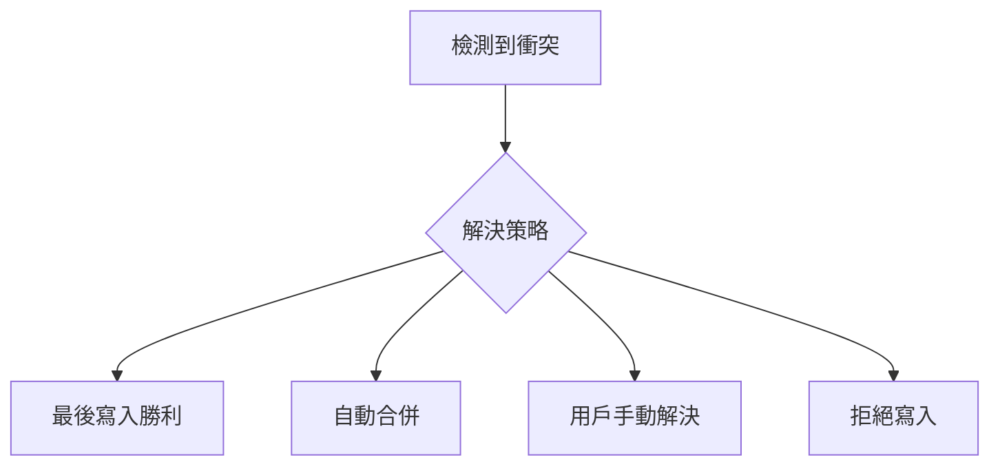
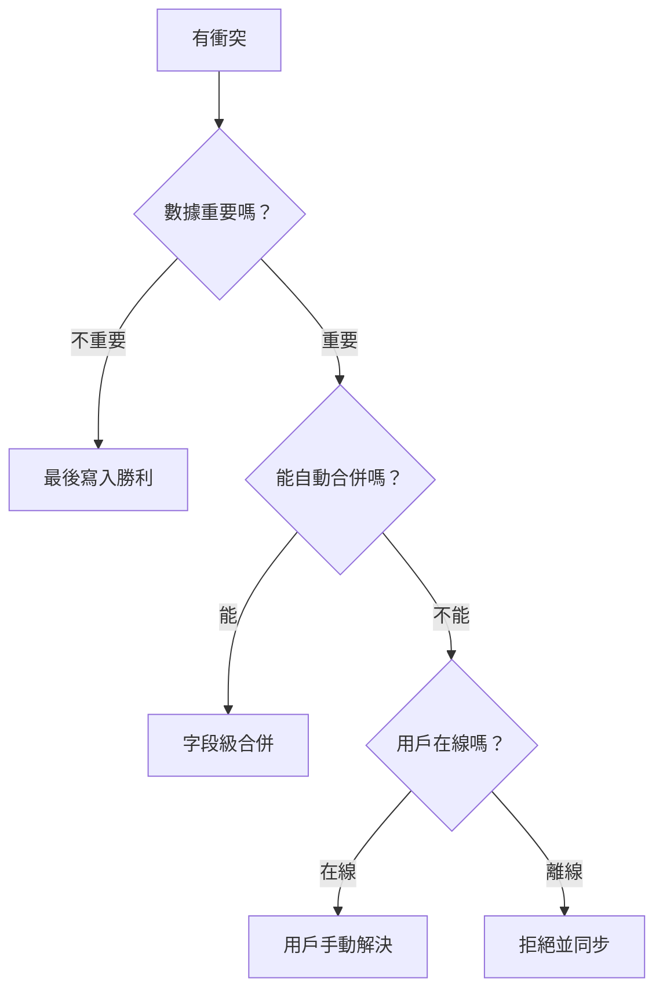

# 4.7.3 衝突了聽誰的——衝突解決：最後寫入勝利 vs 合併策略

### 一句話破題

衝突解決沒有"最好"的策略——需要根據業務場景在"誰贏"、"合併"、"用戶決定"之間做選擇。

### 衝突解決策略



| 策略 | 說明 | 適用場景 |
|------|------|----------|
| **最後寫入勝利** | 後到的覆蓋先到的 | 簡單場景，數據不重要 |
| **自動合併** | 按字段或規則合併 | 字段獨立修改 |
| **用戶手動解決** | 展示差異讓用戶選擇 | 複雜內容編輯 |
| **拒絕寫入** | 返回 409 要求刷新 | 數據準確性優先 |

### 最後寫入勝利（LWW）

```typescript
// 簡單粗暴：直接覆蓋
async function updatePost(id: string, data: PostData) {
  return prisma.post.update({
    where: { id },
    data
  })
}
```

**適用場景**：
- 用戶個人設置
- 不太重要的元數據
- 離線優先應用的同步

### 字段級合併

```typescript
async function mergePost(
  id: string, 
  updates: Partial<PostData>,
  baseVersion: number
) {
  const current = await prisma.post.findUnique({
    where: { id }
  })
  
  if (!current || current.version === baseVersion) {
    // 沒有衝突，直接更新
    return prisma.post.update({
      where: { id },
      data: { ...updates, version: { increment: 1 } }
    })
  }
  
  // 字段級合併
  const merged: Partial<PostData> = {}
  
  for (const [key, value] of Object.entries(updates)) {
    // 如果該字段未被他人修改，則採用本次更新
    // 簡化邏輯：這裏需要記錄每個字段的修改歷史
    merged[key] = value
  }
  
  return prisma.post.update({
    where: { id },
    data: { ...merged, version: { increment: 1 } }
  })
}
```

### 用戶手動解決

```typescript
// 檢測衝突並返回兩個版本供用戶選擇
async function updateWithConflictDetection(
  id: string,
  data: PostData,
  version: number
) {
  const current = await prisma.post.findUnique({
    where: { id }
  })
  
  if (current.version !== version) {
    // 返回衝突信息
    return {
      conflict: true,
      yourVersion: data,
      serverVersion: current,
      message: '數據已被他人修改'
    }
  }
  
  return prisma.post.update({
    where: { id },
    data: { ...data, version: { increment: 1 } }
  })
}
```

```typescript
// 前端展示衝突解決界面
function ConflictResolver({ yourVersion, serverVersion, onResolve }) {
  return (
    <div className="conflict-modal">
      <h3>檢測到衝突</h3>
      <div className="versions">
        <div className="your-version">
          <h4>你的版本</h4>
          <pre>{JSON.stringify(yourVersion, null, 2)}</pre>
        </div>
        <div className="server-version">
          <h4>服務器版本</h4>
          <pre>{JSON.stringify(serverVersion, null, 2)}</pre>
        </div>
      </div>
      <div className="actions">
        <button onClick={() => onResolve('mine')}>使用我的版本</button>
        <button onClick={() => onResolve('theirs')}>使用服務器版本</button>
        <button onClick={() => onResolve('manual')}>手動合併</button>
      </div>
    </div>
  )
}
```

### 基於時間戳的合併

```typescript
interface FieldWithTimestamp<T> {
  value: T
  updatedAt: Date
}

// 每個字段都記錄最後更新時間
async function mergeByTimestamp(
  id: string,
  updates: Record<string, FieldWithTimestamp<any>>
) {
  const current = await prisma.post.findUnique({
    where: { id }
  })
  
  const merged: Record<string, any> = {}
  
  for (const [field, update] of Object.entries(updates)) {
    const currentField = current[field + 'UpdatedAt']
    
    // 誰的時間戳更新，就用誰的值
    if (!currentField || update.updatedAt > currentField) {
      merged[field] = update.value
      merged[field + 'UpdatedAt'] = update.updatedAt
    }
  }
  
  return prisma.post.update({
    where: { id },
    data: merged
  })
}
```

### 業務規則優先

```typescript
// 庫存扣減：不能超賣
async function reduceStock(productId: string, quantity: number) {
  return prisma.$transaction(async (tx) => {
    const product = await tx.product.findUnique({
      where: { id: productId }
    })
    
    // 業務規則：庫存不能爲負
    if (product.stock < quantity) {
      throw new Error('庫存不足')
    }
    
    return tx.product.update({
      where: { id: productId },
      data: { stock: { decrement: quantity } }
    })
  })
}

// 點贊計數：可以合併
async function incrementLikes(postId: string) {
  // 使用原子操作，不會有衝突
  return prisma.post.update({
    where: { id: postId },
    data: { likes: { increment: 1 } }
  })
}
```

### 策略選擇決策樹



### 本節小結

- 最後寫入勝利最簡單，但可能丟失數據
- 字段級合併適合字段獨立修改的場景
- 複雜內容衝突需要用戶手動解決
- 原子操作（increment/decrement）可避免數值衝突
