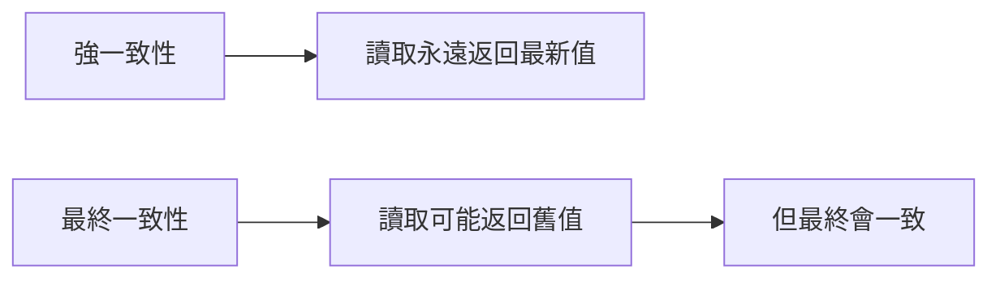
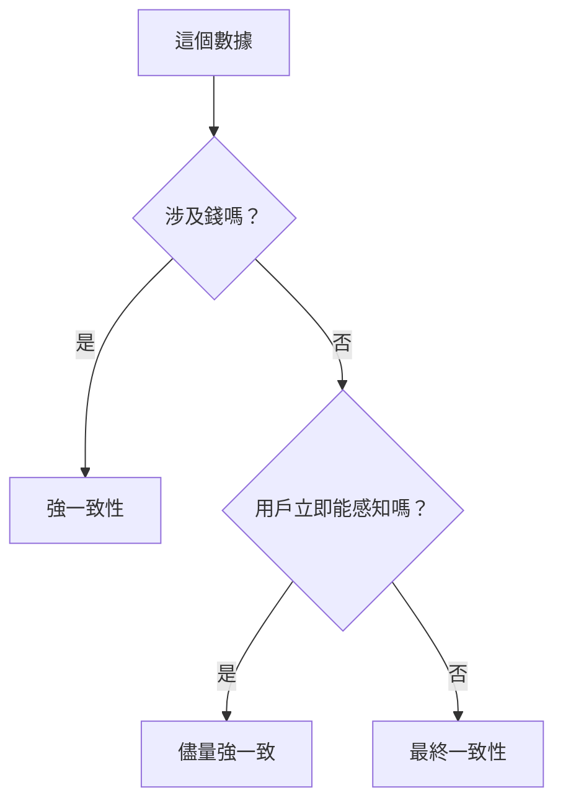

# 4.7.4 數據不一致了怎麼辦——數據一致性：最終一致性與強一致性

### 一句話破題

強一致性保證"立即看到最新數據"，最終一致性保證"遲早會看到最新數據"——選擇取決於業務對"即時性"的要求。

### 一致性級別



| 類型 | 說明 | 示例 |
|------|------|------|
| **強一致性** | 寫入後立即可見 | 銀行轉賬 |
| **最終一致性** | 寫入後一段時間可見 | 社交媒體點贊數 |

### 爲什麼會不一致？

1. **緩存延遲**：數據庫更新了，但緩存還是舊的
2. **複製延遲**：主庫更新了，從庫還沒同步
3. **客戶端緩存**：服務器更新了，瀏覽器還是舊數據

### 場景一：緩存導致的不一致

```typescript
// 問題：更新後緩存未失效
async function updateUser(id: string, data: UserData) {
  await prisma.user.update({
    where: { id },
    data
  })
  // 緩存還是舊數據！
}

// 解決：更新後失效緩存
async function updateUser(id: string, data: UserData) {
  const user = await prisma.user.update({
    where: { id },
    data
  })
  
  // 失效緩存
  await redis.del(`user:${id}`)
  
  return user
}
```

### 場景二：讀寫分離導致的不一致

```typescript
// 問題：寫主庫後立即讀從庫
async function createPostAndRedirect(data: PostData) {
  const post = await prisma.post.create({ data })  // 寫入主庫
  
  // 立即跳轉詳情頁
  redirect(`/posts/${post.id}`)  // 從庫可能還沒同步
}

// 解決方案 1：寫後讀走主庫
async function getPost(id: string, forceMain = false) {
  if (forceMain) {
    return prismaMain.post.findUnique({ where: { id } })
  }
  return prismaReplica.post.findUnique({ where: { id } })
}

// 解決方案 2：創建後延遲跳轉
async function createPostAndRedirect(data: PostData) {
  const post = await prisma.post.create({ data })
  
  // 短暫等待同步
  await new Promise(resolve => setTimeout(resolve, 100))
  
  redirect(`/posts/${post.id}`)
}
```

### 場景三：前端緩存不一致

```typescript
// 使用 SWR 的樂觀更新
import useSWR, { mutate } from 'swr'

function usePost(id: string) {
  return useSWR(`/api/posts/${id}`)
}

async function updatePost(id: string, data: PostData) {
  // 樂觀更新：立即更新本地緩存
  mutate(
    `/api/posts/${id}`,
    { ...data },
    false  // 不重新驗證
  )
  
  // 發送請求
  await fetch(`/api/posts/${id}`, {
    method: 'PUT',
    body: JSON.stringify(data)
  })
  
  // 重新驗證確保一致
  mutate(`/api/posts/${id}`)
}
```

### 保證強一致性的場景

**金融交易**：

```typescript
async function transfer(from: string, to: string, amount: number) {
  return prisma.$transaction(async (tx) => {
    // 在事務中完成所有操作
    const fromAccount = await tx.account.update({
      where: { id: from },
      data: { balance: { decrement: amount } }
    })
    
    if (fromAccount.balance < 0) {
      throw new Error('餘額不足')
    }
    
    await tx.account.update({
      where: { id: to },
      data: { balance: { increment: amount } }
    })
    
    // 記錄交易
    await tx.transaction.create({
      data: { from, to, amount }
    })
  }, {
    isolationLevel: 'Serializable'  // 最高隔離級別
  })
}
```

### 可接受最終一致性的場景

**點贊計數**：

```typescript
// 立即返回，後臺異步更新
async function likePost(postId: string, userId: string) {
  // 記錄點贊
  await prisma.like.create({
    data: { postId, userId }
  })
  
  // 異步更新計數（可能有延遲）
  updateLikeCountAsync(postId)
  
  return { success: true }
}

async function updateLikeCountAsync(postId: string) {
  const count = await prisma.like.count({
    where: { postId }
  })
  
  await prisma.post.update({
    where: { id: postId },
    data: { likeCount: count }
  })
}
```

### 一致性保證策略

| 策略 | 實現方式 | 代價 |
|------|----------|------|
| 數據庫事務 | `$transaction` | 性能開銷 |
| 寫後讀主庫 | 路由到主庫 | 主庫壓力 |
| 緩存失效 | 更新後刪除緩存 | 緩存命中率 |
| 版本號校驗 | 樂觀鎖 | 衝突重試 |

### 如何選擇？



### 本節小結

- 強一致性保證即時性，但有性能代價
- 最終一致性性能好，但要接受短暫不一致
- 金融場景必須強一致性
- 社交/統計類數據可以最終一致性
- 更新後記得處理緩存
