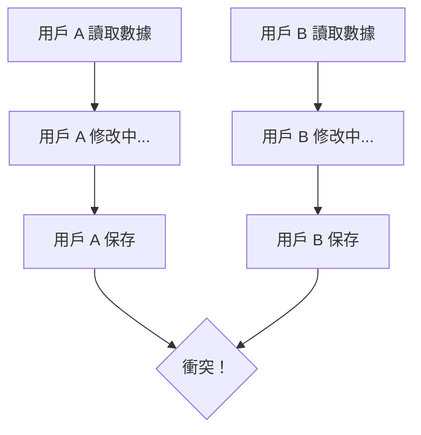

# 4.7 數據打架了怎麼辦——數據同步：冪等/衝突處理

### 認知重構

在分佈式系統和多用戶場景下，數據"打架"是常態而非異常——學會處理衝突是構建健壯應用的必修課。

### 數據衝突的典型場景

**常見衝突場景**：
- 兩個用戶同時編輯同一篇文章
- 用戶重複點擊提交按鈕
- 網絡延遲導致請求重發
- 離線應用數據同步

### 子章節導航

| 章節 | 主題 | 核心問題 |
|------|------|----------|
| 4.7.1 | 冪等性設計 | 如何讓重複請求安全無害？ |
| 4.7.2 | 衝突檢測 | 如何發現數據被別人改了？ |
| 4.7.3 | 衝突解決 | 衝突了該聽誰的？ |
| 4.7.4 | 數據一致性 | 如何保證數據最終正確？ |

### 衝突處理策略概覽

| 策略 | 適用場景 | 優點 | 缺點 |
|------|----------|------|------|
| 悲觀鎖 | 高衝突場景 | 徹底避免衝突 | 性能差 |
| 樂觀鎖 | 低衝突場景 | 性能好 | 需處理衝突 |
| 冪等鍵 | 表單重複提交 | 簡單有效 | 需要額外存儲 |
| 版本號 | 併發編輯 | 實現簡單 | 需前端配合 |

### 本章定位

本章聚焦於**應用層**的數據同步問題，不涉及數據庫複製等底層機制。我們關注的是：

1. 如何讓 API 安全應對重複請求
2. 如何檢測和解決用戶級別的數據衝突
3. 如何在用戶體驗和數據正確性之間取得平衡

### 本章小結

- 數據衝突在多用戶系統中不可避免
- 根據業務場景選擇合適的衝突處理策略
- 冪等性設計是 API 健壯性的基礎
- 衝突檢測和解決需要前後端配合
