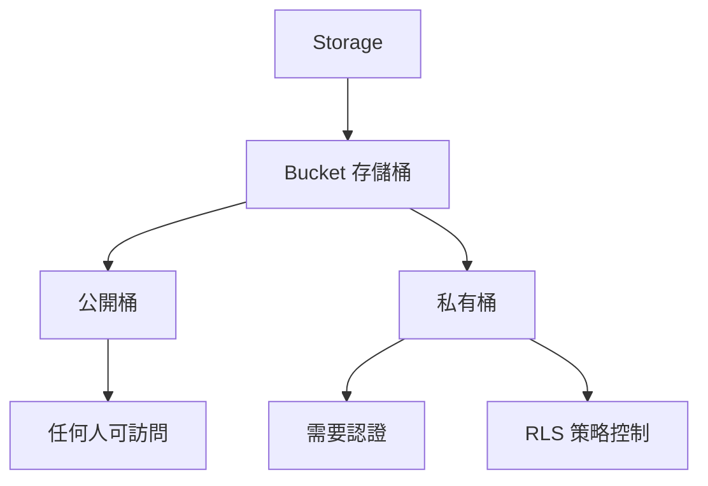

# 4.8.1 拓展：文件怎麼和權限掛鉤——存儲桶：文件上傳與權限控制

### 一句話破題

Supabase Storage 的精髓是"文件權限與用戶權限統一"——通過 RLS 策略，用戶只能訪問自己有權限的文件。

### Storage 核心概念



### 創建存儲桶

**Dashboard 方式**：
1. 進入 Supabase Dashboard
2. Storage → Create new bucket
3. 設置名稱和訪問權限

**SQL 方式**：

```sql
-- 創建私有存儲桶
INSERT INTO storage.buckets (id, name, public)
VALUES ('avatars', 'avatars', false);

-- 創建公開存儲桶
INSERT INTO storage.buckets (id, name, public)
VALUES ('public-images', 'public-images', true);
```

### 配置 RLS 策略

```sql
-- 允許用戶上傳到自己的文件夾
CREATE POLICY "Users can upload own files"
ON storage.objects
FOR INSERT
WITH CHECK (
  bucket_id = 'avatars' AND
  auth.uid()::text = (storage.foldername(name))[1]
);

-- 允許用戶讀取自己的文件
CREATE POLICY "Users can view own files"
ON storage.objects
FOR SELECT
USING (
  bucket_id = 'avatars' AND
  auth.uid()::text = (storage.foldername(name))[1]
);

-- 允許用戶刪除自己的文件
CREATE POLICY "Users can delete own files"
ON storage.objects
FOR DELETE
USING (
  bucket_id = 'avatars' AND
  auth.uid()::text = (storage.foldername(name))[1]
);
```

### 上傳文件

```typescript
import { supabase } from '@/lib/supabase'

async function uploadAvatar(file: File, userId: string) {
  const fileExt = file.name.split('.').pop()
  const fileName = `${userId}/${Date.now()}.${fileExt}`
  
  const { data, error } = await supabase.storage
    .from('avatars')
    .upload(fileName, file, {
      cacheControl: '3600',
      upsert: true
    })
  
  if (error) throw error
  
  return data.path
}
```

### 獲取文件 URL

```typescript
// 公開桶：直接獲取公開 URL
function getPublicUrl(path: string) {
  const { data } = supabase.storage
    .from('public-images')
    .getPublicUrl(path)
  
  return data.publicUrl
}

// 私有桶：獲取簽名 URL（有時效）
async function getSignedUrl(path: string) {
  const { data, error } = await supabase.storage
    .from('avatars')
    .createSignedUrl(path, 3600)  // 1小時有效
  
  if (error) throw error
  return data.signedUrl
}
```

### 下載文件

```typescript
async function downloadFile(path: string) {
  const { data, error } = await supabase.storage
    .from('avatars')
    .download(path)
  
  if (error) throw error
  return data  // Blob
}
```

### 刪除文件

```typescript
async function deleteFile(path: string) {
  const { error } = await supabase.storage
    .from('avatars')
    .remove([path])
  
  if (error) throw error
}

// 批量刪除
async function deleteFiles(paths: string[]) {
  const { error } = await supabase.storage
    .from('avatars')
    .remove(paths)
  
  if (error) throw error
}
```

### 列出文件

```typescript
async function listUserFiles(userId: string) {
  const { data, error } = await supabase.storage
    .from('avatars')
    .list(userId, {
      limit: 100,
      offset: 0,
      sortBy: { column: 'created_at', order: 'desc' }
    })
  
  if (error) throw error
  return data
}
```

### React 組件示例

```typescript
'use client'

import { useState } from 'react'
import { supabase } from '@/lib/supabase'

export function AvatarUpload({ userId }: { userId: string }) {
  const [uploading, setUploading] = useState(false)
  const [avatarUrl, setAvatarUrl] = useState<string | null>(null)
  
  async function handleUpload(e: React.ChangeEvent<HTMLInputElement>) {
    const file = e.target.files?.[0]
    if (!file) return
    
    setUploading(true)
    
    try {
      const path = `${userId}/${Date.now()}.${file.name.split('.').pop()}`
      
      const { error } = await supabase.storage
        .from('avatars')
        .upload(path, file)
      
      if (error) throw error
      
      const { data } = await supabase.storage
        .from('avatars')
        .createSignedUrl(path, 3600)
      
      setAvatarUrl(data?.signedUrl ?? null)
    } catch (error) {
      console.error('上傳失敗:', error)
    } finally {
      setUploading(false)
    }
  }
  
  return (
    <div>
      <input
        type="file"
        accept="image/*"
        onChange={handleUpload}
        disabled={uploading}
      />
      {avatarUrl && }
    </div>
  )
}
```

### 文件類型限制

```typescript
// 驗證文件類型和大小
function validateFile(file: File) {
  const allowedTypes = ['image/jpeg', 'image/png', 'image/webp']
  const maxSize = 5 * 1024 * 1024 // 5MB
  
  if (!allowedTypes.includes(file.type)) {
    throw new Error('只支持 JPG、PNG、WebP 格式')
  }
  
  if (file.size > maxSize) {
    throw new Error('文件大小不能超過 5MB')
  }
}
```

### 本節小結

- 使用 RLS 策略控制文件訪問權限
- 公開桶用於無需認證的資源
- 私有桶配合簽名 URL 提供臨時訪問
- 文件路徑建議按用戶 ID 組織
