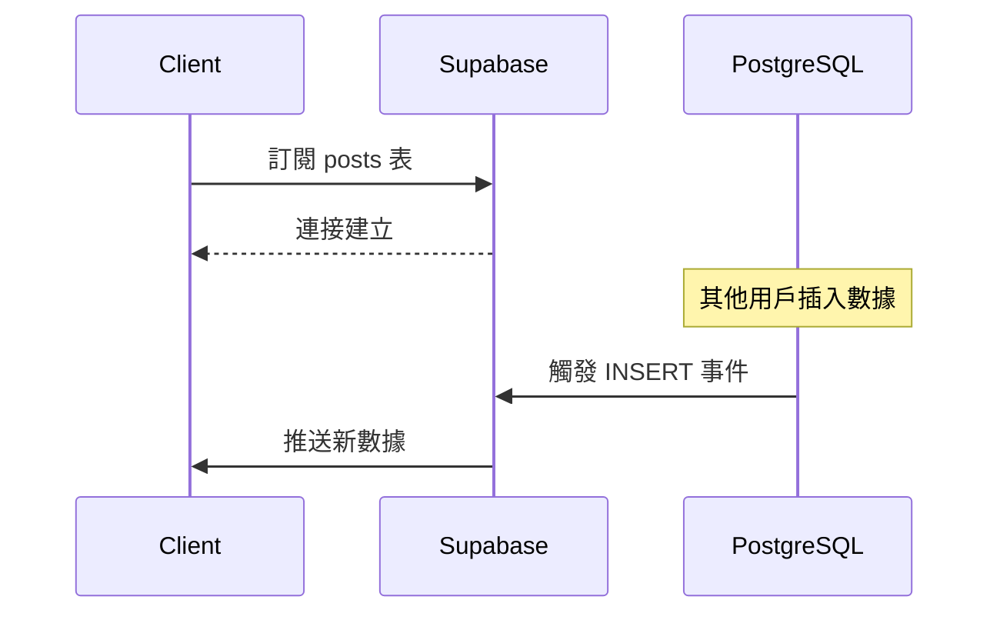

# 4.8.2 拓展：數據一變就通知我——即時訂閱：數據變更推送

### 一句話破題

Supabase Realtime 讓你的應用能夠"監聽"數據庫變化——數據一變，客戶端立即知道，無需輪詢。

### Realtime 工作原理



### 啓用 Realtime

**在 Dashboard 中啓用**：
1. 進入 Table Editor
2. 選擇要監聽的表
3. 啓用 Realtime

**使用 SQL 啓用**：

```sql
-- 啓用表的即時功能
ALTER PUBLICATION supabase_realtime ADD TABLE posts;

-- 驗證
SELECT * FROM pg_publication_tables WHERE pubname = 'supabase_realtime';
```

### 訂閱表變更

```typescript
import { supabase } from '@/lib/supabase'

// 訂閱所有變更
const channel = supabase
  .channel('posts-changes')
  .on(
    'postgres_changes',
    {
      event: '*',  // 'INSERT' | 'UPDATE' | 'DELETE' | '*'
      schema: 'public',
      table: 'posts'
    },
    (payload) => {
      console.log('Change received!', payload)
    }
  )
  .subscribe()

// 取消訂閱
channel.unsubscribe()
```

### 監聽特定事件

```typescript
// 只監聽新插入的數據
const channel = supabase
  .channel('new-posts')
  .on(
    'postgres_changes',
    {
      event: 'INSERT',
      schema: 'public',
      table: 'posts'
    },
    (payload) => {
      console.log('New post:', payload.new)
    }
  )
  .subscribe()
```

### 過濾訂閱

```typescript
// 只監聽特定用戶的文章
const channel = supabase
  .channel('user-posts')
  .on(
    'postgres_changes',
    {
      event: '*',
      schema: 'public',
      table: 'posts',
      filter: `author_id=eq.${userId}`
    },
    (payload) => {
      console.log('User post changed:', payload)
    }
  )
  .subscribe()
```

### React Hook 封裝

```typescript
'use client'

import { useEffect, useState } from 'react'
import { supabase } from '@/lib/supabase'
import { RealtimePostgresChangesPayload } from '@supabase/supabase-js'

interface Post {
  id: string
  title: string
  content: string
}

export function usePosts() {
  const [posts, setPosts] = useState<Post[]>([])
  
  useEffect(() => {
    // 初始加載
    async function loadPosts() {
      const { data } = await supabase
        .from('posts')
        .select('*')
        .order('created_at', { ascending: false })
      
      setPosts(data ?? [])
    }
    
    loadPosts()
    
    // 訂閱變更
    const channel = supabase
      .channel('posts-realtime')
      .on(
        'postgres_changes',
        { event: '*', schema: 'public', table: 'posts' },
        (payload: RealtimePostgresChangesPayload<Post>) => {
          if (payload.eventType === 'INSERT') {
            setPosts(prev => [payload.new, ...prev])
          } else if (payload.eventType === 'UPDATE') {
            setPosts(prev => 
              prev.map(p => p.id === payload.new.id ? payload.new : p)
            )
          } else if (payload.eventType === 'DELETE') {
            setPosts(prev => 
              prev.filter(p => p.id !== payload.old.id)
            )
          }
        }
      )
      .subscribe()
    
    return () => {
      channel.unsubscribe()
    }
  }, [])
  
  return posts
}
```

### Presence：在線狀態

```typescript
// 追蹤用戶在線狀態
const channel = supabase.channel('online-users')

// 追蹤當前用戶
channel.on('presence', { event: 'sync' }, () => {
  const state = channel.presenceState()
  console.log('在線用戶:', Object.keys(state))
})

channel.on('presence', { event: 'join' }, ({ key, newPresences }) => {
  console.log('用戶上線:', key, newPresences)
})

channel.on('presence', { event: 'leave' }, ({ key, leftPresences }) => {
  console.log('用戶離線:', key, leftPresences)
})

// 訂閱並加入
channel.subscribe(async (status) => {
  if (status === 'SUBSCRIBED') {
    await channel.track({
      user_id: userId,
      online_at: new Date().toISOString()
    })
  }
})
```

### Broadcast：廣播消息

```typescript
// 創建聊天室
const channel = supabase.channel('chat-room')

// 監聽消息
channel.on('broadcast', { event: 'message' }, ({ payload }) => {
  console.log('收到消息:', payload)
})

channel.subscribe()

// 發送消息
channel.send({
  type: 'broadcast',
  event: 'message',
  payload: {
    user: 'Alice',
    text: 'Hello!'
  }
})
```

### 聊天室完整示例

```typescript
'use client'

import { useEffect, useState, useRef } from 'react'
import { supabase } from '@/lib/supabase'

interface Message {
  id: string
  user: string
  text: string
  timestamp: string
}

export function ChatRoom({ userId }: { userId: string }) {
  const [messages, setMessages] = useState<Message[]>([])
  const [input, setInput] = useState('')
  const channelRef = useRef<ReturnType<typeof supabase.channel>>()
  
  useEffect(() => {
    const channel = supabase.channel('chat-room')
    
    channel.on('broadcast', { event: 'message' }, ({ payload }) => {
      setMessages(prev => [...prev, payload as Message])
    })
    
    channel.subscribe()
    channelRef.current = channel
    
    return () => {
      channel.unsubscribe()
    }
  }, [])
  
  async function sendMessage() {
    if (!input.trim() || !channelRef.current) return
    
    const message: Message = {
      id: crypto.randomUUID(),
      user: userId,
      text: input,
      timestamp: new Date().toISOString()
    }
    
    await channelRef.current.send({
      type: 'broadcast',
      event: 'message',
      payload: message
    })
    
    setInput('')
  }
  
  return (
    <div>
      <div className="messages">
        {messages.map(msg => (
          <div key={msg.id}>
            <strong>{msg.user}:</strong> {msg.text}
          </div>
        ))}
      </div>
      <input
        value={input}
        onChange={e => setInput(e.target.value)}
        onKeyDown={e => e.key === 'Enter' && sendMessage()}
      />
      <button onClick={sendMessage}>發送</button>
    </div>
  )
}
```

### 本節小結

- `postgres_changes` 監聽數據庫表的變更
- `presence` 追蹤用戶在線狀態
- `broadcast` 實現廣播消息
- 記得在組件卸載時取消訂閱
