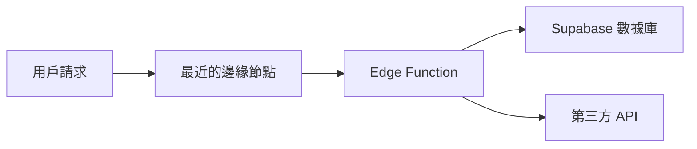

# 4.8.3 拓展：離用戶最近的計算——Edge Functions：邊緣計算函數

### 一句話破題

Edge Functions 讓代碼在全球邊緣節點運行——離用戶最近，響應最快，還能安全訪問敏感 API。

### Edge Functions 是什麼？



**特點**：
- 基於 Deno 運行時
- 全球分佈式部署
- 冷啓動快（毫秒級）
- 支持 TypeScript

### 創建 Edge Function

```bash
# 安裝 Supabase CLI
npm install -g supabase

# 初始化項目（如果還沒有）
supabase init

# 創建函數
supabase functions new hello-world
```

**目錄結構**：
```
supabase/
└── functions/
    └── hello-world/
        └── index.ts
```

### 基礎函數示例

```typescript
// supabase/functions/hello-world/index.ts
import { serve } from "https://deno.land/std@0.168.0/http/server.ts"

serve(async (req: Request) => {
  const { name } = await req.json()
  
  return new Response(
    JSON.stringify({ message: `Hello ${name}!` }),
    { headers: { "Content-Type": "application/json" } }
  )
})
```

### 本地開發

```bash
# 啓動本地函數服務
supabase functions serve

# 測試函數
curl -i --location --request POST \
  'http://localhost:54321/functions/v1/hello-world' \
  --header 'Content-Type: application/json' \
  --data '{"name":"World"}'
```

### 部署函數

```bash
# 部署單個函數
supabase functions deploy hello-world

# 部署所有函數
supabase functions deploy
```

### 訪問 Supabase 服務

```typescript
// supabase/functions/get-user/index.ts
import { serve } from "https://deno.land/std@0.168.0/http/server.ts"
import { createClient } from "https://esm.sh/@supabase/supabase-js@2"

serve(async (req: Request) => {
  const supabase = createClient(
    Deno.env.get('SUPABASE_URL') ?? '',
    Deno.env.get('SUPABASE_SERVICE_ROLE_KEY') ?? ''
  )
  
  const authHeader = req.headers.get('Authorization')!
  const token = authHeader.replace('Bearer ', '')
  
  const { data: { user } } = await supabase.auth.getUser(token)
  
  if (!user) {
    return new Response(
      JSON.stringify({ error: 'Unauthorized' }),
      { status: 401 }
    )
  }
  
  const { data, error } = await supabase
    .from('profiles')
    .select('*')
    .eq('id', user.id)
    .single()
  
  return new Response(
    JSON.stringify(data),
    { headers: { "Content-Type": "application/json" } }
  )
})
```

### 調用第三方 API

```typescript
// supabase/functions/send-email/index.ts
import { serve } from "https://deno.land/std@0.168.0/http/server.ts"

serve(async (req: Request) => {
  const { to, subject, body } = await req.json()
  
  const response = await fetch('https://api.resend.com/emails', {
    method: 'POST',
    headers: {
      'Authorization': `Bearer ${Deno.env.get('RESEND_API_KEY')}`,
      'Content-Type': 'application/json'
    },
    body: JSON.stringify({
      from: 'noreply@example.com',
      to,
      subject,
      html: body
    })
  })
  
  const result = await response.json()
  
  return new Response(
    JSON.stringify(result),
    { headers: { "Content-Type": "application/json" } }
  )
})
```

### 設置環境變量

```bash
# 設置密鑰
supabase secrets set RESEND_API_KEY=re_xxxx

# 查看所有密鑰
supabase secrets list
```

### 在前端調用

```typescript
import { supabase } from '@/lib/supabase'

async function sendWelcomeEmail(userEmail: string) {
  const { data, error } = await supabase.functions.invoke('send-email', {
    body: {
      to: userEmail,
      subject: '歡迎加入',
      body: '<h1>歡迎！</h1>'
    }
  })
  
  if (error) throw error
  return data
}
```

### Webhook 處理

```typescript
// supabase/functions/stripe-webhook/index.ts
import { serve } from "https://deno.land/std@0.168.0/http/server.ts"
import Stripe from "https://esm.sh/stripe@12.0.0?target=deno"

const stripe = new Stripe(Deno.env.get('STRIPE_SECRET_KEY')!, {
  apiVersion: '2023-10-16'
})

serve(async (req: Request) => {
  const signature = req.headers.get('stripe-signature')!
  const body = await req.text()
  
  let event: Stripe.Event
  
  try {
    event = stripe.webhooks.constructEvent(
      body,
      signature,
      Deno.env.get('STRIPE_WEBHOOK_SECRET')!
    )
  } catch (err) {
    return new Response(
      JSON.stringify({ error: 'Invalid signature' }),
      { status: 400 }
    )
  }
  
  switch (event.type) {
    case 'checkout.session.completed':
      // 處理支付成功
      break
    case 'customer.subscription.deleted':
      // 處理訂閱取消
      break
  }
  
  return new Response(JSON.stringify({ received: true }))
})
```

### 常見用例

| 用例 | 說明 |
|------|------|
| 發送郵件 | 調用 Resend/SendGrid 等服務 |
| 處理支付 | Stripe/PayPal Webhook |
| 圖片處理 | 生成縮略圖、水印 |
| AI 調用 | 調用 OpenAI 等 API |
| 定時任務 | 配合 Cron 觸發 |

### 本節小結

- Edge Functions 基於 Deno，使用 TypeScript
- 適合調用第三方 API、處理 Webhook
- 使用 `supabase secrets` 管理敏感配置
- 通過 `supabase.functions.invoke` 在前端調用
