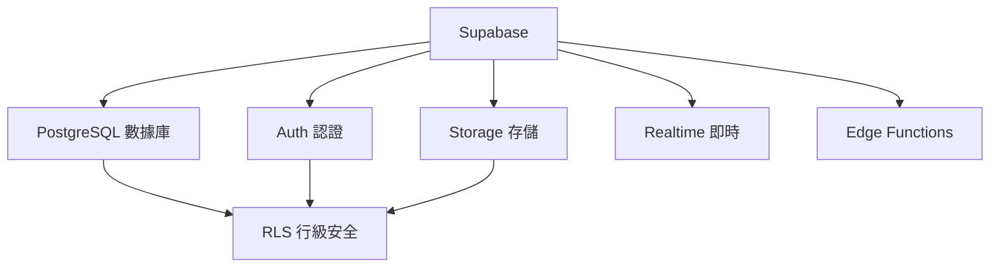
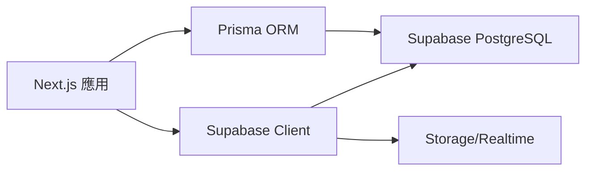

# 4.8 拓展：Supabase 爲何如此強大——存儲與認證聯動

### 認知重構

Supabase 不只是"開源 Firebase"——它是基於 PostgreSQL 的全棧後端平臺，將數據庫、認證、存儲、即時訂閱完美整合。

### Supabase 生態全景



### 子章節導航

| 章節 | 主題 | 核心問題 |
|------|------|----------|
| 4.8.1 | Storage | 如何安全地存儲和訪問文件？ |
| 4.8.2 | Realtime | 如何即時推送數據變更？ |
| 4.8.3 | Edge Functions | 如何在邊緣運行自定義邏輯？ |

### 爲什麼選擇 Supabase？

| 特性 | Supabase | 傳統方案 |
|------|----------|----------|
| 數據庫 | PostgreSQL（企業級） | 各種選擇 |
| 認證 | 內置 + RLS 聯動 | 需要自己實現 |
| 文件存儲 | 內置 + 權限控制 | 需要額外服務 |
| 即時訂閱 | 內置 WebSocket | 需要自己搭建 |
| 定價 | 免費額度充足 | 成本難控制 |

### 核心優勢：RLS 統一權限

Supabase 的殺手鐧是 **Row Level Security**（行級安全策略），讓數據庫、存儲、即時訂閱共享同一套權限規則：

```sql
-- 創建策略：用戶只能訪問自己的數據
CREATE POLICY "Users can view own data"
ON users
FOR SELECT
USING (auth.uid() = id);

-- 同樣的策略自動應用於：
-- - 數據庫查詢
-- - 文件存儲訪問
-- - 即時訂閱過濾
```

### 快速上手

**安裝 SDK**：

```bash
npm install @supabase/supabase-js
```

**初始化客戶端**：

```typescript
// lib/supabase.ts
import { createClient } from '@supabase/supabase-js'

export const supabase = createClient(
  process.env.NEXT_PUBLIC_SUPABASE_URL!,
  process.env.NEXT_PUBLIC_SUPABASE_ANON_KEY!
)
```

### 與 Prisma 的關係



- **Prisma**：用於複雜的數據庫操作
- **Supabase Client**：用於存儲、即時訂閱、認證等特性

### 本章小結

- Supabase 提供一站式後端解決方案
- RLS 是統一權限控制的核心
- 可以與 Prisma 配合使用
- 適合快速構建全棧應用
