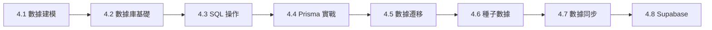

# 4 ｜數據庫與數據生命週期

### 認知重構

數據庫不是"存數據的地方"，而是應用的**記憶中樞**。它決定了你的應用能"記住"什麼、"想起"什麼、以及如何保證"記憶"的準確性。

### 本章學習目標

完成本章後，你將能夠：

- 理解數據建模的核心概念，設計合理的數據結構
- 掌握關係型數據庫的基本原理和操作
- 熟練使用 Prisma ORM 進行數據庫開發
- 處理數據遷移、種子數據和數據同步問題
- 瞭解 Supabase 的高級特性

### 章節導航

| 章節 | 主題 | 核心內容 |
|------|------|----------|
| 4.1 | 數據建模 | ER 圖、實體關係、範式理論 |
| 4.2 | 數據庫基礎 | CRUD、索引、事務、併發控制 |
| 4.3 | SQL 基礎 | DDL、DML、約束、JOIN、聚合 |
| 4.4 | Prisma 實戰 | Schema、遷移、查詢、事務 |
| 4.5 | 數據遷移 | 環境同步、回滾、數據處理 |
| 4.6 | 種子數據 | 冪等造數、測試數據、脫敏 |
| 4.7 | 數據同步 | 冪等性、衝突處理、一致性 |
| 4.8 | Supabase | 存儲桶、即時訂閱、邊緣函數 |

### 技術棧說明

本章使用的技術棧：

- **ORM**：Prisma（類型安全的數據庫訪問）
- **數據庫**：PostgreSQL（生產環境）/ SQLite（開發環境）
- **BaaS**：Supabase（可選的全棧解決方案）

### 學習路徑建議

- **零基礎**：按順序學習 4.1 → 4.2 → 4.3 → 4.4
- **有 SQL 基礎**：可跳過 4.2、4.3，重點學習 4.4 Prisma
- **使用 Supabase**：完成基礎後，重點學習 4.8
