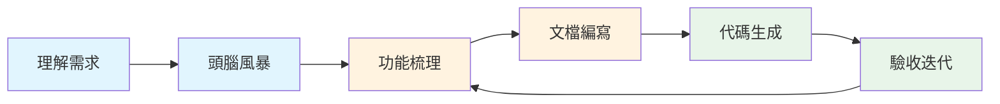

# 5.1.2 AI 如何包辦開發——AI 協助產品開發全流程

### 一句話破題

AI 可以參與從"理解需求"到"生成代碼"的全流程，但**你始終是決策者和驗收者**。

### 全流程協作地圖



| 階段 | 你的職責 | AI 的角色 |
|------|----------|-----------|
| **理解需求** | 提供原始信息 | 幫你拆解、提問、澄清 |
| **頭腦風暴** | 選擇方向 | 提供創意、分析可行性 |
| **功能梳理** | 確定優先級 | 結構化整理、查缺補漏 |
| **文檔編寫** | 審覈確認 | 生成初稿、格式規範 |
| **代碼生成** | 驗收審查 | 編寫代碼、處理細節 |
| **驗收迭代** | 反饋問題 | 修復調整、優化改進 |

### 階段一：理解需求

**場景**：你拿到一個模糊的需求，比如"做一個博客系統"。

**與 AI 的協作方式**：

```
你：我想做一個博客系統，請幫我梳理一下核心需求

AI 會幫你：
1. 提出澄清問題：面向個人還是多用戶？需要評論嗎？
2. 列出功能清單：文章管理、分類標籤、用戶系統...
3. 識別技術約束：SEO 要求、性能考量...
```

**你的決策點**：從 AI 提供的選項中選擇，明確邊界。

### 階段二：頭腦風暴

**場景**：需求明確後，需要決定具體的實現方案。

**與 AI 的協作方式**：

```
你：博客系統的文章編輯器，有哪些實現方案？

AI 會提供：
1. 方案對比：Markdown vs 富文本 vs 塊編輯器
2. 優劣分析：學習成本、開發難度、用戶體驗
3. 推薦建議：根據你的場景推薦合適方案
```

**你的決策點**：選擇最適合你場景的方案。

### 階段三：功能梳理

**場景**：把散亂的想法整理成結構化的功能列表。

**與 AI 的協作方式**：

```
你：幫我把博客系統的功能整理成 MVP 和後續迭代兩部分

AI 會幫你：
1. 按優先級分類：核心功能 vs 錦上添花
2. 識別依賴關係：哪些功能依賴其他功能
3. 估算複雜度：簡單/中等/複雜
```

**輸出示例**：

```markdown
## MVP（第一版）
- [ ] 文章 CRUD
- [ ] Markdown 編輯器
- [ ] 文章列表頁

## V1.1（第二版）
- [ ] 分類和標籤
- [ ] 搜索功能

## V1.2（第三版）
- [ ] 評論系統
- [ ] RSS 訂閱
```

### 階段四：文檔編寫

**場景**：把功能列表轉化爲 AI 能執行的結構化文檔。

**與 AI 的協作方式**：

```
你：幫我爲"文章 CRUD"功能寫一份技術方案

AI 會生成：
1. 數據模型設計
2. API 接口定義
3. 前端頁面規劃
4. 邊界情況處理
```

**你的審覈點**：
- 數據結構是否合理？
- 接口設計是否符合 RESTful 規範？
- 是否遺漏了重要場景？

### 階段五：代碼生成

**場景**：基於文檔讓 AI 生成代碼。

**與 AI 的協作方式**：

```
你：根據上面的技術方案，生成 Prisma schema 和 API 路由

AI 會生成：
- prisma/schema.prisma
- app/api/posts/route.ts
- app/api/posts/[id]/route.ts
```

**你的驗收點**：
- 代碼能運行嗎？
- 邏輯正確嗎？
- 符合項目規範嗎？

### 階段六：驗收迭代

**場景**：發現問題，讓 AI 修復。

**高效反饋的方式**：

```
❌ 不好的反饋："這個不對"

✅ 好的反饋："創建文章時，如果標題爲空，應該返回 400 錯誤，
但現在返回的是 500。請檢查參數校驗邏輯。"
```

**迭代技巧**：
1. **一次只反饋一個問題**：避免 AI 遺漏
2. **提供具體的錯誤信息**：報錯日誌、截圖
3. **說明期望的行爲**：你希望它變成什麼樣

### 協作心法

1. **先粗後細**：從整體框架開始，逐步細化
2. **分步驗收**：不要等全部完成再檢查，每個階段都要驗收
3. **保持主動**：AI 是助手，不是老闆，你來決定方向
4. **記錄決策**：重要的選擇記錄下來，方便後續回顧
