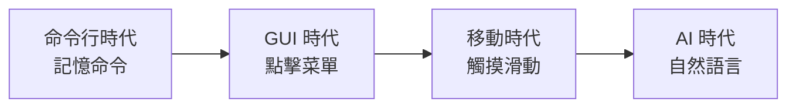

# 5.1.3 告別繁瑣的點擊——AI 重塑交互方式

### 一句話破題

AI 時代的交互設計核心：**用一句話完成過去需要十次點擊的操作**。

### 交互範式的演變



| 時代 | 主要交互 | 學習成本 | 靈活性 |
|------|----------|----------|--------|
| 命令行 | 輸入命令 | 高 | 高 |
| 圖形界面 | 點擊按鈕 | 中 | 中 |
| 移動端 | 觸摸手勢 | 低 | 低 |
| AI | 自然語言 | 最低 | 最高 |

### 傳統交互的痛點

以"導出 PDF"爲例：

```
傳統方式（6 步）：
1. 點擊"文件"菜單
2. 找到"導出"選項
3. 選擇"PDF 格式"
4. 設置頁邊距
5. 選擇頁面範圍
6. 點擊"確認"

AI 方式（1 步）：
"導出爲 PDF，頁邊距 2cm，只要前 5 頁"
```

### AI 交互的核心優勢

#### 1. 意圖直達

用戶不需要知道功能藏在哪個菜單裏，直接說出想要的結果：

```
傳統：我要在哪裏找到這個功能？
AI：我直接說我想要什麼
```

#### 2. 參數內聯

不需要一個個字段填寫，所有條件在一句話裏說完：

```
傳統：填寫表單 → 日期、金額、類別分別選擇
AI："幫我統計上個月餐飲類支出超過 100 元的訂單"
```

#### 3. 複合操作

多個步驟可以合併成一個指令：

```
傳統：創建文件夾 → 移動文件 → 重命名
AI："把這些照片按日期分類整理到不同文件夾"
```

### 對開發者的啓示

當你用 AI 輔助編程時，同樣可以：

**傳統方式**：
1. 打開文檔查 API
2. 複製示例代碼
3. 修改參數
4. 調試運行

**AI 方式**：
```
"用 Prisma 創建一個用戶表，包含 id、郵箱、密碼哈希、
創建時間，郵箱要唯一索引"
```

### 設計 AI 友好的產品

如果你要設計支持 AI 交互的產品，記住：

1. **減少必填項**：能推斷的就不要強制填寫
2. **支持自然語言輸入**：在關鍵入口提供對話框
3. **提供快捷確認**：AI 理解後讓用戶一鍵確認
4. **優雅降級**：AI 無法理解時，平滑切換到傳統表單
