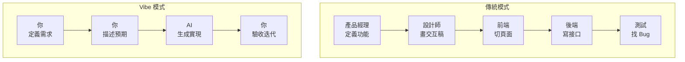

# 5.1.4 Vibe 如何改變產品設計

### 一句話破題

Vibe Coding 的核心理念：**你負責定義"做什麼"和"做成什麼樣"，AI 負責"怎麼做"**。

### 傳統產品設計 vs Vibe 產品設計



| 維度 | 傳統模式 | Vibe 模式 |
|------|----------|-----------|
| **關注點** | 實現細節 | 最終效果 |
| **溝通對象** | 團隊成員 | AI 助手 |
| **迭代速度** | 天/周 | 分鐘/小時 |
| **試錯成本** | 高 | 低 |

### Vibe 設計的三個核心原則

#### 1. 效果驅動，而非過程驅動

**傳統思維**：先想清楚每一步怎麼做，再開始執行  
**Vibe 思維**：先描述想要的效果，讓 AI 找最佳路徑

```
傳統："我需要一個狀態管理庫，考慮用 Redux 還是 Zustand..."

Vibe："我需要在多個組件間共享用戶登錄狀態，
頁面刷新後狀態要保持，幫我實現"
```

#### 2. 漸進式細化，而非一次到位

**傳統思維**：寫一份完整的 PRD，然後開始開發  
**Vibe 思維**：先跑通最小閉環，再逐步添加細節

```
第一輪："做一個博客，能發文章就行"
第二輪："加上 Markdown 支持"
第三輪："文章要能分類和打標籤"
第四輪："加個搜索功能"
```

#### 3. 快速驗證，而非完美規劃

**傳統思維**：規劃周全再動手，避免返工  
**Vibe 思維**：快速產出原型，通過實際使用發現問題

```
傳統：花一週寫 PRD → 一週設計 → 兩週開發 → 發現需求理解錯誤

Vibe：30 分鐘出原型 → 試用發現問題 → 10 分鐘調整 → 再試用
```

### 對產品定義的影響

在 Vibe 模式下，產品定義的重點從"怎麼實現"轉向：

1. **用戶是誰**：這個功能給誰用？
2. **場景是什麼**：用戶在什麼情況下會用到？
3. **期望是什麼**：用戶希望得到什麼結果？
4. **成功標準**：怎麼判斷這個功能做得好不好？

### 實踐建議

1. **先做最小可用版本**：能跑起來的粗糙版本，比完美的規劃更有價值
2. **讓 AI 提供選項**：不確定時，讓 AI 給出 2-3 種方案供你選擇
3. **保持迭代節奏**：每次只改一小部分，驗證通過再繼續
4. **記錄決策理由**：爲什麼選 A 不選 B，後面可能會用到

### 心態轉變

從"我要把每個細節都想清楚"轉變爲"我先把核心需求說清楚，細節在迭代中完善"。

這不是偷懶，而是更高效的工作方式。你的時間應該花在思考"做什麼"和"爲什麼做"上，而不是糾結於實現細節。
