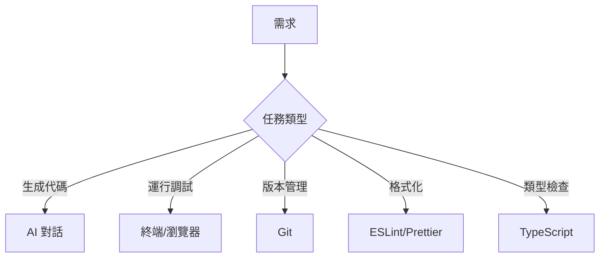

# 5.1.7 別把 AI 累死——工具調用策略

### 一句話破題

AI 不是萬能的，**把合適的任務交給合適的工具**纔是高效協作的祕訣。

### AI 擅長與不擅長的事

| AI 擅長 | AI 不擅長 |
|---------|-----------|
| 生成代碼框架 | 複雜的多文件重構 |
| 解釋概念和原理 | 即時調試運行時錯誤 |
| 提供實現思路 | 訪問外部服務和 API |
| 代碼審查建議 | 記住跨對話的狀態 |
| 格式轉換和規範化 | 精確的數學計算 |

### 工具分工策略



#### 1. AI 負責生成，工具負責驗證

```
工作流程：
1. [AI] 生成代碼
2. [TypeScript] 檢查類型錯誤
3. [ESLint] 檢查代碼規範
4. [瀏覽器] 驗證功能正確性
5. [AI] 根據反饋修復問題
```

#### 2. 不要讓 AI 做重複勞動

```
❌ 每次都讓 AI 重新格式化代碼

✅ 配置好 Prettier，保存時自動格式化
```

#### 3. 利用 AI 的強項

```
✅ 生成 boilerplate 代碼
✅ 解釋複雜的報錯信息
✅ 提供多種實現方案
✅ 代碼重構建議
```

### 常見場景的工具選擇

| 場景 | 推薦工具 | 原因 |
|------|----------|------|
| **創建新文件** | AI | 生成完整模板 |
| **小範圍修改** | 手動編輯 | 比描述更快 |
| **批量重命名** | IDE 重構功能 | 更可靠 |
| **理解陌生代碼** | AI | 擅長解釋 |
| **性能優化** | Profiler + AI | AI 分析結果 |
| **依賴安裝** | 包管理器 | 更可靠 |

### 高效協作模式

#### 模式一：AI 寫骨架，你填細節

```
你：幫我創建一個用戶管理的 CRUD API 骨架

AI：[生成基本結構]

你：[手動補充業務邏輯、錯誤處理等細節]
```

#### 模式二：你寫代碼，AI 審查

```
你：幫我審查這段代碼，看看有什麼問題

AI：[指出潛在問題和改進建議]

你：[根據建議修改]
```

#### 模式三：AI 解釋，你決策

```
你：這個報錯是什麼意思？有哪些解決方案？

AI：[解釋原因，提供 2-3 種方案]

你：[選擇合適的方案執行]
```

### 避免的反模式

**反模式 1：讓 AI 做它不擅長的事**

```
❌ "幫我連接數據庫測試一下"
（AI 無法執行實際操作）

✅ "幫我寫一個測試數據庫連接的腳本，我來運行"
```

**反模式 2：過度依賴 AI**

```
❌ 每個小改動都問 AI

✅ 簡單修改直接做，複雜問題才請教 AI
```

**反模式 3：不給 AI 足夠信息**

```
❌ "這個不行"

✅ "運行報錯：TypeError: Cannot read property 'id' of undefined
在 app/api/posts/route.ts 第 15 行"
```

### 建議的工具鏈配置

```json
// package.json
{
  "scripts": {
    "dev": "next dev",
    "lint": "eslint .",
    "format": "prettier --write .",
    "typecheck": "tsc --noEmit"
  }
}
```

在提交代碼前運行這些檢查，而不是期望 AI 幫你發現所有問題。
