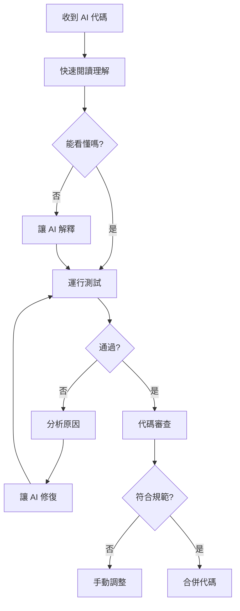

# 5.1.9 AI 寫的代碼能用嗎——代碼質量控制

### 一句話破題

AI 生成的代碼**不能直接用**，必須經過審查、測試和優化。

### AI 代碼的常見問題

| 問題類型 | 表現 | 風險等級 |
|----------|------|----------|
| **幻覺 API** | 使用不存在的庫或方法 | 高 |
| **過時語法** | 使用舊版本的寫法 | 中 |
| **邏輯漏洞** | 邊界情況未處理 | 高 |
| **安全隱患** | 敏感信息暴露、注入風險 | 嚴重 |
| **性能問題** | 低效算法、重複查詢 | 中 |
| **風格不一致** | 與項目規範不符 | 低 |

### 審查清單

收到 AI 生成的代碼後，逐項檢查：

#### 1. 依賴檢查

```
□ 引入的庫在 package.json 中存在嗎？
□ API 方法在當前版本中存在嗎？
□ 是否使用了正確的導入路徑？
```

#### 2. 邏輯檢查

```
□ 空值/undefined 處理了嗎？
□ 數組爲空的情況處理了嗎？
□ 異步操作有錯誤處理嗎？
□ 循環有終止條件嗎？
```

#### 3. 安全檢查

```
□ 用戶輸入有驗證和過濾嗎？
□ 敏感信息（密鑰、密碼）沒有硬編碼吧？
□ SQL/NoSQL 注入風險排除了嗎？
□ XSS 風險排除了嗎？
```

#### 4. 性能檢查

```
□ 數據庫查詢有必要的索引嗎？
□ N+1 查詢問題解決了嗎？
□ 大數據量有分頁嗎？
□ 沒有不必要的重複計算吧？
```

### 審查流程



### 實戰示例

**AI 生成的代碼**：

```typescript
// 獲取用戶列表
export async function GET() {
  const users = await prisma.user.findMany()
  return Response.json(users)
}
```

**問題分析**：

1. ❌ 沒有分頁，數據量大時會崩潰
2. ❌ 返回了所有字段，可能暴露敏感信息
3. ❌ 沒有錯誤處理

**修復後**：

```typescript
export async function GET(request: Request) {
  try {
    const { searchParams } = new URL(request.url)
    const page = parseInt(searchParams.get('page') || '1')
    const limit = parseInt(searchParams.get('limit') || '10')
    
    const users = await prisma.user.findMany({
      skip: (page - 1) * limit,
      take: limit,
      select: {
        id: true,
        name: true,
        email: true,
        // 不返回 password 等敏感字段
      }
    })
    
    return Response.json(users)
  } catch (error) {
    console.error('Failed to fetch users:', error)
    return Response.json(
      { error: 'Internal server error' },
      { status: 500 }
    )
  }
}
```

### 培養代碼審查能力

1. **多看好代碼**：閱讀開源項目，學習最佳實踐
2. **理解原理**：知道爲什麼要這樣寫，而不只是照搬
3. **總結經驗**：記錄 AI 常犯的錯誤，下次重點檢查
4. **持續學習**：關注安全公告、最佳實踐更新

### 建立審查習慣

```
每次收到 AI 代碼後：
1. 先不要急着運行
2. 花 2 分鐘快速審查
3. 有疑問就問 AI 爲什麼這樣寫
4. 運行並觀察行爲是否符合預期
5. 通過測試後再合併
```
