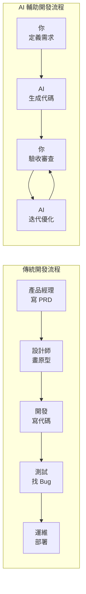

# 5.1 先把想做的說明白——AI 時代產品開發理念

在傳統開發中，"想法"到"產品"的路徑是：**想法 → 需求文檔 → 設計稿 → 代碼 → 測試 → 上線**。每一步都需要專業人員，每一步都可能出現理解偏差。

在 AI 時代，這條路徑被大幅壓縮：**想法 → 結構化描述 → AI 生成代碼 → 人工驗收 → 迭代優化**。

### 核心轉變：從"執行者"到"決策者"

| 角色 | 傳統模式 | AI 時代 |
|------|----------|---------|
| **你的職責** | 寫代碼、調 Bug | 定義需求、驗收結果 |
| **核心能力** | 編程技能 | 問題定義、溝通表達 |
| **時間分配** | 80% 編碼、20% 思考 | 30% 描述、70% 驗收與迭代 |

### 本節目標

學完本節，你將掌握：

1. **AI Native 思維**：理解 AI 應用與傳統應用的本質區別
2. **全流程協作**：學會在"理解需求 → 功能設計 → 代碼生成 → 驗收迭代"各環節與 AI 高效配合
3. **Prompt 工程基礎**：掌握與 AI 有效溝通的核心原則
4. **質量把控**：學會審查 AI 產出、識別錯誤、提供反饋

**記住**：AI 是你的高效執行者，但你纔是產品的主人。你需要清晰地知道"要做什麼"、"爲什麼做"、"做成什麼樣"，AI 才能幫你把想法變成現實。
