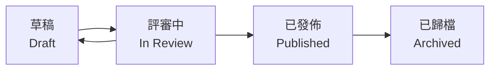

# 5.2.1 這份文檔算數嗎——文檔狀態管理

### 一句話破題

文檔狀態告訴所有人：**這份文檔能不能當真**。

### 爲什麼需要狀態管理

沒有狀態標識的文檔會導致：

- **誤用過時信息**：以爲是最新版，其實已經廢棄
- **提前實現**：按照還沒確認的草稿開始開發
- **重複勞動**：不知道別人已經在改這份文檔了

### 常見的文檔狀態



| 狀態 | 含義 | 能否執行 |
|------|------|----------|
| **草稿** | 作者還在寫，內容不完整 | ❌ 不能 |
| **評審中** | 等待他人審覈確認 | ❌ 不能 |
| **已發佈** | 經過確認，可以作爲依據 | ✅ 可以 |
| **已歸檔** | 歷史版本，僅供參考 | ❌ 不能 |

### 在文檔中標註狀態

**方式一：文檔頭部元數據**

```markdown
status: draft  # draft | review | published | archived
author: 張三
last_updated: 2024-01-15
```

**方式二：顯眼的提示框**

```markdown
> ⚠️ **文檔狀態：草稿**
> 
> 本文檔尚未完成評審，內容可能發生變化。
> 請勿基於此文檔進行開發。
```

**方式三：文件名約定**

```
feature-login.md          # 已發佈
feature-login.draft.md    # 草稿
feature-login.v1.md       # 歸檔的歷史版本
```

### 狀態流轉規則

```
1. 新建文檔 → 草稿
2. 草稿完成 → 提交評審
3. 評審通過 → 發佈
4. 評審不通過 → 返回草稿修改
5. 需求變更 → 已發佈變爲草稿，重新評審
6. 功能下線 → 歸檔
```

### 對 AI 協作的影響

當你把文檔餵給 AI 時：

- **草稿**：告訴 AI "這是初稿，幫我補充完善"
- **已發佈**：告訴 AI "按照這個文檔實現代碼"

```
示例 Prompt：

這是一份已發佈的 PRD 文檔，請嚴格按照文檔要求生成代碼，
不要自行添加或修改功能。

[文檔內容]
```

### 實用建議

1. **簡單項目**：草稿 → 發佈 兩個狀態就夠了
2. **團隊協作**：加上"評審中"狀態，明確責任
3. **長期維護**：加上"歸檔"狀態，保留歷史記錄
4. **狀態要顯眼**：放在文檔開頭，一眼就能看到
