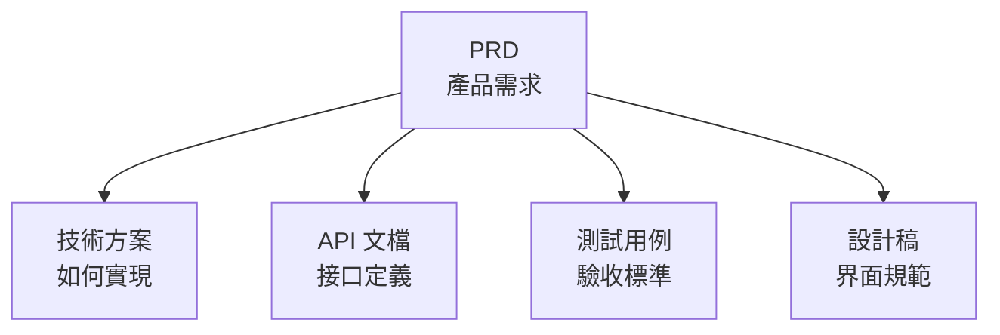

# 5.2.3 去哪裏找相關資料——相關文檔索引

### 一句話破題

相關文檔索引讓你知道：**這個功能還有哪些配套資料**。

### 爲什麼需要文檔索引

一個功能通常涉及多份文檔：



沒有索引時，你需要四處尋找相關資料。有了索引，**一切關聯文檔一目瞭然**。

### 索引的標準格式

```markdown
## 相關文檔

| 文檔類型 | 鏈接 | 說明 |
|----------|------|------|
| 技術方案 | [user-auth-tech.md](./tech/user-auth-tech.md) | 認證流程技術設計 |
| API 文檔 | [api/auth.md](./api/auth.md) | 登錄註冊接口定義 |
| 測試用例 | [tests/auth.md](./tests/auth.md) | 功能測試用例 |
| 設計稿 | [Figma 鏈接](https://figma.com/...) | UI 設計規範 |
```

### 常見的關聯文檔類型

| 類型 | 內容 | 誰負責 |
|------|------|--------|
| **PRD** | 功能需求描述 | 產品/你自己 |
| **技術方案** | 實現思路、架構設計 | 開發/你自己 |
| **API 文檔** | 接口定義、參數說明 | 後端/你自己 |
| **測試用例** | 驗收標準、邊界測試 | 測試/你自己 |
| **設計稿** | UI 規範、交互說明 | 設計/你自己 |

### 在 Vibe Coding 中的應用

對於個人項目，可以簡化文檔結構：

```
docs/
├── features/
│   ├── user-auth/
│   │   ├── prd.md          # 需求文檔
│   │   ├── tech-spec.md    # 技術方案
│   │   └── api.md          # API 定義
│   └── blog-posts/
│       ├── prd.md
│       └── tech-spec.md
└── shared/
    └── glossary.md         # 全局術語表
```

### 索引的維護原則

1. **創建時就添加**：新建文檔時，同時更新相關文檔的索引
2. **刪除時要清理**：刪除文檔時，檢查並移除失效的鏈接
3. **定期檢查**：確保鏈接仍然有效
4. **雙向鏈接**：A 鏈接到 B，B 也應該鏈接到 A

### 對 AI 協作的影響

向 AI 提供相關文檔，能讓它更好地理解全局：

```
我要實現用戶認證功能。

相關文檔：
- PRD: [粘貼內容或鏈接]
- 技術方案: [粘貼內容或鏈接]
- 已有的 API 定義: [粘貼內容或鏈接]

請基於以上文檔生成認證相關的代碼。
```

### 實用建議

1. **使用相對路徑**：`./tech-spec.md` 而不是絕對路徑
2. **說明文檔用途**：不僅給鏈接，還要說明這份文檔是幹什麼的
3. **區分必讀和參考**：標註哪些是必須閱讀的，哪些是可選參考的
