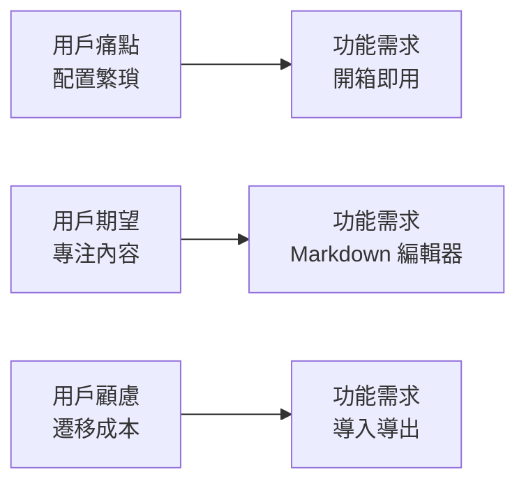

# 5.3.3 用戶到底想要什麼——AI 協助用戶洞察

### 一句話破題

讓 AI 幫你**站在用戶角度思考**，發現你作爲開發者看不到的需求。

### 爲什麼需要用戶洞察

開發者視角和用戶視角往往存在偏差：

| 你以爲的需求 | 用戶真實的需求 |
|--------------|----------------|
| 功能越多越好 | 核心功能好用就行 |
| 界面要炫酷 | 找得到想要的功能 |
| 技術要先進 | 加載速度快、不卡 |
| 數據結構要完美 | 操作步驟要少 |

### 用 AI 構建用戶畫像

**Prompt 模板**：

```markdown
我要做一個 [產品描述]。

請幫我分析目標用戶：
1. 用戶是誰？（人口統計特徵）
2. 用戶在什麼場景下使用？
3. 用戶的核心痛點是什麼？
4. 用戶期望獲得什麼價值？
5. 用戶可能的顧慮是什麼？
```

**示例對話**：

```
你：我要做一個個人博客系統，目標用戶是技術人員

AI：## 用戶畫像分析

### 1. 用戶是誰
- 年齡：25-40 歲
- 職業：程序員、技術經理、技術自媒體
- 技術水平：熟悉 Markdown、Git，有一定開發能力
- 特點：追求效率，對技術有潔癖

### 2. 使用場景
- 記錄技術學習筆記和踩坑經驗
- 分享開源項目和技術方案
- 建立個人技術品牌
- 求職時展示技術能力

### 3. 核心痛點
- 第三方平臺審覈嚴格、限制多
- 擔心平臺關閉導致內容丟失
- 想要自定義域名和樣式
- 現有方案（如 Hexo）配置繁瑣

### 4. 期望價值
- 快速發佈文章，專注內容
- 良好的 SEO，被搜索引擎收錄
- 代碼高亮、Markdown 支持
- 穩定運行，不用操心維護

### 5. 可能顧慮
- 自建博客的服務器成本
- 維護精力（更新、安全）
- 遷移成本（已有內容如何導入）
```

### 從用戶畫像推導功能

用戶畫像不是終點，而是推導功能的起點：



**痛點到功能的映射**：

| 用戶痛點 | 對應功能 |
|----------|----------|
| 平臺審覈多 | 完全自主可控 |
| 擔心丟失 | 本地備份、導出 |
| 配置繁瑣 | 一鍵部署、默認配置 |
| SEO 差 | 自動生成 sitemap、meta |

### 用 AI 驗證需求

在確定功能後，可以讓 AI 從用戶角度驗證：

```
你：我計劃在博客系統中實現以下功能：
- Markdown 編輯器
- 文章分類
- 評論系統

請從用戶角度評估，有沒有遺漏的重要需求？

AI：從用戶角度，還建議考慮：

## 高優先級遺漏
1. **搜索功能**：文章多了之後，用戶需要快速找到歷史內容
2. **草稿保存**：寫長文時意外關閉頁面，內容不能丟失

## 中優先級建議
3. **RSS 訂閱**：技術用戶習慣用 RSS 閱讀器
4. **代碼塊複製**：一鍵複製代碼片段

## 可後續迭代
5. **閱讀統計**：瞭解哪些文章受歡迎
6. **系列文章**：將相關文章組織成系列
```

### 用戶訪談的 AI 替代

如果沒有條件做真實用戶訪談，可以讓 AI 模擬：

```
你：請扮演一個想要搭建技術博客的程序員，回答我的問題。

AI：好的，我是一名有 5 年經驗的後端工程師，最近想搭建一個技術博客...

你：你最看重博客系統的什麼特性？

AI：首先是 Markdown 支持，這是必須的。其次是部署要簡單，
我不想花太多時間在運維上。另外，加載速度要快，
我自己訪問一個網站如果超過 3 秒就會關掉...
```

### 實用建議

1. **區分用戶和客戶**：使用產品的人和付費的人可能不同
2. **避免自我代入**：你不是典型用戶，你的需求不代表大多數
3. **關注行爲而非態度**：用戶說"我想要 X"不一定代表他真的會用
4. **持續驗證**：上線後收集真實反饋，修正用戶畫像
