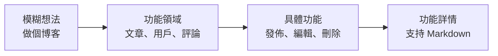
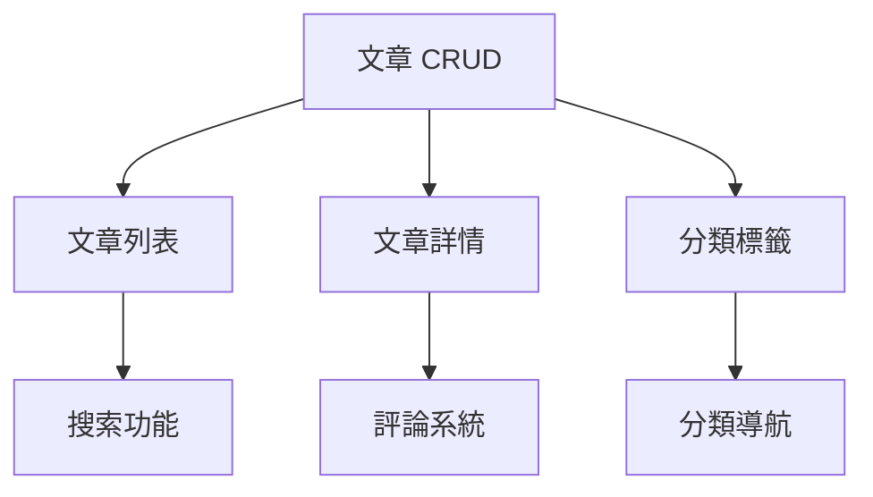

# 5.3.4 從想法到功能列表——AI 輔助功能梳理

### 一句話破題

讓 AI 幫你把散亂的想法**整理成結構化、可執行的功能清單**。

### 從模糊到具體的轉化



### 讓 AI 幫你梳理功能

**Prompt 模板**：

```markdown
我要做一個 [產品描述]。

請幫我梳理功能列表：
1. 按功能模塊分類
2. 每個功能說明：功能描述、用戶價值、實現複雜度
3. 標註哪些是核心功能，哪些是可選功能
```

**示例對話**：

```
你：我要做一個個人博客系統

AI：## 功能清單

### 模塊一：文章管理
| 功能 | 描述 | 用戶價值 | 複雜度 | 優先級 |
|------|------|----------|--------|--------|
| 創建文章 | 新建文章並保存 | 核心功能 | ⭐ | P0 |
| 編輯文章 | 修改已發佈的文章 | 核心功能 | ⭐ | P0 |
| 刪除文章 | 移除不需要的文章 | 核心功能 | ⭐ | P0 |
| 草稿保存 | 未發佈的文章保存爲草稿 | 防止內容丟失 | ⭐ | P1 |
| 定時發佈 | 設定發佈時間 | 內容規劃 | ⭐⭐ | P2 |

### 模塊二：內容展示
| 功能 | 描述 | 用戶價值 | 複雜度 | 優先級 |
|------|------|----------|--------|--------|
| 文章列表 | 展示所有已發佈文章 | 核心功能 | ⭐ | P0 |
| 文章詳情 | 單篇文章的完整內容 | 核心功能 | ⭐ | P0 |
| 分類導航 | 按類別篩選文章 | 內容組織 | ⭐ | P1 |
| 標籤系統 | 多維度標記文章 | 內容發現 | ⭐ | P1 |
| 搜索功能 | 關鍵詞檢索文章 | 快速定位 | ⭐⭐ | P1 |

### 模塊三：用戶交互
| 功能 | 描述 | 用戶價值 | 複雜度 | 優先級 |
|------|------|----------|--------|--------|
| 評論系統 | 讀者留言互動 | 社區感 | ⭐⭐ | P2 |
| 點贊/收藏 | 標記喜歡的文章 | 用戶參與 | ⭐ | P2 |
| 分享功能 | 分享到社交平臺 | 內容傳播 | ⭐ | P2 |
```

### 功能的分層結構

將功能按層次組織，便於後續開發：

```
博客系統
├── 核心功能（P0 - 必須有）
│   ├── 文章 CRUD
│   ├── 文章列表/詳情頁
│   └── Markdown 編輯器
├── 重要功能（P1 - 應該有）
│   ├── 分類和標籤
│   ├── 搜索
│   ├── 草稿保存
│   └── SEO 優化
├── 增強功能（P2 - 可以有）
│   ├── 評論系統
│   ├── 閱讀統計
│   └── RSS 訂閱
└── 未來功能（P3 - 後續考慮）
    ├── 多作者支持
    ├── 會員訂閱
    └── Newsletter
```

### 功能依賴分析

有些功能依賴其他功能，需要理清順序：



**讓 AI 幫你分析依賴**：

```
你：幫我分析這些功能的依賴關係和開發順序

AI：## 依賴分析

### 第一階段（無依賴）
- 文章 CRUD：基礎功能，其他都依賴它
- 用戶認證：如果需要後臺管理

### 第二階段（依賴第一階段）
- 文章列表/詳情：依賴文章數據
- 分類標籤：依賴文章模型

### 第三階段（依賴第二階段）
- 搜索功能：需要文章數據
- 分類導航：需要分類數據

### 第四階段（獨立增強）
- 評論系統：可獨立開發
- RSS 訂閱：依賴文章列表
```

### 功能描述的規範

每個功能應包含以下信息：

```markdown
## 功能名稱

### 功能描述
一句話說明這個功能做什麼

### 用戶故事
作爲 [用戶類型]，我希望 [做什麼]，以便 [獲得什麼價值]

### 驗收標準
- [ ] 條件 1：結果 1
- [ ] 條件 2：結果 2

### 邊界情況
- 情況 1：如何處理
- 情況 2：如何處理
```

**示例**：

```markdown
## 文章發佈

### 功能描述
用戶可以創建併發布博客文章

### 用戶故事
作爲博主，我希望能夠撰寫併發布文章，以便分享我的技術經驗

### 驗收標準
- [ ] 可以輸入標題（必填，1-100 字符）
- [ ] 可以輸入正文（必填，支持 Markdown）
- [ ] 可以選擇分類（可選，單選）
- [ ] 可以添加標籤（可選，多選，最多 5 個）
- [ ] 點擊發布後，文章在列表頁可見

### 邊界情況
- 標題爲空：提示"請輸入標題"
- 正文爲空：提示"請輸入內容"
- 網絡斷開：保存到本地草稿
```

### 實用建議

1. **先粗後細**：先列大模塊，再拆小功能
2. **用戶視角**：每個功能都要回答"給用戶帶來什麼價值"
3. **標註優先級**：不是所有功能都一樣重要
4. **保持靈活**：功能列表會隨着開發迭代調整
