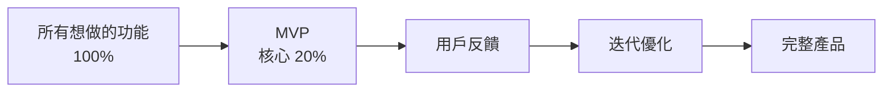

# 5.3.5 哪些功能最重要——MVP 視角收斂

### 一句話破題

MVP 不是"做一個簡陋的版本"，而是**用最小成本驗證核心價值**。

### 什麼是 MVP

MVP（Minimum Viable Product）= 最小可行產品



**MVP 的核心理念**：
- 不是做一個"半成品"
- 而是做一個"能驗證想法的完整閉環"
- 用最少的功能，驗證用戶是否真的需要這個產品

### 如何定義 MVP

**Prompt 模板**：

```markdown
我要做一個 [產品描述]，功能列表如下：
[功能列表]

請幫我定義 MVP：
1. 哪些功能是 MVP 必須有的？
2. 判斷標準是什麼？
3. MVP 需要多長時間可以完成？
```

**示例對話**：

```
你：我要做一個博客系統，功能列表：
- 文章 CRUD
- Markdown 編輯器
- 分類標籤
- 評論系統
- 搜索功能
- RSS 訂閱
- 閱讀統計

請幫我定義 MVP

AI：## MVP 定義

### MVP 必須包含
| 功能 | 理由 | 預計工時 |
|------|------|----------|
| 文章創建/編輯/刪除 | 核心功能，沒有就不是博客 | 4h |
| Markdown 編輯器 | 目標用戶的基本預期 | 2h |
| 文章列表和詳情頁 | 內容展示的基礎 | 3h |

**MVP 工時估算：約 9 小時（1-2 天）**

### MVP 可以不包含
| 功能 | 理由 | 延後優先級 |
|------|------|------------|
| 分類標籤 | 文章少時不需要 | V1.1 |
| 評論系統 | 可用第三方替代 | V1.2 |
| 搜索功能 | 文章少時不急需 | V1.1 |
| RSS 訂閱 | 增強功能 | V1.2 |
| 閱讀統計 | 錦上添花 | V1.3 |

### 判斷標準
一個博客的 MVP 能回答這個問題：
**"我能不能用它寫文章並讓別人看到？"**
- 能寫 ✓
- 能保存 ✓
- 能展示 ✓
→ MVP 達成
```

### MVP 判斷的四個問題

在決定某個功能是否進入 MVP 時，問自己：

```
1. 沒有這個功能，產品還能用嗎？
   - 能用 → 不進 MVP
   - 不能用 → 進 MVP

2. 這個功能能被其他方式替代嗎？
   - 能替代 → 不進 MVP（如：評論可用 Giscus 替代）
   - 不能替代 → 進 MVP

3. 這個功能是解決核心問題還是錦上添花？
   - 核心問題 → 進 MVP
   - 錦上添花 → 不進 MVP

4. 實現這個功能需要多少成本？
   - 成本低且有價值 → 進 MVP
   - 成本高 → 延後
```

### 優先級排序矩陣

使用重要性和緊急性兩個維度來排序：

```
         緊急
          ↑
    P0    |   P1
  (立即做) | (儘快做)
    ------+------
    P2    |   P3
  (計劃做) | (以後再說)
          |
  ← 不重要 ─┼─ 重要 →
          |
        不緊急
```

**讓 AI 幫你排序**：

```
你：請幫我給這些功能排優先級：
[功能列表]

排序標準：
- 用戶價值：對用戶有多重要
- 實現成本：需要多少開發時間
- 依賴關係：是否依賴其他功能

AI：## 優先級排序

### P0（MVP 必須）
1. 文章 CRUD - 價值高/成本低/無依賴
2. 文章列表 - 價值高/成本低/依賴 CRUD

### P1（第二版）
3. 分類標籤 - 價值中/成本低/依賴 CRUD
4. 搜索 - 價值高/成本中/依賴列表

### P2（第三版）
5. 評論 - 價值中/成本高/可替代
6. RSS - 價值低/成本低/依賴列表

### P3（以後考慮）
7. 閱讀統計 - 價值低/成本中
```

### MVP 的驗收標準

MVP 完成的標誌是能夠回答核心問題：

| 產品類型 | 核心問題 | MVP 驗收標準 |
|----------|----------|--------------|
| 博客系統 | 能寫文章並展示嗎？ | 發佈一篇文章並能訪問 |
| 電商網站 | 能下單購買嗎？ | 完成一次完整購買流程 |
| 社交應用 | 能發消息給朋友嗎？ | 發送並接收一條消息 |
| 工具應用 | 能解決核心問題嗎？ | 用工具完成一次任務 |

### 常見誤區

**誤區 1：MVP = 簡陋版**
```
❌ 界面醜、Bug 多、體驗差的"能用就行"版本
✅ 功能精簡但體驗完整的"小而美"版本
```

**誤區 2：什麼都想放進 MVP**
```
❌ "這個功能很簡單，順便加上吧"
✅ "這個功能對驗證核心價值有幫助嗎？"
```

**誤區 3：MVP 完成後就結束**
```
❌ 發佈 MVP 後就不管了
✅ MVP 是起點，收集反饋、持續迭代
```

### 實用建議

1. **先做減法**：列完功能後，問"哪些可以不做"
2. **一週原則**：MVP 最好能在一週內完成
3. **用戶視角**：MVP 要能讓用戶完成一個完整的任務
4. **快速迭代**：MVP 上線後，根據反饋快速優化
