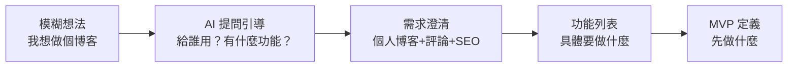

# 5.3 不會提需求怎麼辦——讓 AI 幫你問對問題

### 從模糊想法到清晰需求

很多時候，我們有一個大概的想法，但不知道如何把它變成可執行的需求。這時候，AI 可以成爲你的"需求分析師"。



### AI 可以幫你做什麼

| 需求階段 | AI 能做的事 |
|----------|-------------|
| **需求挖掘** | 提出你沒想到的問題 |
| **頭腦風暴** | 提供多種可能的方案 |
| **用戶分析** | 分析目標用戶畫像 |
| **功能梳理** | 將想法結構化爲功能列表 |
| **MVP 收斂** | 幫你確定第一版做什麼 |

### 與 AI 協作的典型對話

```
你：我想做一個博客系統

AI：好的，我來幫你梳理需求。請回答幾個問題：
1. 這個博客是給自己用，還是允許多人註冊？
2. 需要支持評論功能嗎？
3. 對 SEO 有要求嗎？（需要被搜索引擎收錄）
4. 需要支持多語言嗎？
5. 文章編輯器你希望用 Markdown 還是富文本？

你：個人博客，需要評論，要 SEO，中文就行，用 Markdown

AI：明白了，我幫你整理一下核心功能：

MVP 功能：
- 文章 CRUD（創建/閱讀/更新/刪除）
- Markdown 編輯器
- 文章列表和詳情頁
- 基礎 SEO（meta 標籤、sitemap）

V1.1 可以加：
- 評論系統
- 文章分類和標籤

V1.2 可以加：
- RSS 訂閱
- 搜索功能
```

### 本節目標

學完本節，你將掌握：

1. **需求拆解**：把模糊的想法變成具體的問題
2. **頭腦風暴**：讓 AI 幫你想出更多可能性
3. **用戶分析**：理解目標用戶真正需要什麼
4. **功能梳理**：從想法到功能列表的轉化
5. **MVP 定義**：確定第一版的最小範圍
