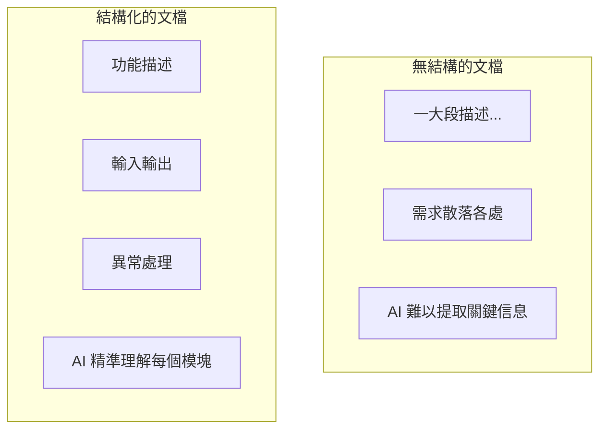

# 5.4.1 爲什麼格式很重要——結構化 PRD

### 一句話破題

結構化的文檔讓 AI 能**準確定位信息**，而不是在模糊描述中猜測。

### 結構化的價值



### 推薦的文檔結構

```markdown
# [功能名稱]

## 功能概述
一句話說明這個功能做什麼

## 用戶故事
作爲 [角色]，我希望 [做什麼]，以便 [獲得什麼價值]

## 功能詳情

### 輸入
- 字段 1：類型，必填/可選，約束條件
- 字段 2：類型，必填/可選，約束條件

### 輸出
- 成功時：返回數據結構
- 失敗時：錯誤碼和錯誤信息

### 業務規則
1. 規則 1
2. 規則 2

### 異常處理
| 異常情況 | 處理方式 |
|----------|----------|
| 情況 1 | 響應 1 |
| 情況 2 | 響應 2 |

## 技術約束
- 使用什麼技術棧
- 遵循什麼規範

## 驗收標準
- [ ] 標準 1
- [ ] 標準 2
```

### 實際示例

**功能**：用戶註冊

```markdown
# 用戶註冊

## 功能概述
新用戶通過郵箱和密碼創建賬號

## 用戶故事
作爲新訪客，我希望能註冊一個賬號，以便保存我的個人設置

## 功能詳情

### 輸入
| 字段 | 類型 | 必填 | 約束 |
|------|------|------|------|
| email | string | 是 | 有效郵箱格式 |
| password | string | 是 | 8-20 字符，至少包含字母和數字 |
| name | string | 否 | 最長 50 字符 |

### 輸出
成功：
```json
{
  "id": "user_123",
  "email": "user@example.com",
  "name": "張三",
  "createdAt": "2024-01-15T10:00:00Z"
}
```

失敗：
```json
{
  "error": "EMAIL_EXISTS",
  "message": "該郵箱已被註冊"
}
```

### 業務規則
1. 郵箱不區分大小寫
2. 密碼存儲前必須 hash
3. 註冊後發送驗證郵件

### 異常處理
| 異常情況 | HTTP 狀態碼 | 錯誤碼 |
|----------|-------------|--------|
| 郵箱已存在 | 409 | EMAIL_EXISTS |
| 郵箱格式錯誤 | 400 | INVALID_EMAIL |
| 密碼不符合要求 | 400 | WEAK_PASSWORD |

## 技術約束
- API 路徑：POST /api/auth/register
- 使用 bcrypt 加密密碼
- 返回 JWT token

## 驗收標準
- [ ] 有效輸入可以成功註冊
- [ ] 重複郵箱返回正確錯誤
- [ ] 密碼在數據庫中是加密的
```

### 模塊化的好處

將文檔分成獨立模塊後：

1. **AI 更容易理解**：每個模塊職責明確
2. **便於局部更新**：修改一處不影響其他
3. **方便驗收**：逐個模塊檢查是否完成
4. **支持迭代**：可以先實現核心模塊

### 常見的結構問題

**問題 1：信息混在一起**
```
❌ "用戶輸入郵箱和密碼，如果郵箱已存在就報錯，密碼要加密..."

✅ 分開寫：
- 輸入：郵箱、密碼
- 異常：郵箱已存在 → 報錯
- 技術約束：密碼要加密
```

**問題 2：缺少關鍵信息**
```
❌ "實現用戶登錄功能"

✅ 補充完整：
- 輸入：郵箱、密碼
- 輸出：用戶信息 + token
- 異常：密碼錯誤、用戶不存在
- 技術：JWT 有效期 7 天
```

### 實用建議

1. **使用模板**：每次寫文檔都用同樣的結構
2. **先列框架再填內容**：先寫好標題，再逐個補充
3. **保持一致性**：項目內所有文檔用同樣的格式
4. **定期回顧**：檢查文檔結構是否需要優化
