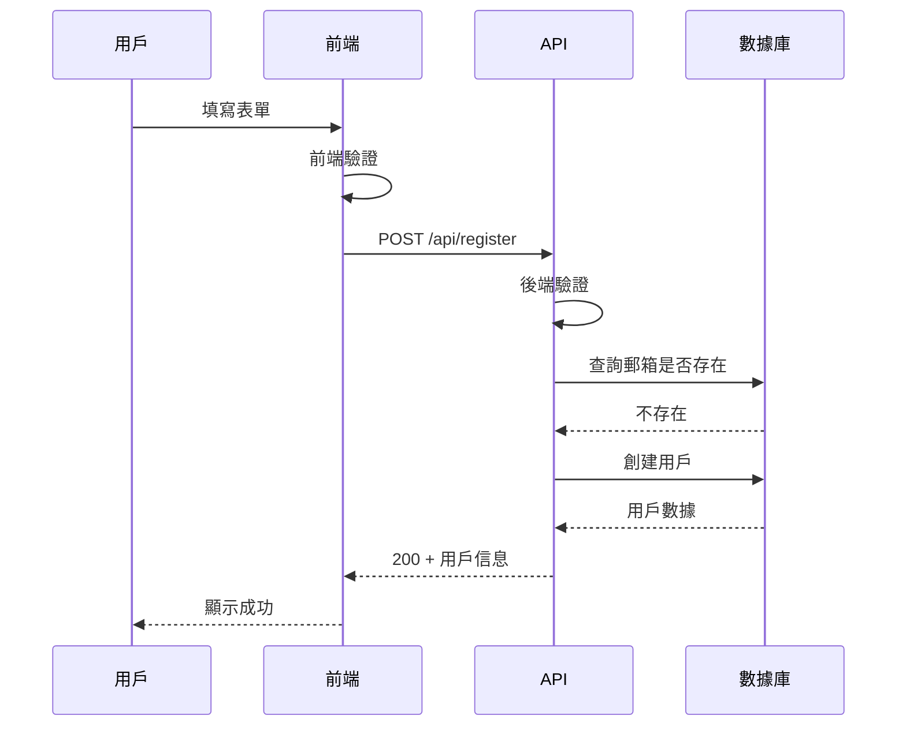

# 5.4.2 數據從哪來，到哪去——輸入輸出定義

### 一句話破題

明確的輸入輸出定義，讓 AI 知道**接收什麼數據、返回什麼結果**。

### 爲什麼輸入輸出很重要


模糊的輸入輸出定義是代碼錯誤的主要來源：

| 模糊的定義 | AI 可能的理解 | 你期望的 |
|------------|---------------|----------|
| "接收用戶數據" | 只有 name？ | email + password + name |
| "返回用戶信息" | 包括密碼？ | 不包括敏感字段 |
| "分頁返回" | 一頁多少條？ | 10 條/頁 |

### 輸入定義的要素

每個輸入字段應該說明：

```markdown
| 字段 | 類型 | 必填 | 默認值 | 約束條件 | 說明 |
|------|------|------|--------|----------|------|
| email | string | 是 | - | 有效郵箱格式 | 用戶郵箱 |
| password | string | 是 | - | 8-20 字符 | 登錄密碼 |
| page | number | 否 | 1 | >= 1 | 頁碼 |
| limit | number | 否 | 10 | 1-100 | 每頁條數 |
```

### 輸出定義的要素

成功和失敗要分開定義：

```markdown
### 成功響應 (200)
```json
{
  "data": {
    "id": "string",
    "email": "string",
    "name": "string | null",
    "createdAt": "ISO8601 時間戳"
  },
  "token": "string (JWT)"
}
```

### 失敗響應
```json
{
  "error": {
    "code": "ERROR_CODE",
    "message": "人類可讀的錯誤描述"
  }
}
```
```

### 數據流的完整描述

用圖表展示數據的流轉：



### 常見的數據類型說明

```markdown
## 數據類型約定

### 基礎類型
- string: 字符串
- number: 數字（整數或浮點）
- boolean: true/false
- null: 空值

### 複合類型
- array<T>: T 類型的數組
- object: 鍵值對對象

### 特殊類型
- id: 唯一標識符（如 "user_abc123"）
- email: 有效郵箱格式
- url: 有效 URL
- datetime: ISO8601 格式時間戳
- uuid: UUID 格式字符串
```

### 輸入驗證規則

明確每個字段的驗證規則：

```markdown
### email
- 格式：xxx@xxx.xxx
- 大小寫不敏感
- 最大長度：255 字符

### password
- 長度：8-20 字符
- 必須包含：至少 1 個字母 + 1 個數字
- 可選包含：特殊字符 !@#$%^&*

### name
- 長度：1-50 字符
- 允許中文、英文、數字
- 不允許特殊字符
```

### 分頁輸出格式

分頁是常見場景，建議標準化：

```markdown
### 分頁響應格式
```json
{
  "data": [...],           // 當前頁數據
  "pagination": {
    "page": 1,             // 當前頁碼
    "limit": 10,           // 每頁條數
    "total": 100,          // 總條數
    "totalPages": 10       // 總頁數
  }
}
```
```

### 實際案例：文章列表 API

```markdown
## 獲取文章列表

### 請求
- 方法：GET
- 路徑：/api/posts

### 輸入參數（Query）
| 參數 | 類型 | 必填 | 默認值 | 說明 |
|------|------|------|--------|------|
| page | number | 否 | 1 | 頁碼 |
| limit | number | 否 | 10 | 每頁條數 |
| category | string | 否 | - | 分類篩選 |
| search | string | 否 | - | 關鍵詞搜索 |

### 成功響應 (200)
```json
{
  "data": [
    {
      "id": "post_123",
      "title": "文章標題",
      "excerpt": "摘要...",
      "author": {
        "id": "user_456",
        "name": "張三"
      },
      "createdAt": "2024-01-15T10:00:00Z"
    }
  ],
  "pagination": {
    "page": 1,
    "limit": 10,
    "total": 50,
    "totalPages": 5
  }
}
```
```

### 實用建議

1. **用表格列出字段**：比文字描述更清晰
2. **給出示例數據**：讓 AI 知道期望的格式
3. **區分必填和可選**：避免遺漏驗證
4. **說明邊界值**：最大長度、範圍限制
5. **保持一致性**：整個項目用相同的格式約定
