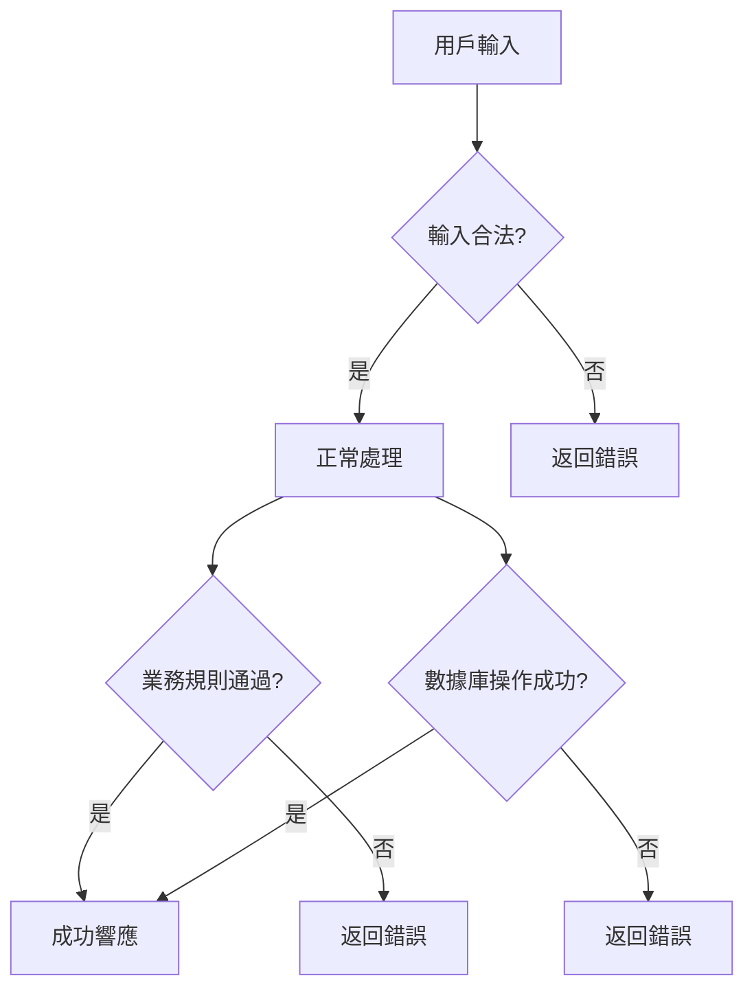

# 5.4.3 萬一...怎麼辦——邊界條件與異常處理

### 一句話破題

預判所有可能出錯的情況，讓 AI 知道**每種異常該如何響應**。

### 爲什麼邊界條件很重要

正常流程只佔代碼的 20%，異常處理佔 80%：



如果不定義邊界條件，AI 生成的代碼可能：
- 遺漏重要的錯誤處理
- 返回不一致的錯誤格式
- 產生安全漏洞

### 邊界條件的分類

```markdown
## 邊界條件清單

### 1. 輸入邊界
- 必填字段爲空
- 字段格式錯誤
- 字段超出範圍
- 非法字符

### 2. 業務邊界
- 資源不存在
- 資源已存在（重複）
- 無權限訪問
- 超出配額限制

### 3. 系統邊界
- 數據庫連接失敗
- 第三方服務超時
- 服務器內部錯誤
```

### 異常處理的標準格式

每種異常都要說明：

| 異常情況 | HTTP 狀態碼 | 錯誤碼 | 錯誤消息 | 處理建議 |
|----------|-------------|--------|----------|----------|
| 郵箱爲空 | 400 | MISSING_EMAIL | 請輸入郵箱 | 前端表單驗證 |
| 郵箱格式錯誤 | 400 | INVALID_EMAIL | 郵箱格式不正確 | 前端正則校驗 |
| 郵箱已存在 | 409 | EMAIL_EXISTS | 該郵箱已被註冊 | 提示去登錄 |
| 用戶不存在 | 404 | USER_NOT_FOUND | 用戶不存在 | - |
| 密碼錯誤 | 401 | INVALID_PASSWORD | 密碼錯誤 | 不透露具體原因 |

### 錯誤響應的統一格式

```json
{
  "error": {
    "code": "ERROR_CODE",
    "message": "給用戶看的友好提示",
    "details": {
      "field": "email",
      "reason": "格式不正確"
    }
  }
}
```

### 實際案例：用戶登錄

```markdown
## 登錄接口異常處理

### 輸入驗證
| 條件 | 響應 |
|------|------|
| 郵箱爲空 | 400 MISSING_EMAIL |
| 密碼爲空 | 400 MISSING_PASSWORD |
| 郵箱格式錯誤 | 400 INVALID_EMAIL |

### 業務驗證
| 條件 | 響應 |
|------|------|
| 用戶不存在 | 401 INVALID_CREDENTIALS |
| 密碼錯誤 | 401 INVALID_CREDENTIALS |
| 賬號被禁用 | 403 ACCOUNT_DISABLED |
| 登錄次數過多 | 429 TOO_MANY_ATTEMPTS |

### 安全考慮
- 用戶不存在和密碼錯誤返回相同的錯誤碼
- 避免攻擊者通過錯誤信息探測有效賬號
```

### 邊界值測試清單

爲每個功能列出測試邊界：

```markdown
## 文章發佈 - 邊界測試

### 標題
- 空標題 → 400 MISSING_TITLE
- 1 個字符 → 成功
- 100 個字符 → 成功
- 101 個字符 → 400 TITLE_TOO_LONG
- 包含 HTML 標籤 → 自動轉義

### 內容
- 空內容 → 400 MISSING_CONTENT
- 1 個字符 → 成功
- 100000 個字符 → 成功
- 100001 個字符 → 400 CONTENT_TOO_LONG

### 標籤
- 0 個標籤 → 成功
- 5 個標籤 → 成功
- 6 個標籤 → 400 TOO_MANY_TAGS
- 標籤名 50 字符 → 成功
- 標籤名 51 字符 → 400 TAG_TOO_LONG
```

### 讓 AI 幫你發現邊界條件

```
你：我要實現用戶註冊功能，請幫我列出所有需要處理的邊界條件

AI：## 邊界條件清單

### 輸入驗證
1. 郵箱
   - 爲空 → 400 MISSING_EMAIL
   - 格式錯誤 → 400 INVALID_EMAIL
   - 長度超過 255 → 400 EMAIL_TOO_LONG

2. 密碼
   - 爲空 → 400 MISSING_PASSWORD
   - 長度小於 8 → 400 PASSWORD_TOO_SHORT
   - 長度大於 20 → 400 PASSWORD_TOO_LONG
   - 不包含字母 → 400 PASSWORD_WEAK
   - 不包含數字 → 400 PASSWORD_WEAK

### 業務驗證
1. 郵箱已被註冊 → 409 EMAIL_EXISTS
2. 觸發反垃圾規則 → 429 RATE_LIMITED

### 系統異常
1. 數據庫連接失敗 → 500 INTERNAL_ERROR
2. 郵件服務不可用 → 註冊成功，但記錄發送失敗
```

### 優雅降級策略

對於非關鍵功能，考慮降級處理：

```markdown
## 降級策略

### 發送驗證郵件
- 正常：註冊成功後立即發送
- 降級：郵件服務故障時，記錄到隊列，稍後重試
- 用戶提示："註冊成功，驗證郵件稍後送達"

### 頭像上傳
- 正常：上傳到 OSS
- 降級：OSS 故障時，保存到本地臨時目錄
- 後續：定時任務遷移到 OSS
```

### 實用建議

1. **先列再補**：先想正常流程，再逐個想"如果...怎麼辦"
2. **安全優先**：敏感操作的錯誤信息要模糊化
3. **用戶友好**：錯誤消息要讓用戶知道該怎麼做
4. **統一格式**：所有接口用相同的錯誤響應結構
5. **記錄日誌**：服務端錯誤要有詳細日誌，但不暴露給用戶
