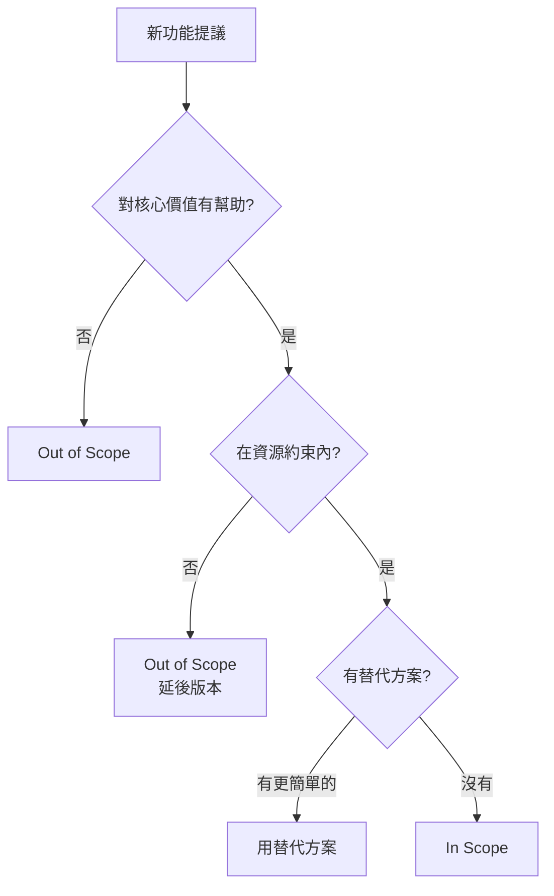

# 5.5.3 哪些該做，哪些不做——範圍界定

### 一句話破題

範圍界定就是明確：**做什麼（In Scope）和不做什麼（Out of Scope）**。

### 爲什麼範圍界定很重要

沒有邊界的需求會導致：
- **範圍蔓延**：不斷加新功能，項目無限延期
- **期望偏差**：你以爲做完了，用戶以爲還差很多
- **資源浪費**：做了很多"錦上添花"卻忽略了核心

### 範圍界定的結構

```markdown
## 範圍界定

### In Scope（要做的）
- 功能 1
- 功能 2
- 功能 3

### Out of Scope（不做的）
- 功能 A（原因：超出 MVP）
- 功能 B（原因：技術複雜度高）
- 功能 C（原因：用戶量不足以支撐）

### 非功能需求
- 性能要求
- 安全要求
- 兼容性要求
```

### 實際案例：博客系統

```markdown
## 博客系統 V1.0 範圍

### In Scope
- [x] 文章 CRUD（創建、閱讀、更新、刪除）
- [x] Markdown 編輯器
- [x] 文章列表和詳情頁
- [x] 分類和標籤
- [x] 基礎 SEO（meta 標籤、sitemap）

### Out of Scope
| 功能 | 原因 | 計劃版本 |
|------|------|----------|
| 評論系統 | MVP 階段不需要 | V1.1 |
| 多用戶支持 | 個人博客暫不需要 | V2.0 |
| 付費訂閱 | 商業化考慮延後 | V2.0+ |
| 多語言 | 初期只服務中文用戶 | 暫不規劃 |

### 非功能需求
- **性能**：首頁加載 < 3 秒
- **安全**：用戶密碼加密存儲
- **兼容**：支持主流瀏覽器（Chrome、Safari、Firefox）
- **可用性**：99% 可用率
```

### In/Out 的判斷標準



### 非功能需求清單

除了功能，還要考慮：

| 類型 | 考慮點 | 示例 |
|------|--------|------|
| **性能** | 響應時間、併發量 | 首頁加載 < 3s |
| **安全** | 認證、授權、數據保護 | 密碼加密、HTTPS |
| **可用性** | 在線率、故障恢復 | 99% 可用率 |
| **可維護** | 代碼質量、文檔 | TypeScript 強類型 |
| **兼容性** | 瀏覽器、設備 | 支持移動端 |
| **擴展性** | 未來增長 | 支持水平擴展 |

### 如何拒絕範圍蔓延

當有人提出新功能時：

```
1. 首先確認理解需求
   "你希望實現的是...對嗎？"

2. 評估與核心價值的關係
   "這個功能對解決核心問題有多大幫助？"

3. 評估實現成本
   "實現這個需要多少時間？"

4. 提出替代方案或延後
   "我們可以先用 XX 方式解決，下個版本再優化"
```

### 讓 AI 幫你界定範圍

```
你：博客系統 MVP 應該包含什麼功能？哪些可以延後？

AI：## MVP 範圍建議

### 必須有（In Scope）
核心價值：讓用戶能寫博客並被訪問
1. 文章 CRUD - 核心功能
2. Markdown 支持 - 目標用戶基本預期
3. 列表/詳情頁 - 內容展示基礎

### 可以延後（Out of Scope）
1. 評論 → 可用 Giscus 等第三方
2. 搜索 → 文章少時可用瀏覽器搜索
3. RSS → 增強功能，非必需
4. 統計 → 可用 Google Analytics

### 非功能優先級
1. 高優：安全（密碼加密）
2. 中優：性能（首頁 3s 內）
3. 低優：SEO（可後續優化）
```

### 實用建議

1. **寫下來**：口頭說的邊界容易遺忘
2. **說明理由**：爲什麼不做比不做本身更重要
3. **留有餘地**：Out of Scope 不是永遠不做
4. **定期回顧**：隨着項目進展，範圍可能需要調整
