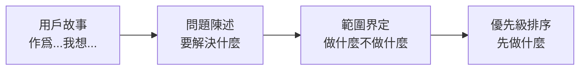

# 5.5 先講故事再列清單——用戶故事與優先級

### 從故事到清單

在定義需求時，很多人習慣直接列功能清單。但更好的方式是**先講故事，再列清單**。

### 爲什麼用戶故事很重要

用戶故事幫助你：
- **保持用戶視角**：功能是爲用戶服務的
- **明確價值**：每個功能都要回答"爲什麼要做"
- **便於溝通**：用自然語言描述，AI 和人都能理解

### 用戶故事 vs 功能列表

| 功能列表 | 用戶故事 |
|----------|----------|
| "用戶登錄功能" | "作爲用戶，我想用郵箱密碼登錄，以便訪問我的個人數據" |
| "文章搜索" | "作爲讀者，我想搜索歷史文章，以便快速找到感興趣的內容" |
| "消息通知" | "作爲作者，我想收到評論通知，以便及時回覆讀者" |

### 本節目標

學完本節，你將掌握：

1. **用戶故事格式**：用標準格式描述需求
2. **問題陳述**：明確要解決的核心問題
3. **範圍界定**：定義做什麼、不做什麼
4. **優先級矩陣**：科學地決定先後順序

**記住**：好的需求定義不是"我要什麼功能"，而是"用戶需要解決什麼問題"。
