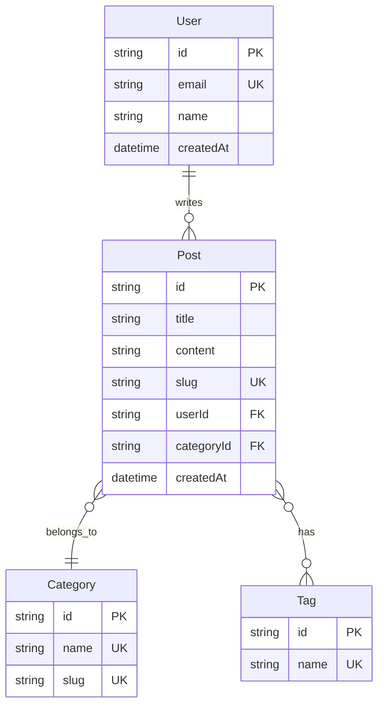

# 5.6.2 數據該怎麼存——數據表設計

### 一句話破題

數據表設計回答一個問題：**數據以什麼結構存儲、表與表之間有什麼關係**。

### 實體關係圖（ER 圖）

先畫圖，再建表：



### 關係類型

| 關係 | 符號 | 示例 |
|------|------|------|
| 一對一 | `||--||` | User - Profile |
| 一對多 | `||--o{` | User - Posts |
| 多對多 | `}o--o{` | Post - Tags |

### 字段定義模板

```markdown
## Post 表

| 字段 | 類型 | 約束 | 說明 |
|------|------|------|------|
| id | string | PK | 主鍵，使用 cuid |
| title | string | NOT NULL | 標題，1-100 字符 |
| content | text | NOT NULL | 內容，Markdown 格式 |
| slug | string | UNIQUE | URL 友好標識 |
| status | enum | DEFAULT 'draft' | draft/published |
| userId | string | FK → User.id | 作者 |
| categoryId | string | FK → Category.id | 分類 |
| createdAt | datetime | DEFAULT now() | 創建時間 |
| updatedAt | datetime | AUTO UPDATE | 更新時間 |

### 索引
- `slug` - 唯一索引，用於 URL 查詢
- `userId` - 普通索引，用於按作者篩選
- `createdAt` - 普通索引，用於排序
```

### Prisma Schema 示例

```prisma
model Post {
  id         String    @id @default(cuid())
  title      String
  content    String
  slug       String    @unique
  status     Status    @default(DRAFT)
  
  author     User      @relation(fields: [userId], references: [id])
  userId     String
  
  category   Category  @relation(fields: [categoryId], references: [id])
  categoryId String
  
  tags       Tag[]
  
  createdAt  DateTime  @default(now())
  updatedAt  DateTime  @updatedAt
  
  @@index([userId])
  @@index([createdAt])
}

enum Status {
  DRAFT
  PUBLISHED
}
```

### 設計原則

#### 1. 主鍵設計
```
✅ 使用 cuid 或 uuid
   - 不暴露業務信息
   - 支持分佈式生成
   
❌ 使用自增 ID
   - 容易被猜測
   - 合併數據時衝突
```

#### 2. 時間字段
```
每張表都應該有：
- createdAt：記錄創建時間
- updatedAt：記錄最後更新時間

可選：
- deletedAt：軟刪除標記
```

#### 3. 外鍵處理
```
刪除關聯數據時的策略：

CASCADE  - 級聯刪除（刪用戶時刪文章）
SET NULL - 設爲空（刪分類時文章分類設空）
RESTRICT - 禁止刪除（有文章時不能刪分類）
```

### 常見設計模式

#### 多對多關係
```prisma
// 方案一：隱式中間表（Prisma 自動創建）
model Post {
  tags Tag[]
}
model Tag {
  posts Post[]
}

// 方案二：顯式中間表（需要額外字段時）
model PostTag {
  post    Post     @relation(fields: [postId], references: [id])
  postId  String
  tag     Tag      @relation(fields: [tagId], references: [id])
  tagId   String
  order   Int      // 額外字段：排序
  
  @@id([postId, tagId])
}
```

#### 軟刪除
```prisma
model Post {
  // ...
  deletedAt DateTime?
}

// 查詢時過濾
const posts = await prisma.post.findMany({
  where: { deletedAt: null }
})
```

### 讓 AI 幫你設計數據表

```
你：博客系統需要哪些數據表？請給出 Prisma Schema

AI：// prisma/schema.prisma

model User {
  id       String @id @default(cuid())
  email    String @unique
  name     String
  password String
  posts    Post[]
  createdAt DateTime @default(now())
}

model Post {
  id         String   @id @default(cuid())
  title      String
  content    String
  slug       String   @unique
  published  Boolean  @default(false)
  author     User     @relation(fields: [authorId], references: [id])
  authorId   String
  category   Category @relation(fields: [categoryId], references: [id])
  categoryId String
  tags       Tag[]
  createdAt  DateTime @default(now())
  updatedAt  DateTime @updatedAt
}

model Category {
  id    String @id @default(cuid())
  name  String @unique
  slug  String @unique
  posts Post[]
}

model Tag {
  id    String @id @default(cuid())
  name  String @unique
  posts Post[]
}
```

### 實用建議

1. **先畫 ER 圖**：可視化幫助理清關係
2. **命名一致**：字段命名風格統一（camelCase 或 snake_case）
3. **適度冗餘**：爲了查詢效率，可以適當冗餘
4. **預留擴展**：考慮未來可能的需求
