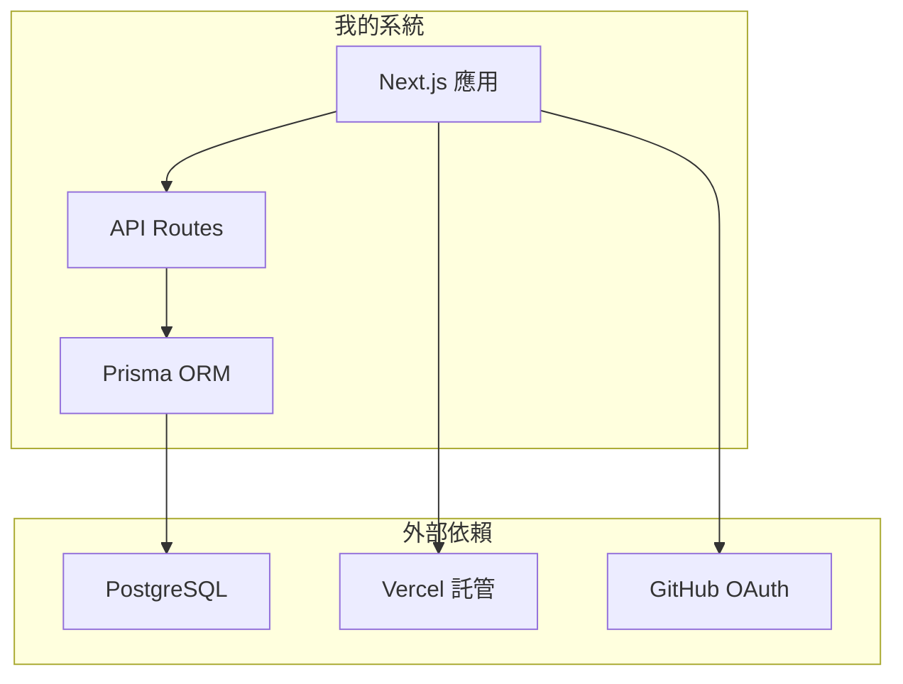
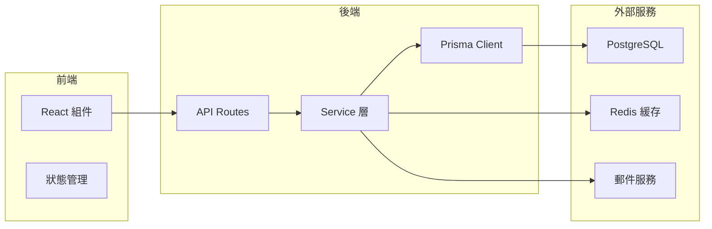

# 5.6.3 哪裏歸我管——系統邊界

### 一句話破題

系統邊界定義**哪些是自己開發的、哪些是依賴外部的**。

### 爲什麼要劃分邊界



邊界清晰才能：
- 知道什麼問題找誰解決
- 評估哪些是可控的、哪些有風險
- 制定備選方案

### 內部組件 vs 外部依賴

```markdown
## 博客系統邊界劃分

### 內部組件（自己實現）
| 組件 | 說明 | 可控性 |
|------|------|--------|
| 前端頁面 | Next.js React 組件 | 完全可控 |
| API 接口 | Next.js API Routes | 完全可控 |
| 數據訪問 | Prisma ORM 調用 | 完全可控 |
| 業務邏輯 | 文章/用戶/分類管理 | 完全可控 |

### 外部依賴（使用服務）
| 依賴 | 用途 | 可替換性 | 風險 |
|------|------|----------|------|
| PostgreSQL | 數據存儲 | 中（換 MySQL） | 低 |
| Vercel | 部署託管 | 高（換 Railway） | 低 |
| GitHub OAuth | 用戶認證 | 中（換 Google） | 低 |
| Cloudinary | 圖片存儲 | 高（換 OSS） | 低 |
```

### 依賴關係圖



### 外部依賴清單

```markdown
## 外部依賴清單

### 基礎設施
| 服務 | 用途 | 免費額度 | 付費價格 |
|------|------|----------|----------|
| Vercel | 託管 | 100GB/月 | $20/月起 |
| Supabase | 數據庫 | 500MB | $25/月起 |
| Cloudflare | CDN | 無限 | 免費 |

### 第三方 API
| 服務 | 用途 | 免費額度 |
|------|------|----------|
| GitHub OAuth | 登錄 | 免費 |
| Resend | 郵件 | 100封/天 |
| Sentry | 錯誤監控 | 5K事件/月 |

### npm 依賴
| 包 | 用途 | 活躍度 |
|----|------|--------|
| @prisma/client | ORM | 活躍 |
| next-auth | 認證 | 活躍 |
| zod | 驗證 | 活躍 |
```

### 風險評估

每個外部依賴都要考慮：

| 風險類型 | 問題 | 應對方案 |
|----------|------|----------|
| **可用性** | 服務宕機怎麼辦 | 準備備選服務 |
| **成本** | 超出免費額度怎麼辦 | 設置用量告警 |
| **遷移** | 需要換服務怎麼辦 | 抽象接口層 |
| **安全** | API Key 泄露怎麼辦 | 環境變量 + 權限控制 |

### 依賴抽象

爲了降低依賴風險，可以做一層抽象：

```typescript
// 不好：直接耦合
import { S3Client } from '@aws-sdk/client-s3'
const client = new S3Client({...})

// 好：抽象接口
interface StorageService {
  upload(file: File): Promise<string>
  delete(url: string): Promise<void>
}

class S3Storage implements StorageService {
  async upload(file: File) { /* ... */ }
  async delete(url: string) { /* ... */ }
}

class LocalStorage implements StorageService {
  async upload(file: File) { /* ... */ }
  async delete(url: string) { /* ... */ }
}
```

### 讓 AI 幫你分析依賴

```
你：分析我的博客系統有哪些外部依賴，評估風險

AI：## 依賴分析

### 高依賴（必須有）
1. **PostgreSQL 數據庫**
   - 風險：中等（託管服務可能變更）
   - 備選：自建 / 換 MySQL
   
2. **Vercel 託管**
   - 風險：低（可快速遷移）
   - 備選：Railway / Fly.io

### 中依賴（可替換）
1. **GitHub OAuth**
   - 風險：低
   - 備選：Google OAuth / 郵箱密碼

### 低依賴（錦上添花）
1. **Google Analytics**
   - 風險：很低
   - 備選：Umami / 不用
```

### 實用建議

1. **列出所有依賴**：包括 npm 包和雲服務
2. **評估替換成本**：哪些是容易換的
3. **關鍵依賴要抽象**：方便未來遷移
4. **監控依賴健康**：關注服務狀態和版本更新
