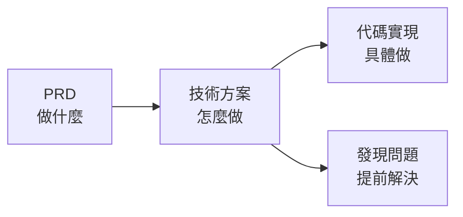

# 5.6 方案是用來減風險的——技術方案

### 寫技術方案的目的

技術方案不是爲了"走流程"，而是爲了**在寫代碼之前發現問題**。



### 技術方案該包含什麼

一份最小化但有效的技術方案：

```markdown
## 技術方案模板

### 1. 接口設計
- API 路徑、方法、參數
- 請求/響應格式

### 2. 數據表設計
- 表結構、字段定義
- 表之間的關係

### 3. 系統邊界
- 哪些是自己實現
- 哪些依賴外部服務

### 4. 風險評估
- 可能遇到的技術難點
- 應對措施

### 5. 工作量估算
- 各模塊開發時間
- 總體時間安排
```

### 爲什麼獨立開發者也需要技術方案

| 場景 | 不寫方案 | 寫方案 |
|------|----------|--------|
| 開發中途 | 發現設計有問題，需要重寫 | 提前發現，調整方案 |
| 讓 AI 實現 | AI 各自爲政，接口不統一 | AI 按方案實現，風格一致 |
| 評估時間 | 拍腦袋，經常低估 | 有依據，更準確 |

### 技術方案 vs 代碼註釋

技術方案是**頂層設計**，回答"爲什麼這樣做"：
- 爲什麼用 PostgreSQL 而不是 MongoDB？
- 爲什麼用 JWT 而不是 Session？
- 表結構爲什麼這樣設計？

代碼註釋是**實現細節**，回答"這段代碼做什麼"。

### 本節目標

學完本節，你將掌握：

1. **接口設計**：如何設計清晰的 API
2. **數據表設計**：如何設計合理的數據結構
3. **系統邊界**：如何劃分內外部依賴
4. **風險評估**：如何識別和緩解技術風險
5. **單人自評**：如何評估自己能否完成

**核心原則**：技術方案越早寫越好，修改方案的成本遠低於修改代碼。
