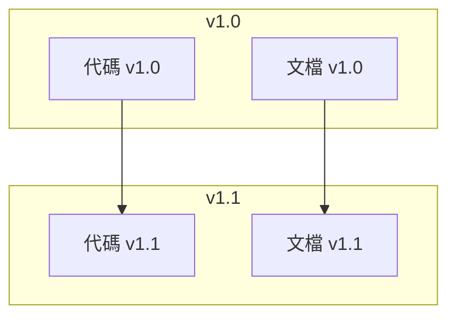

# 5.7.3 文檔也需要後悔藥——文檔版本控制

### 一句話破題

用 Git 管理文檔，可以**追溯歷史、回退修改、對比變化**。

### 爲什麼要版本控制文檔

```
場景 1：文檔寫錯了
  沒有版本控制 → 改了就改了，不知道原來寫的是什麼
  有版本控制   → git diff 看看改了什麼，git revert 回退

場景 2：查歷史決策
  沒有版本控制 → 不知道爲什麼這樣設計
  有版本控制   → git log 看看當時的 commit 信息

場景 3：多版本文檔
  沒有版本控制 → v1-doc.md, v2-doc.md, v2-final-doc.md
  有版本控制   → git checkout v1.0 看那個版本的文檔
```

### 文檔版本控制基礎

```bash
# 查看文檔變更歷史
git log --oneline docs/

# 查看某個文檔的修改
git log --oneline docs/api.md

# 查看具體改了什麼
git diff HEAD~1 docs/api.md

# 回退到上一個版本
git checkout HEAD~1 -- docs/api.md
```

### Commit 信息規範

文檔相關的 commit 建議使用 `docs:` 前綴：

```bash
# 新增文檔
docs: 添加 API 文檔

# 更新文檔
docs: 更新部署說明

# 修復文檔錯誤
docs: 修正 API 參數說明

# 重構文檔結構
docs: 重新組織文檔目錄
```

### 文檔與代碼版本對應

確保每個代碼版本都有對應的文檔：



實現方法：
```bash
# 打版本標籤時，確保文檔也更新了
git tag -a v1.0.0 -m "Release v1.0.0"

# 查看某個版本的文檔
git checkout v1.0.0 -- docs/
```

### 文檔分支策略

對於複雜項目，文檔可以有分支：

```
main 分支
├── 最新穩定版文檔

develop 分支  
├── 開發中的文檔更新

feature/xxx 分支
├── 新功能相關的文檔草稿
```

對於個人項目，通常只用 main 分支就夠了。

### 查看文檔變更示例

```bash
# 看 api.md 最近 5 次修改
git log --oneline -5 docs/api.md

# 輸出示例
a1b2c3d docs: 添加搜索接口文檔
e4f5g6h docs: 更新認證接口參數
i7j8k9l feat: 實現用戶註冊（含文檔）
m0n1o2p docs: 初始化 API 文檔
q3r4s5t docs: 創建文檔目錄結構

# 查看某次修改的內容
git show a1b2c3d
```

### 文檔版本發佈

發佈新版本時，確保文檔同步：

```markdown
## 發佈檢查清單

### 代碼
- [ ] 所有功能開發完成
- [ ] 測試通過
- [ ] 版本號更新

### 文檔
- [ ] API 文檔與代碼一致
- [ ] CHANGELOG 更新
- [ ] README 版本號更新
- [ ] 部署文檔檢查
```

### CHANGELOG 維護

記錄每個版本的變更：

```markdown
# Changelog

## [1.1.0] - 2024-01-20

### Added
- 文章搜索功能
- 標籤管理功能

### Changed
- 優化文章列表加載速度

### Fixed
- 修復登錄超時問題

## [1.0.0] - 2024-01-01

### Added
- 初始版本
- 文章 CRUD
- 用戶認證
```

### 實用建議

1. **文檔和代碼一起提交**：保證版本對應
2. **commit 信息要清晰**：方便以後查找
3. **重要版本打 tag**：便於回溯
4. **定期清理過時文檔**：刪除或歸檔
