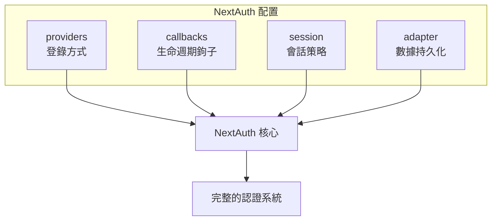
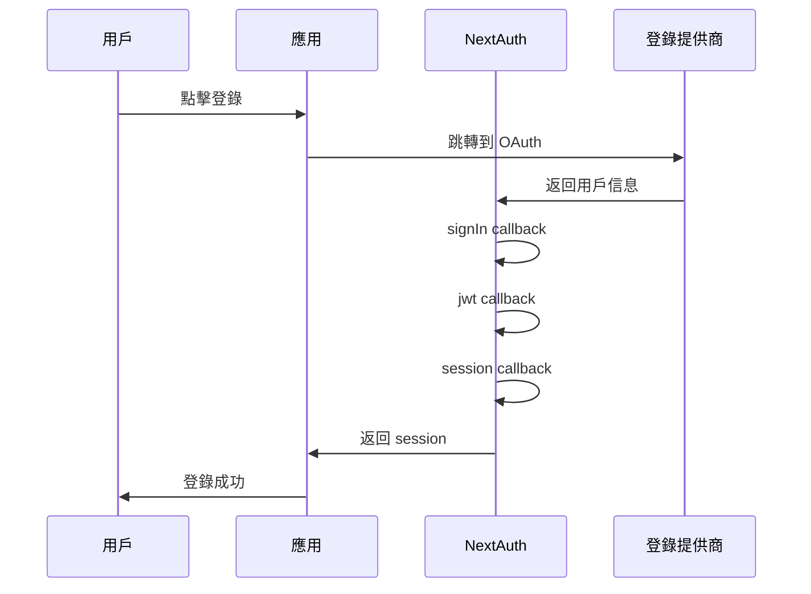

# 6.1.1 開箱即用的認證——NextAuth 配置

## 本質還原

NextAuth 的核心是一個**配置驅動的認證框架**。你只需要告訴它"用什麼方式登錄"（providers）和"登錄過程中要做什麼額外處理"（callbacks），剩下的流程它全包了。



## 配置文件結構

在 App Router 中，NextAuth 的配置文件位於 `app/api/auth/[...nextauth]/route.ts`：

```typescript
import NextAuth, { type NextAuthOptions } from "next-auth"
import GoogleProvider from "next-auth/providers/google"

export const authOptions: NextAuthOptions = {
  // 1. providers: 定義支持的登錄方式
  providers: [
    GoogleProvider({
      clientId: process.env.GOOGLE_CLIENT_ID!,
      clientSecret: process.env.GOOGLE_CLIENT_SECRET!,
    }),
  ],
  
  // 2. callbacks: 自定義認證流程中的行爲
  callbacks: {
    // 登錄時觸發，返回 true 允許登錄
    async signIn({ user, account, profile }) {
      return true
    },
    // 創建 JWT 時觸發
    async jwt({ token, user, account }) {
      if (user) {
        token.id = user.id
      }
      return token
    },
    // 獲取 session 時觸發
    async session({ session, token }) {
      if (session.user) {
        session.user.id = token.id as string
      }
      return session
    },
  },
  
  // 3. session: 會話存儲策略
  session: {
    strategy: "jwt", // 或 "database"
    maxAge: 30 * 24 * 60 * 60, // 30 天
  },
  
  // 4. pages: 自定義頁面路由
  pages: {
    signIn: "/login",      // 自定義登錄頁
    error: "/auth/error",  // 錯誤頁
  },
}

const handler = NextAuth(authOptions)
export { handler as GET, handler as POST }
```

## Providers 詳解

Providers 決定了用戶可以通過什麼方式登錄你的應用：

### OAuth Providers（社交登錄）

```typescript
import GoogleProvider from "next-auth/providers/google"
import GitHubProvider from "next-auth/providers/github"
import DiscordProvider from "next-auth/providers/discord"

providers: [
  GoogleProvider({
    clientId: process.env.GOOGLE_CLIENT_ID!,
    clientSecret: process.env.GOOGLE_CLIENT_SECRET!,
  }),
  GitHubProvider({
    clientId: process.env.GITHUB_ID!,
    clientSecret: process.env.GITHUB_SECRET!,
  }),
]
```

### Credentials Provider（賬號密碼登錄）

```typescript
import CredentialsProvider from "next-auth/providers/credentials"

providers: [
  CredentialsProvider({
    name: "Credentials",
    credentials: {
      email: { label: "郵箱", type: "email" },
      password: { label: "密碼", type: "password" }
    },
    async authorize(credentials) {
      // 在這裏驗證用戶憑據
      const user = await validateUser(
        credentials?.email,
        credentials?.password
      )
      if (user) {
        return user
      }
      return null
    }
  })
]
```

::: warning 安全提醒
使用 Credentials Provider 時，你需要自己處理密碼哈希、防暴力破解等安全問題。對於新手，推薦先使用 OAuth Provider。
:::

## Callbacks 詳解

Callbacks 是 NextAuth 的鉤子函數，讓你在認證流程的關鍵節點插入自定義邏輯：



### 常用 Callback 場景

```typescript
callbacks: {
  // 場景1：限制只有特定郵箱域名可以登錄
  async signIn({ user }) {
    const allowedDomain = "@company.com"
    if (user.email?.endsWith(allowedDomain)) {
      return true
    }
    return false // 拒絕登錄
  },
  
  // 場景2：在 token 中添加用戶角色
  async jwt({ token, user }) {
    if (user) {
      // 首次登錄時，從數據庫獲取用戶角色
      const dbUser = await prisma.user.findUnique({
        where: { email: user.email! }
      })
      token.role = dbUser?.role || "user"
    }
    return token
  },
  
  // 場景3：在 session 中暴露用戶角色
  async session({ session, token }) {
    if (session.user) {
      session.user.role = token.role as string
    }
    return session
  },
}
```

## 環境變量配置

```bash
# .env.local
NEXTAUTH_URL=http://localhost:3000
NEXTAUTH_SECRET=your-secret-key-here

# Google OAuth
GOOGLE_CLIENT_ID=your-google-client-id
GOOGLE_CLIENT_SECRET=your-google-client-secret

# GitHub OAuth
GITHUB_ID=your-github-client-id
GITHUB_SECRET=your-github-client-secret
```

::: danger 重要
- `NEXTAUTH_SECRET` 是必需的，用於加密 JWT。生產環境請使用強隨機字符串
- 使用 `openssl rand -base64 32` 生成安全的密鑰
- 永遠不要將這些值提交到 Git
:::

## 覺知：審查 AI 生成代碼的檢查點

當 AI 幫你生成 NextAuth 配置時，重點檢查：

1. **環境變量引用**：是否使用 `process.env.XXX`，而不是硬編碼值
2. **類型安全**：是否添加了 `!` 或進行了空值檢查
3. **Callback 返回值**：`signIn` 必須返回布爾值，`jwt` 和 `session` 必須返回修改後的對象
4. **路由文件位置**：App Router 必須放在 `app/api/auth/[...nextauth]/route.ts`
