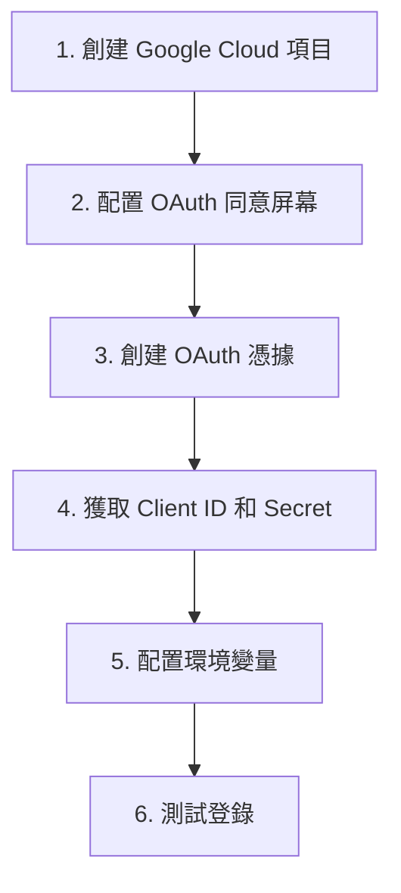

# 6.1.2 Google 登錄怎麼接——Google OAuth 實戰

## 一句話破題

接入 Google 登錄只需要三步：在 Google Cloud Console 創建應用、配置回調地址、把 Client ID 和 Secret 填到環境變量裏。

## 完整流程圖



## 步驟一：創建 Google Cloud 項目

1. 訪問 [Google Cloud Console](https://console.cloud.google.com/)
2. 點擊頂部的項目選擇器 → "新建項目"
3. 輸入項目名稱（如 `my-nextjs-app`）→ 創建

## 步驟二：配置 OAuth 同意屏幕

1. 在左側菜單選擇 **"API 和服務"** → **"OAuth 同意屏幕"**
2. 選擇用戶類型：
   - **外部**：適用於公開應用，任何 Google 賬號都能登錄
   - **內部**：僅限組織內部使用（需要 Google Workspace）
3. 填寫必填信息：
   - 應用名稱
   - 用戶支持郵箱
   - 開發者聯繫信息

::: tip 開發階段
選擇"外部"後，應用會處於"測試"狀態。在測試狀態下，只有你添加的測試用戶才能登錄。正式發佈前需要提交審覈。
:::

## 步驟三：創建 OAuth 憑據

1. 進入 **"API 和服務"** → **"憑據"**
2. 點擊 **"創建憑據"** → **"OAuth 客戶端 ID"**
3. 應用類型選擇 **"Web 應用"**
4. 填寫名稱（如 `NextJS App`）
5. 配置重定向 URI：

```
# 開發環境
http://localhost:3000/api/auth/callback/google

# 生產環境
https://your-domain.com/api/auth/callback/google
```

::: warning 回調地址格式
NextAuth 的 Google Provider 固定使用 `/api/auth/callback/google` 作爲回調路徑，不要修改。
:::

6. 創建完成後，複製 **Client ID** 和 **Client Secret**

## 步驟四：配置環境變量

```bash
# .env.local
GOOGLE_CLIENT_ID=your-client-id-here.apps.googleusercontent.com
GOOGLE_CLIENT_SECRET=your-client-secret-here
```

## 步驟五：NextAuth 配置

```typescript
// app/api/auth/[...nextauth]/route.ts
import NextAuth from "next-auth"
import GoogleProvider from "next-auth/providers/google"

const handler = NextAuth({
  providers: [
    GoogleProvider({
      clientId: process.env.GOOGLE_CLIENT_ID!,
      clientSecret: process.env.GOOGLE_CLIENT_SECRET!,
    }),
  ],
})

export { handler as GET, handler as POST }
```

## 測試登錄

```typescript
// app/page.tsx
"use client"

import { signIn, signOut, useSession } from "next-auth/react"

export default function Home() {
  const { data: session, status } = useSession()

  if (status === "loading") {
    return <div>加載中...</div>
  }

  if (session) {
    return (
      <div>
        <p>已登錄：{session.user?.email}</p>
        
        <button onClick={() => signOut()}>退出</button>
      </div>
    )
  }

  return (
    <button onClick={() => signIn("google")}>
      使用 Google 登錄
    </button>
  )
}
```

## 常見問題

### Error 400: redirect_uri_mismatch

**原因**：回調地址配置不匹配

**解決**：檢查 Google Console 中的重定向 URI 是否與你的 `NEXTAUTH_URL` 一致

### Error: Access blocked

**原因**：應用處於測試狀態，且當前用戶不在測試用戶列表中

**解決**：
1. 去 OAuth 同意屏幕 → 測試用戶 → 添加當前賬號
2. 或者提交應用審覈

## 獲取更多用戶信息

默認情況下，Google 只返回基礎信息。如需獲取更多數據，配置 `authorization` 參數：

```typescript
GoogleProvider({
  clientId: process.env.GOOGLE_CLIENT_ID!,
  clientSecret: process.env.GOOGLE_CLIENT_SECRET!,
  authorization: {
    params: {
      scope: "openid email profile",
      // 可添加更多 scope
    },
  },
})
