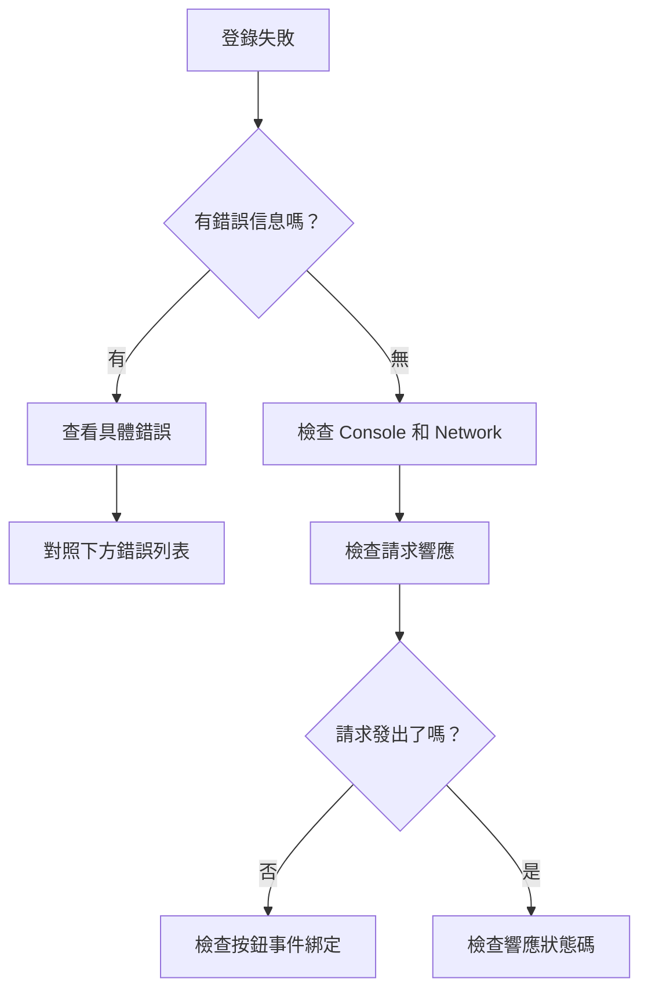

# 6.1.5 登錄失敗了怎麼辦——常見問題排查

## 問題排查思路



## 常見錯誤及解決方案

### 1. NEXTAUTH_URL 配置錯誤

**錯誤表現**：
```
Error: NEXTAUTH_URL environment variable is not set
```

**解決方案**：

```bash
# .env.local
# 開發環境
NEXTAUTH_URL=http://localhost:3000

# 生產環境
NEXTAUTH_URL=https://your-domain.com
```

::: warning 注意
- URL 末尾不要加 `/`
- 生產環境必須使用 HTTPS
- Vercel 部署時會自動設置，但其他平臺需要手動配置
:::

### 2. NEXTAUTH_SECRET 未設置

**錯誤表現**：
```
[next-auth][error][NO_SECRET] 
Please define a `secret` in production
```

**解決方案**：

```bash
# 生成隨機密鑰
openssl rand -base64 32

# 添加到 .env.local
NEXTAUTH_SECRET=生成的隨機字符串
```

### 3. 回調地址不匹配

**錯誤表現**：
```
Error 400: redirect_uri_mismatch
```

**排查步驟**：

1. 檢查 OAuth 提供商後臺配置的回調地址
2. 確保格式完全正確：

```
# Google
http://localhost:3000/api/auth/callback/google

# GitHub  
http://localhost:3000/api/auth/callback/github
```

3. 檢查協議（http vs https）和端口號是否一致

### 4. OAuth Client ID/Secret 錯誤

**錯誤表現**：
```
Error: invalid_client
```

**排查步驟**：

1. 確認環境變量名稱正確
2. 確認值沒有多餘的空格或換行
3. 確認 Secret 沒有過期（GitHub Secret 只顯示一次）

```bash
# 檢查環境變量是否正確加載
console.log("GOOGLE_CLIENT_ID:", process.env.GOOGLE_CLIENT_ID)
```

### 5. SessionProvider 未配置

**錯誤表現**：
```
Error: useSession must be wrapped in a SessionProvider
```

**解決方案**：

```typescript
// app/providers.tsx
"use client"
import { SessionProvider } from "next-auth/react"

export function Providers({ children }: { children: React.ReactNode }) {
  return <SessionProvider>{children}</SessionProvider>
}

// app/layout.tsx
import { Providers } from "./providers"

export default function RootLayout({ children }) {
  return (
    <html>
      <body>
        <Providers>{children}</Providers>
      </body>
    </html>
  )
}
```

### 6. 服務器組件中使用客戶端 Hook

**錯誤表現**：
```
Error: useSession only works in Client Components
```

**解決方案**：

```typescript
// ❌ 錯誤：在 Server Component 中使用 useSession
export default function Page() {
  const { data: session } = useSession() // 報錯
}

// ✅ 正確：在 Server Component 中使用 getServerSession
import { getServerSession } from "next-auth"

export default async function Page() {
  const session = await getServerSession(authOptions)
}

// ✅ 正確：在 Client Component 中使用 useSession
"use client"
export default function Page() {
  const { data: session } = useSession()
}
```

### 7. 開發環境 HTTPS 問題

**錯誤表現**：
```
Cookies require Secure; SameSite=None
```

**解決方案**：

開發環境使用 HTTP 時，需要配置：

```typescript
// NextAuth 配置
cookies: {
  sessionToken: {
    name: `next-auth.session-token`,
    options: {
      httpOnly: true,
      sameSite: "lax",
      path: "/",
      secure: process.env.NODE_ENV === "production",
    },
  },
},
```

## 調試技巧

### 啓用 NextAuth 調試模式

```typescript
const handler = NextAuth({
  debug: process.env.NODE_ENV === "development",
  // ...其他配置
})
```

### 檢查 Network 請求

1. 打開瀏覽器開發者工具 → Network 面板
2. 過濾 `auth` 關鍵詞
3. 檢查 `/api/auth/` 開頭的請求
4. 查看請求和響應的詳細內容

### 常用調試端點

| 端點 | 用途 |
|------|------|
| `/api/auth/providers` | 查看已配置的 Provider |
| `/api/auth/session` | 查看當前 Session |
| `/api/auth/csrf` | 獲取 CSRF Token |

## 生產環境檢查清單

::: tip 上線前必查
1. [ ] `NEXTAUTH_URL` 設置爲生產域名
2. [ ] `NEXTAUTH_SECRET` 使用強隨機字符串
3. [ ] OAuth 提供商後臺添加了生產環境回調地址
4. [ ] 環境變量已在部署平臺正確配置
5. [ ] `debug: false` 或已移除 debug 選項
6. [ ] HTTPS 已正確配置
:::
