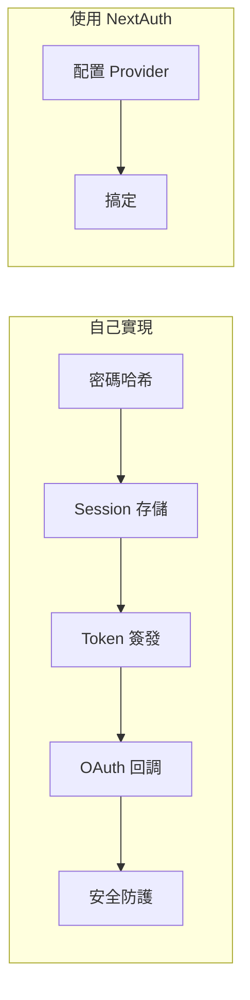

# 6.1 別再從零開始寫登錄註冊——NextAuth 快速上手

## 一句話破題

NextAuth.js（現已更名爲 Auth.js）是 Next.js 生態中最流行的認證解決方案——它讓你用幾行配置就能接入 Google、GitHub 等主流登錄方式，省去從零實現認證系統的繁瑣。

## 核心價值

自己實現登錄系統意味着：密碼加密、Session 管理、Token 簽發、OAuth 回調處理、安全漏洞防護……每一項都是坑。NextAuth 把這些複雜性封裝成開箱即用的 API，讓你專注於業務邏輯。



## 本節內容

| 小節 | 學習目標 |
|------|----------|
| 6.1.1 NextAuth 配置 | 理解 providers 和 callbacks 的基礎設置 |
| 6.1.2 Google OAuth | 實戰接入 Google 登錄 |
| 6.1.3 GitHub OAuth | 實戰接入 GitHub 登錄 |
| 6.1.4 會話管理 | 理解用戶狀態持久化與路由保護 |
| 6.1.5 常見問題 | 登錄失敗的排查與解決方案 |

## 快速上手預覽

10 分鐘內，你將實現這樣的登錄流程：

```typescript
// 1. 安裝依賴
// npm install next-auth

// 2. 創建配置文件 app/api/auth/[...nextauth]/route.ts
import NextAuth from "next-auth"
import GoogleProvider from "next-auth/providers/google"
import GitHubProvider from "next-auth/providers/github"

const handler = NextAuth({
  providers: [
    GoogleProvider({
      clientId: process.env.GOOGLE_CLIENT_ID!,
      clientSecret: process.env.GOOGLE_CLIENT_SECRET!,
    }),
    GitHubProvider({
      clientId: process.env.GITHUB_ID!,
      clientSecret: process.env.GITHUB_SECRET!,
    }),
  ],
})

export { handler as GET, handler as POST }
```

```typescript
// 3. 在頁面中使用
import { signIn, signOut, useSession } from "next-auth/react"

export function LoginButton() {
  const { data: session } = useSession()
  
  if (session) {
    return (
      <div>
        <p>歡迎, {session.user?.name}</p>
        <button onClick={() => signOut()}>退出登錄</button>
      </div>
    )
  }
  
  return <button onClick={() => signIn()}>登錄</button>
}
```

## AI 協作指南

向 AI 描述你的認證需求時，使用這些關鍵詞：

- **核心意圖**："使用 NextAuth 實現社交登錄"
- **關鍵術語**：`providers`、`callbacks`、`session`、`signIn`、`signOut`
- **交互策略**：先讓 AI 生成基礎配置，確認能跑通後，再添加自定義 callbacks

::: tip 驗收清單
在接受 AI 生成的 NextAuth 代碼前，檢查：
1. 環境變量是否正確引用（不要硬編碼密鑰）
2. 是否使用了 App Router 的 route handler 寫法
3. SessionProvider 是否包裹在合適的層級
:::
