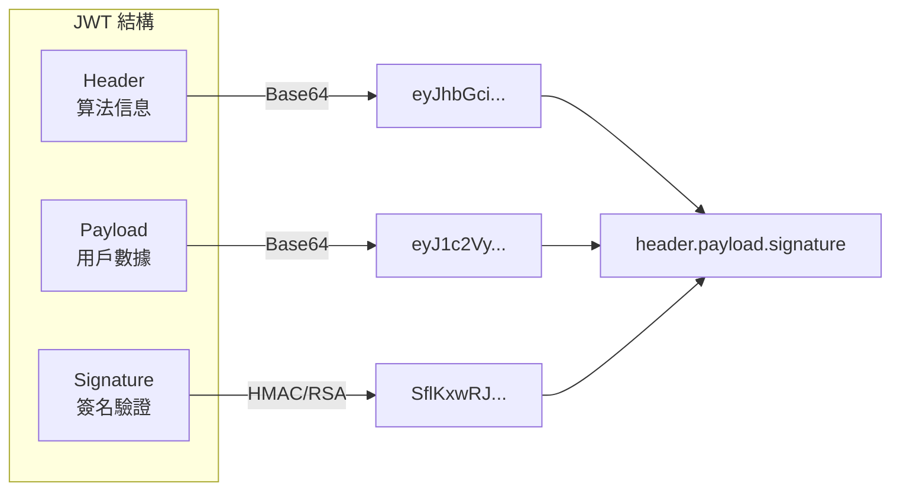
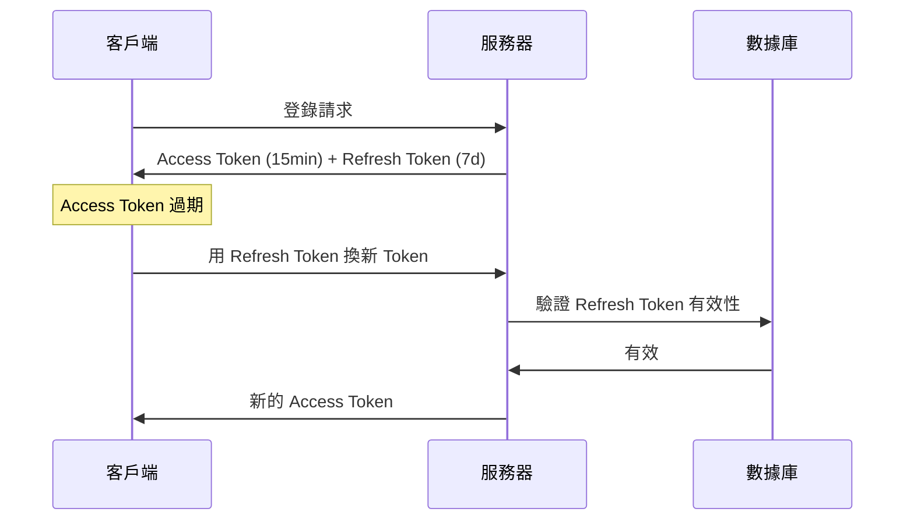

# 6.2.1 JWT 安全：密鑰管理與過期策略

## 本質還原

JWT（JSON Web Token）是一種自包含的令牌格式，把用戶信息編碼在令牌本身中。服務器無需查詢數據庫就能驗證用戶身份，但這也帶來了獨特的安全挑戰。



## JWT 的安全風險

### 1. 密鑰泄露

如果簽名密鑰泄露，攻擊者可以僞造任意用戶的 Token。

```typescript
// ❌ 危險：硬編碼密鑰
const token = jwt.sign(payload, "my-secret-key")

// ✅ 安全：使用環境變量
const token = jwt.sign(payload, process.env.JWT_SECRET!)
```

### 2. 算法混淆攻擊

某些 JWT 庫允許攻擊者將算法從 RS256 改爲 HS256，用公鑰作爲密鑰驗證。

```typescript
// ✅ 顯式指定算法，不信任 token 中的 alg
const decoded = jwt.verify(token, secret, { 
  algorithms: ['HS256']  // 只接受這個算法
})
```

### 3. 無法即時撤銷

JWT 一旦簽發，在過期前無法撤銷。用戶改密碼後，舊 Token 仍然有效。

## 密鑰管理最佳實踐

### 生成強密鑰

```bash
# 生成 256 位隨機密鑰
openssl rand -base64 32

# 輸出類似：K7gNU3sdo+OL0wNhqoVWhr3g6s1xYv72ol/pe/Unols=
```

### 密鑰輪換

定期更換密鑰，但要支持舊 Token 的驗證過渡期：

```typescript
const CURRENT_KEY = process.env.JWT_SECRET_CURRENT!
const PREVIOUS_KEY = process.env.JWT_SECRET_PREVIOUS!

function verifyToken(token: string) {
  try {
    return jwt.verify(token, CURRENT_KEY)
  } catch {
    // 嘗試用舊密鑰驗證（過渡期）
    return jwt.verify(token, PREVIOUS_KEY)
  }
}
```

### 非對稱加密

對於分佈式系統，推薦使用 RS256（RSA + SHA256）：

```typescript
import { readFileSync } from 'fs'

const privateKey = readFileSync('private.pem')
const publicKey = readFileSync('public.pem')

// 簽發（只有認證服務有私鑰）
const token = jwt.sign(payload, privateKey, { algorithm: 'RS256' })

// 驗證（任何服務都可以用公鑰驗證）
const decoded = jwt.verify(token, publicKey, { algorithms: ['RS256'] })
```

## 過期策略

### Access Token + Refresh Token



```typescript
// 簽發雙 Token
function issueTokens(userId: string) {
  const accessToken = jwt.sign(
    { userId, type: 'access' },
    process.env.JWT_SECRET!,
    { expiresIn: '15m' }  // 短期有效
  )
  
  const refreshToken = jwt.sign(
    { userId, type: 'refresh' },
    process.env.JWT_REFRESH_SECRET!,
    { expiresIn: '7d' }   // 長期有效
  )
  
  // 將 refresh token 存入數據庫（可撤銷）
  await db.refreshToken.create({
    data: { token: refreshToken, userId }
  })
  
  return { accessToken, refreshToken }
}
```

### 刷新 Token 端點

```typescript
// app/api/auth/refresh/route.ts
export async function POST(request: Request) {
  const { refreshToken } = await request.json()
  
  try {
    const decoded = jwt.verify(
      refreshToken,
      process.env.JWT_REFRESH_SECRET!
    )
    
    // 檢查 token 是否在數據庫中（未被撤銷）
    const stored = await db.refreshToken.findUnique({
      where: { token: refreshToken }
    })
    
    if (!stored) {
      return Response.json({ error: '無效的刷新令牌' }, { status: 401 })
    }
    
    // 簽發新的 access token
    const newAccessToken = jwt.sign(
      { userId: decoded.userId, type: 'access' },
      process.env.JWT_SECRET!,
      { expiresIn: '15m' }
    )
    
    return Response.json({ accessToken: newAccessToken })
  } catch {
    return Response.json({ error: '令牌已過期' }, { status: 401 })
  }
}
```

## Token 撤銷機制

### 方案一：Token 黑名單

```typescript
// 退出登錄時，將 token 加入黑名單
async function logout(token: string) {
  const decoded = jwt.decode(token) as { exp: number }
  const ttl = decoded.exp - Math.floor(Date.now() / 1000)
  
  // 存入 Redis，過期時間與 token 一致
  await redis.setex(`blacklist:${token}`, ttl, '1')
}

// 驗證時檢查黑名單
async function verifyToken(token: string) {
  const isBlacklisted = await redis.get(`blacklist:${token}`)
  if (isBlacklisted) throw new Error('Token 已撤銷')
  
  return jwt.verify(token, process.env.JWT_SECRET!)
}
```

### 方案二：Token 版本號

```typescript
// 用戶表增加 tokenVersion 字段
// 修改密碼時遞增版本號
async function changePassword(userId: string, newPassword: string) {
  await db.user.update({
    where: { id: userId },
    data: { 
      password: await hash(newPassword),
      tokenVersion: { increment: 1 }
    }
  })
}

// 簽發時包含版本號
const token = jwt.sign({ userId, tokenVersion: user.tokenVersion }, secret)

// 驗證時檢查版本號
async function verifyToken(token: string) {
  const decoded = jwt.verify(token, secret)
  const user = await db.user.findUnique({ where: { id: decoded.userId } })
  
  if (user.tokenVersion !== decoded.tokenVersion) {
    throw new Error('Token 已失效')
  }
  return decoded
}
```

## 安全配置清單

::: tip JWT 安全檢查清單
1. [ ] 密鑰長度至少 256 位
2. [ ] 密鑰存儲在環境變量中
3. [ ] 顯式指定簽名算法
4. [ ] Access Token 過期時間 ≤ 15 分鐘
5. [ ] 實現 Refresh Token 機制
6. [ ] Refresh Token 可撤銷（存數據庫）
7. [ ] 敏感操作前驗證 Token 時效性
:::
