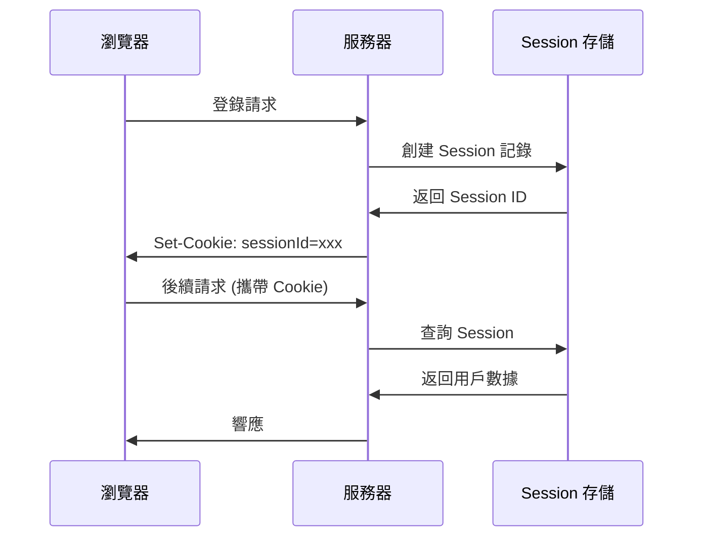

# 6.2.2 Session 安全：存儲與傳輸安全

## 本質還原

Session 是服務端保存用戶狀態的機制。與 JWT 不同，Session 數據存儲在服務端，客戶端只保存一個 Session ID。



## Session 安全威脅

### 1. Session 劫持

攻擊者通過各種手段獲取用戶的 Session ID，冒充用戶身份。

**防護措施**：

```typescript
// 使用安全的 Cookie 設置
const sessionOptions = {
  cookie: {
    httpOnly: true,    // 防止 JS 讀取
    secure: true,      // 僅 HTTPS 傳輸
    sameSite: 'strict', // 防止跨站請求攜帶
    maxAge: 24 * 60 * 60 * 1000 // 1 天
  }
}
```

### 2. Session 固定攻擊

攻擊者先獲取一個有效的 Session ID，誘導用戶使用該 ID 登錄。

**防護措施**：

```typescript
// 登錄成功後，重新生成 Session ID
async function login(user: User, session: Session) {
  // 銷燬舊 session
  await session.destroy()
  
  // 創建新 session
  const newSession = await createSession()
  newSession.userId = user.id
  
  return newSession.id
}
```

### 3. Session 數據泄露

Session 存儲不當導致數據泄露。

**防護措施**：

```typescript
// 不要在 session 中存儲敏感信息
// ❌ 危險
session.password = user.password
session.creditCard = user.creditCard

// ✅ 安全：只存必要的標識符
session.userId = user.id
session.role = user.role
```

## Session 存儲方案

| 存儲方式 | 優點 | 缺點 | 適用場景 |
|----------|------|------|----------|
| 內存 | 快速 | 重啓丟失、無法擴展 | 開發環境 |
| 文件 | 簡單 | IO 慢、難擴展 | 小型應用 |
| 數據庫 | 持久化 | 查詢開銷 | 中型應用 |
| Redis | 快速、可擴展 | 需額外維護 | 生產環境 |

### Redis Session 存儲示例

```typescript
import Redis from 'ioredis'

const redis = new Redis(process.env.REDIS_URL)

async function getSession(sessionId: string) {
  const data = await redis.get(`session:${sessionId}`)
  return data ? JSON.parse(data) : null
}

async function setSession(sessionId: string, data: object, ttl: number) {
  await redis.setex(
    `session:${sessionId}`,
    ttl,
    JSON.stringify(data)
  )
}

async function deleteSession(sessionId: string) {
  await redis.del(`session:${sessionId}`)
}
```

## 安全配置最佳實踐

### Session ID 生成

```typescript
import { randomBytes } from 'crypto'

function generateSessionId(): string {
  // 使用加密安全的隨機數
  return randomBytes(32).toString('hex')
}
```

### Session 超時策略

```typescript
const SESSION_CONFIG = {
  // 絕對超時：創建後 24 小時過期
  absoluteTimeout: 24 * 60 * 60 * 1000,
  
  // 空閒超時：30 分鐘無活動過期
  idleTimeout: 30 * 60 * 1000,
}

async function validateSession(session: Session) {
  const now = Date.now()
  
  // 檢查絕對超時
  if (now - session.createdAt > SESSION_CONFIG.absoluteTimeout) {
    throw new Error('Session 已過期')
  }
  
  // 檢查空閒超時
  if (now - session.lastActivity > SESSION_CONFIG.idleTimeout) {
    throw new Error('Session 因不活動已過期')
  }
  
  // 更新最後活動時間
  session.lastActivity = now
}
```

### 敏感操作的會話驗證

```typescript
async function sensitiveOperation(session: Session) {
  // 敏感操作前檢查 session 是否最近創建
  const sessionAge = Date.now() - session.createdAt
  const RECENT_THRESHOLD = 5 * 60 * 1000 // 5 分鐘
  
  if (sessionAge > RECENT_THRESHOLD) {
    throw new Error('請重新登錄以執行此操作')
  }
}
```

## NextAuth 中的 Session 安全

```typescript
// NextAuth 配置
export const authOptions: NextAuthOptions = {
  session: {
    strategy: 'database', // 使用數據庫存儲
    maxAge: 24 * 60 * 60,  // 24 小時
    updateAge: 60 * 60,    // 每小時更新
  },
  
  callbacks: {
    async session({ session, user }) {
      // 只暴露必要的用戶信息
      session.user.id = user.id
      session.user.role = user.role
      // 不暴露敏感信息
      return session
    }
  }
}
```

::: tip Session 安全檢查清單
1. [ ] Session ID 使用加密安全的隨機數生成
2. [ ] Cookie 設置 HttpOnly、Secure、SameSite
3. [ ] 登錄成功後重新生成 Session ID
4. [ ] 實現絕對超時和空閒超時
5. [ ] Session 數據不包含敏感信息
6. [ ] 生產環境使用 Redis 等可擴展存儲
:::
