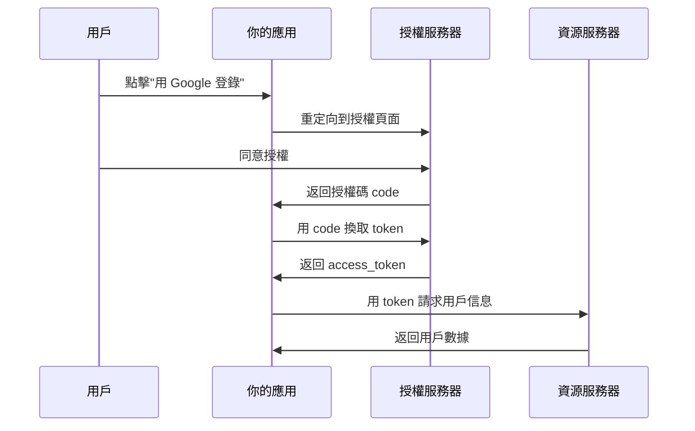

# 6.2.4 OAuth 2.0：授權碼模式與安全配置

## 本質還原

OAuth 2.0 是一個授權框架，允許第三方應用在用戶授權下訪問用戶的資源，而無需獲取用戶的密碼。



## OAuth 2.0 授權模式

| 模式 | 適用場景 | 安全性 |
|------|----------|--------|
| 授權碼模式 | Web 應用 | ⭐⭐⭐⭐⭐ |
| PKCE | 移動/SPA 應用 | ⭐⭐⭐⭐⭐ |
| 隱式模式 | 已廢棄 | ⚠️ 不推薦 |
| 密碼模式 | 僅自有應用 | ⚠️ 謹慎使用 |

## 授權碼模式安全要點

### 1. State 參數防止 CSRF

```typescript
// 生成 state
const state = crypto.randomBytes(32).toString('hex')
session.oauthState = state

// 發起授權請求時帶上 state
const authUrl = `https://accounts.google.com/oauth?
  client_id=${CLIENT_ID}&
  redirect_uri=${REDIRECT_URI}&
  state=${state}&
  response_type=code`

// 回調時驗證 state
if (request.query.state !== session.oauthState) {
  throw new Error('State 驗證失敗，可能是 CSRF 攻擊')
}
```

### 2. PKCE 防止授權碼劫持

PKCE（Proof Key for Code Exchange）爲 SPA 和移動應用提供額外保護：

```typescript
import crypto from 'crypto'

// 生成 code_verifier（隨機字符串）
const codeVerifier = crypto.randomBytes(32).toString('base64url')

// 生成 code_challenge
const codeChallenge = crypto
  .createHash('sha256')
  .update(codeVerifier)
  .digest('base64url')

// 授權請求帶上 challenge
const authUrl = `${AUTH_URL}?
  code_challenge=${codeChallenge}&
  code_challenge_method=S256`

// 換取 token 時帶上 verifier
const tokenResponse = await fetch(TOKEN_URL, {
  method: 'POST',
  body: new URLSearchParams({
    code,
    code_verifier: codeVerifier,
    // ...其他參數
  })
})
```

### 3. 安全存儲 Client Secret

```typescript
// ❌ 危險：Secret 暴露在前端
const response = await fetch('/oauth/token', {
  body: JSON.stringify({
    client_secret: 'my-secret' // 暴露在瀏覽器中！
  })
})

// ✅ 安全：Secret 只在服務端使用
// app/api/auth/callback/route.ts
export async function GET(request: Request) {
  const code = new URL(request.url).searchParams.get('code')
  
  // 在服務端使用 secret
  const token = await exchangeCodeForToken(code, {
    client_secret: process.env.CLIENT_SECRET // 環境變量
  })
}
```

## NextAuth 中的 OAuth 安全

NextAuth 已經內置了這些安全措施：

```typescript
import GoogleProvider from "next-auth/providers/google"

export const authOptions = {
  providers: [
    GoogleProvider({
      clientId: process.env.GOOGLE_CLIENT_ID!,
      clientSecret: process.env.GOOGLE_CLIENT_SECRET!,
      // NextAuth 自動處理：
      // - state 參數
      // - PKCE（如果 provider 支持）
      // - 安全的 token 存儲
    }),
  ],
}
```

## Token 安全存儲

| 存儲位置 | 安全性 | 說明 |
|----------|--------|------|
| HttpOnly Cookie | ✅ 推薦 | 防 XSS |
| localStorage | ❌ 不推薦 | 易被 XSS 竊取 |
| sessionStorage | ❌ 不推薦 | 易被 XSS 竊取 |
| 內存 | ✅ 可用 | 刷新頁面丟失 |

::: warning OAuth 安全檢查清單
1. [ ] 使用授權碼模式，不用隱式模式
2. [ ] SPA/移動應用使用 PKCE
3. [ ] 驗證 state 參數防止 CSRF
4. [ ] Client Secret 只在服務端使用
5. [ ] Token 存儲在 HttpOnly Cookie
6. [ ] 限制 redirect_uri 白名單
:::
